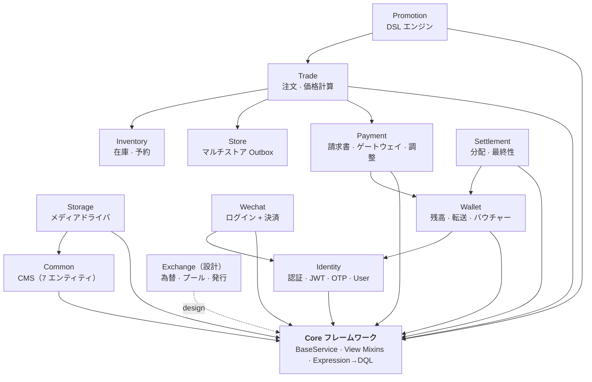
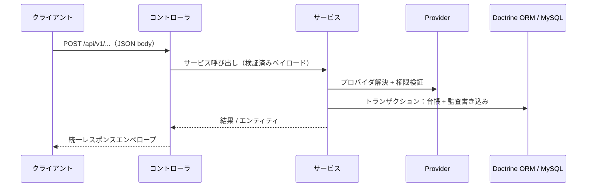
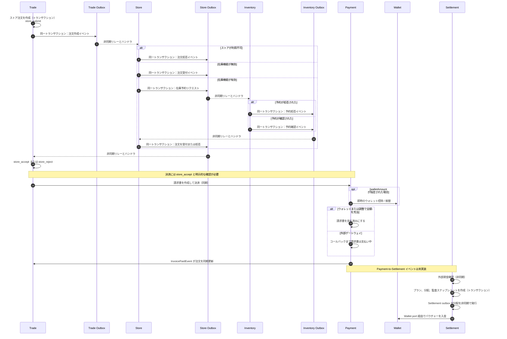

# CRUD Skeleton

モジュラー CRUD と高トランザクション API のための Symfony 8.1 バックエンド基盤。再利用可能な API 規約、組み合わせ可能なビジネスモジュール、運用上の安全装置を備えていますが、すべてのアプリケーションがすべてのモジュールを採用する必要はありません。

> English: [README.md](README.md) · Chinese (Simplified): [README.zh-cn.md](README.zh-cn.md) · Chinese (Traditional): [README.zh-hant.md](README.zh-hant.md)

> ドキュメントサイト: [GitHub Pages](https://immane.github.io/crud-skeleton) | 開発マニュアル: [docs/manual/index.md](docs/manual/index.md) | アーキテクチャ: [docs/design/system-architecture.md](docs/design/system-architecture.md)

## アーキテクチャ

アプリケーションは階層型 Symfony API です。コントローラは trait ベースのビューミックスインを `BaseService`（CRUD + 動的クエリ）の上に組み合わせ、サービスがビジネスルールを担い、Doctrine ORM が MySQL に永続化します。これはモジュラーモノリスであり、各モジュールは単一の Symfony アプリケーション内で明示的なサービス・イベント境界を通じて連携します。



ビジネス操作は一貫した「リクエストからトランザクションまで」の境界に従います。たとえばウォレット決済は、サービス層でプロバイダを解決し、その効果を単一のデータベーストランザクションで記録します。



### コマースオーケストレーション

注文の履行は、同期トランザクション境界と非同期イベント配信をまたぎます。決済分配は意図的に別に示しています。外部で確認された資金から開始され、未実装の Payment-to-Settlement イベントからは開始されません。



## 目次

- [アーキテクチャ](#アーキテクチャ)
- [クイックスタートガイド](#クイックスタートガイド)
- [このプロジェクトの目的](#このプロジェクトの目的)
- [含まれる機能](#含まれる機能)
- [モジュール概要](#モジュール概要)
- [独自の CRUD モジュールを作成する](#独自の-crud-モジュールを作成する)
- [ドキュメント](#ドキュメント)
- [テスト](#テスト)
- [Docker デプロイ](#docker-デプロイ)
- [コントリビューション](#コントリビューション)
- [ライセンス](#ライセンス)

## クイックスタートガイド

ローカルでのログインと認証を素早く試すには（JWT キー、DB マイグレーション、管理者ユーザー、ログイン/認証テスト）、[QUICKSTART.md](QUICKSTART.md) を参照してください。

macOS では、CLI のバージョン不一致を避けるため、クイックスタートのコマンドは Homebrew PHP（`/opt/homebrew/bin/php`）を優先します。

## このプロジェクトの目的

CRUD Skeleton は、生成された CRUD 以上のものを必要とするが、初日から分散システムを必要としないアプリケーション向けです。日常的な API 作業を一貫させつつ、ドメイン固有の振る舞いのための明確な拡張ポイントを提供します。

- **再利用可能な API 基盤**: 共有サービス、コントローラミックスイン、バリデーション、シリアライゼーション、式駆動クエリにより、反復的なエンドポイントコードを削減します。
- **組み合わせ可能なビジネスドメイン**: コマース、在庫、決済、ウォレット、決済分配、アイデンティティ、ストレージ、プロモーションが、明示的なサービス・イベント境界の周りに整理されています。
- **運用準備済みのデフォルト**: Docker Compose、非同期ワーカー、outbox 処理、ヘルスチェック、メトリクス、レート制限、CI 品質ゲートが統合作業として残されるのではなく、含まれています。

## 含まれる機能

- **一貫した CRUD API**: 共有サービス動作、コントローラ構成、動的なフィルタリング・ソート・プロジェクション・展開。
- **トランザクション型コマースワークフロー**: 注文、在庫予約、請求書、決済ゲートウェイ、ウォレット調整、決済分配。
- **財務の監査可能性**: 冪等な転送、バウチャー裏付けの入金・出金、内部残高検証と照合、バージョン付き決済ルール。
- **拡張可能な統合**: JWT と OTP 認証、WeChat ログインと決済、ローカルまたは Qiniu メディアストレージ、プロモーションルール DSL。
- **アクセス制御と監査**: ロール保護された管理エンドポイント、特権動的クエリの保護、変更リクエストの有界監査ログ。
- **信頼性の高い非同期処理**: Messenger ワーカーと、モジュール間イベントのための outbox/inbox パターン。
- **本番診断**: OpenAPI ドキュメント、準備・生存プローブ、Prometheus メトリクス、エンドポイントレート制限。
- **強制される品質チェック**: PHPUnit、PHPStan Level 8、Rector 型ルール、CI での 90% 行カバレッジ閾値。

## 技術スタック

| コンポーネント | 技術 |
|---------------|------|
| 言語 | PHP `>= 8.4` |
| フレームワーク | Symfony `8.1.*` |
| ORM | Doctrine ORM `^3.6` |
| データベース | MySQL 8（Docker/本番）/ SQLite（ローカルテスト）/ PostgreSQL 16（CI テスト） |
| 認証 | JWT（RS256）+ OTP（SMS） |
| API ドキュメント | NelmioApiDocBundle（OpenAPI 3） |
| テスト | PHPUnit `^12.5`（paratest による並列実行対応） |
| 静的解析 | PHPStan Level 8 + Rector 型ルール |
| フロントエンド | [crud-admin](https://github.com/immane/crud-admin) — 設定駆動の管理画面 |
| ドキュメント | MkDocs Material（GitHub Pages） |

完全な依存関係リストは `composer.json` を参照してください。

## プロジェクト構成

リポジトリはモジュラーモノリスです。`src/` にアプリケーションコード（Core フレームワークと、Common、Identity、Trade、Payment、Wallet、Storage などのビジネスモジュール）が置かれ、その隣に `config/`、`migrations/`、`tests/`、`docs/`、Docker/Compose ファイルがあります。

完全な詳細ディレクトリツリー（各モジュールのコントローラ、サービス、エンティティ、リポジトリまで）は、
**[プロジェクト構成 — 開発マニュアル](docs/manual/project-structure.md)** を参照してください。

## はじめに

ネイティブと Docker のセットアップ方法、JWT 設定、初回実行の検証、トラブルシューティングは、
**[はじめに — 開発マニュアル](docs/manual/getting-started.md)** を参照してください。

Docker 開発は env ファイルを作成せずに動作します。ネイティブ PHP/Symfony の場合は、`.env.local` にローカルオーバーライドを作成してください（[設定](#設定) を参照）。

## 設定

環境ファイルの完全なリファレンス（ファイルの役割、すべての変数、完全な `.env.local` / `.env.prod.local` の例、シークレット生成）は、
**[デプロイ — 開発マニュアル](docs/manual/deployment.md)** を参照してください。

環境ファイルの役割の概要：

| ファイル | 用途 | コミット? |
|----------|------|-----------|
| `.env` | コミット済みの Symfony デフォルト、シークレットなし | はい |
| `.env.dev`、`.env.test` | コミット済みの dev/test デフォルト | はい |
| `.env.local`、`.env.*.local` | マシンローカルのオーバーライドとシークレット | いいえ |
| `.env.example` | ローカル開発変数のリファレンス | はい |
| `.env.prod.example` | 本番 Docker テンプレート | はい |
| `.env.prod.local` | 実際の本番 Docker 値 | いいえ |

本番では、シークレットをコミット済みファイルに保存しないでください。実際の環境変数またはローカルの本番 env ファイルを使用してください。

### メディアストレージと Qiniu

メディアアップロードは、統一されたメディアストレージインターフェースを通じて複数のストレージドライバをサポートします（`local` は組み込み、`qiniu` はオプション）。デフォルトドライバは環境変数で設定され、アップロードごとに `storage` という multipart フォームフィールドで上書きできます。

完全なリファレンス（Qiniu SDK のインストール、Qiniu 認証情報の設定、ドライバの有効化）は、
**[メディアストレージと Qiniu — 開発マニュアル](docs/manual/storage.md)** を参照してください。

## ローカルでの実行

完全なセットアップ手順（Docker とネイティブ PHP、JWT キー、検証、トラブルシューティング）は、
**[はじめに — 開発マニュアル](docs/manual/getting-started.md)** を参照してください。

PHP/Symfony でネイティブに実行するか、Docker Compose（app、nginx、MySQL、Redis、Mailpit）で実行できます。アプリは設定されたローカルポートで実行されます。

## モジュール概要

| モジュール | 用途 | 主な機能 |
|-----------|------|---------|
| **Core** | API 基盤 | REST コントローラサポート、共有サービス動作、ビューミックスイン、式クエリ |
| **Common** | CMS と設定 | カテゴリ、タグ、コンテンツ、メディア、ページ、コメント、キーバリュー設定 |
| **Trade** | コマース | 商品、仕様、注文ワークフロー、価格計算 |
| **Store** | マルチストア運用 | ストアメンバーシップと信頼性の高い注文イベント引き継ぎ |
| **Inventory** | 在庫管理 | ストア別在庫、予約、レシピ、在庫台帳ポリシー |
| **Payment** | 請求書オーケストレーション | 請求書ライフサイクル、ゲートウェイ抽象化、決済調整、Webhook |
| **Wallet** | 残高操作 | 転送、入金、出金、バウチャー、照合 |
| **Settlement** | 分配と最終性 | バージョン付きルール、監査可能な分配、ウォレット入金 |
| **Promotion** | 価格ルール | プロモーション DSL、計算戦略、キャンペーンルーティング |
| **Identity** | 認証 | JWT、OTP、登録、ユーザープロフィール、管理 |
| **Storage** | メディアアップロード | ローカルと Qiniu Kodo ストレージドライバ |
| **Wechat** | WeChat 連携 | ログインと WeChat Pay V3 |
| **Exchange** *(設計)* | ポイント経済 | 為替レートと流動性プールの設計；未実装 |

アプリケーション API エンドポイントは統一された JSON エンベロープを返します。ヘルスチェック、メトリクス、Swagger/OpenAPI エンドポイントはそれぞれの形式を使用します。リクエスト/レスポンス形式、認証、ページネーション、エラーハンドリングは、
**[API 契約 — 開発マニュアル](docs/manual/api-contracts.md)** を参照してください。

## サービス層の仕組み

`BaseService` は、インフラストラクチャアクセス、トランザクション、動的クエリエンジンを備えた読み取り/リスト動作、変更動作（`new()`/`update()`/`remove()`）を提供する焦点を絞ったトレイトを組み合わせ、`BaseServiceInterface` を通じて公開互換性を維持します。

詳細は、**[コアフレームワーク — 開発マニュアル](docs/manual/core-framework.md)**
と **[コアの使い方 — 開発マニュアル](docs/manual/core-usage.md)** を参照してください。

## 動的クエリシステム

`list()` メソッドは、ページネーションに加えて、式駆動のフィルタリング・ソート・順序・フィールド選択・展開パラメータをサポートします（DQL にコンパイルされ、インメモリフォールバックを備えます）。完全なリファレンスは **[クエリシステム — 開発マニュアル](docs/manual/query-system.md)** を参照してください。

## 独自の CRUD モジュールを作成する

手順の概要：Doctrine エンティティ、`BaseService` を継承するサービス、リポジトリ、API ミックスインを使用する App/Manage コントローラを作成し、ルートを登録してマイグレーションを追加します。

最小限のコントローラは、サービスインターフェースの上に API ビューミックスインを組み合わせます：

```php
namespace App\Common\Controller\App;

use App\Common\Service\ContentServiceInterface;
use App\Core\Controller\RestController;
use App\Core\View\ApiView;
use App\Core\View\DetailApiViewMixin;
use App\Core\View\ListApiViewMixin;

class ContentController extends RestController
{
    use ApiView, DetailApiViewMixin, ListApiViewMixin;

    public function __construct(
        protected readonly ContentServiceInterface $service
    ) {}
}
```

完全な仕様は **[モジュール設計契約](docs/design/module-design.md)**、実用的なレシピは **[コアの使い方 — 開発マニュアル](docs/manual/core-usage.md)** を参照してください。

## ドキュメント

- **[クイックスタート](QUICKSTART.md)** — 最小限のローカルセットアップ、初回マイグレーション、認証チェック
- **[開発マニュアル](docs/manual/index.md)** — セットアップ、アーキテクチャ、フレームワークの使い方、テスト、デプロイのタスク指向ガイド
- **[アーキテクチャと設計契約](docs/design/system-architecture.md)** — モジュール境界、API、データモデル、拡張契約
- **[データベースとマイグレーション](docs/manual/database-and-migrations.md)** — Doctrine の慣例と移植可能なマイグレーションワークフロー
- **[統合イベント](docs/manual/integration-events.md)** — トランザクション outbox/inbox、冪等コンシューマ、リトライ、スケジューラ操作
- **[バンドル設計ドキュメント](docs/design/bundles/)** — 実装済みおよび設計段階のモジュールの設計ノート
- **[Runbooks](docs/runbooks/)** — モジュール別の運用手順
- **[テストと本番検証](docs/testing/crud-skeleton-production/README.md)** — 変更タイプ別に必要な検証エビデンス
- **[OpenAPI 仕様](docs/openapi/endpoints.yaml)** と **[注文と決済フロー](docs/openapi/order-payment-flow.md)** — API リファレンスとコンシューマワークフロー
- **実行時 Swagger UI**: アプリケーション実行中は `http://localhost:8080/api/doc`
- **[セキュリティ強化](docs/design/security-hardening.md)** と **[セキュリティポリシー](SECURITY.md)** — セキュリティ制御と責任ある開示

## テスト

テストスイートは、ユニット、統合、低価値、スモークの各レイヤーをカバーします。CI はカバレッジ付きでメインスイートを実行し、90% の行カバレッジ閾値を強制し、PHPStan Level 8 と Rector 型ルールチェックも実行します。

完全なテスト構造、ヘルパー、実行方法（直列/並列/カバレッジ）、CI カバレッジの詳細は、
**[テスト — 開発マニュアル](docs/manual/testing.md)** を参照してください。

## Docker デプロイ

完全なデプロイリファレンス（すべてのサービス、すべての環境変数、`.env` / `.env.prod.local` のセットアップ、JWT キー、ヘルスチェック、スケジューラコマンド、アップグレード）は、
**[デプロイ — 開発マニュアル](docs/manual/deployment.md)** を参照してください。

スタックは nginx（リバースプロキシ）の背後で PHP-FPM を実行し、MySQL と Redis で支えられ、Messenger ワーカーと outbox スケジューラを備えています。開発用と本番用のオーバーレイは Compose ファイルで提供されます。

## トラブルシューティング

一般的な問題には、PHP バージョンの不一致、データベース接続エラー、シリアライゼーションの問題、認証失敗があります。完全なトラブルシューティング手順は、
**[はじめに — 開発マニュアル](docs/manual/getting-started.md)** を参照してください。

## コントリビューション

ブランチ、コードスタイル、テスト、コミット規約、PR の期待事項については、**[コントリビューションガイド](CONTRIBUTING.md)** に従ってください。PR は焦点を絞り、動作変更にはテストを追加または更新してください。脆弱性は公開 issue ではなく **[セキュリティポリシー](SECURITY.md)** を通じて報告してください。

## 国際化（i18n）

このプロジェクトは Symfony Translation コンポーネントを通じて `en`、`zh`、`zh_Hant`、`ja` をサポートしています。ロケールはリクエスト、`Accept-Language` ヘッダー、またはデフォルトから自動的に検出されます。

完全な i18n リファレンス（キーの追加、ロケール検出、ドキュメント翻訳フロー）は、
**[国際化 — 開発マニュアル](docs/manual/i18n.md)** を参照してください。

翻訳版 README：[README.zh-cn.md](README.zh-cn.md) · [README.zh-hant.md](README.zh-hant.md)

## ライセンス

Apache-2.0。詳細は [LICENSE](LICENSE) をご覧ください。
