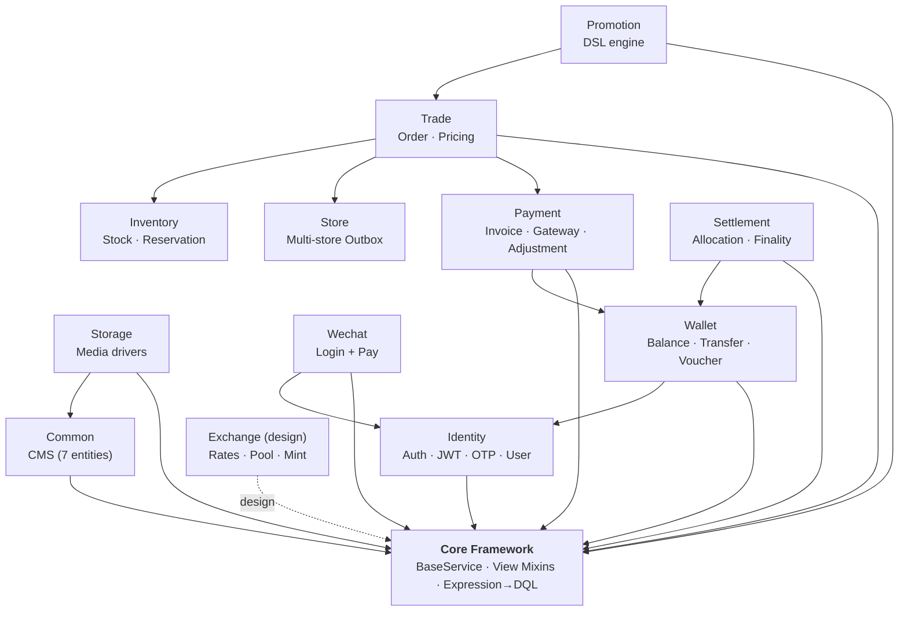
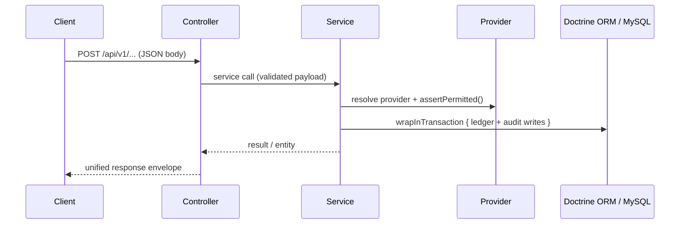
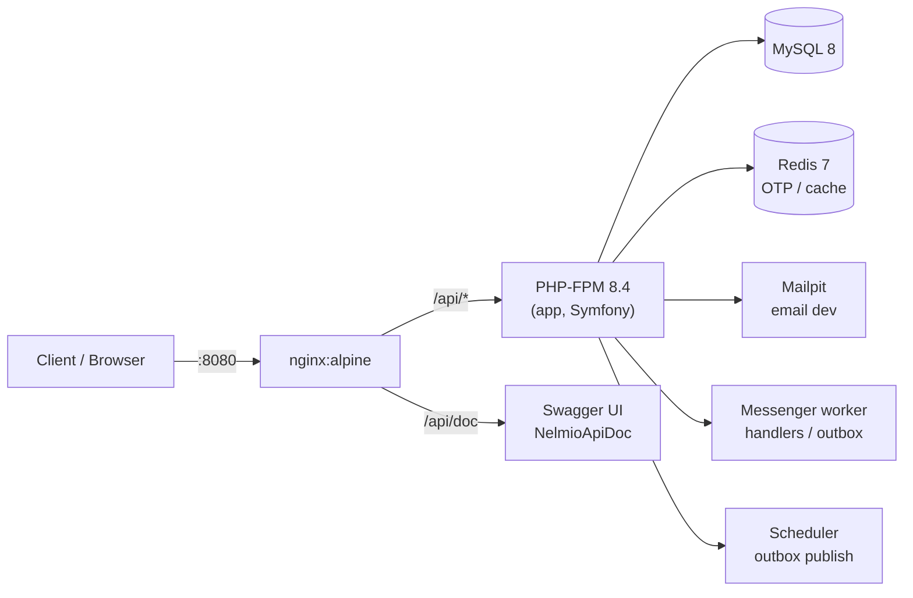

# CRUD Skeleton

A production-oriented Symfony 8.1 API skeleton with reusable service-layer abstractions, modular architecture, JWT authentication, dynamic query engine, and pluggable business modules.

> Chinese (Simplified): [README.zh-cn.md](README.zh-cn.md) · Chinese (Traditional): [README.zh-hant.md](README.zh-hant.md) · Japanese: [README.ja.md](README.ja.md)

> Documentation site: [GitHub Pages](https://immane.github.io/crud-skeleton) | Design contracts: [docs/design/](docs/design/)

## Architecture

The application is a layered Symfony API: controllers compose trait-based view mixins over `BaseService` (CRUD + dynamic query), services own the business rules, and Doctrine ORM persists to MySQL. Modules depend on Core and on each other only through service interfaces.



Request flow for a business operation (e.g. a wallet payment):



## Table of Contents

- [Architecture](#architecture)
- [Quick Start Guide](#quick-start-guide)
- [Why This Project](#why-this-project)
- [Features](#features)
- [Tech Stack](#tech-stack)
- [Project Structure](#project-structure)
- [Getting Started](#getting-started)
- [Configuration](#configuration)
- [Run Locally](#run-locally)
- [Module Overview](#module-overview)
- [API Endpoints](#api-endpoints)
- [How the Service Layer Works](#how-the-service-layer-works)
- [Dynamic Query System](#dynamic-query-system)
- [Create Your Own CRUD Module](#create-your-own-crud-module)
- [Documentation](#documentation)
- [Testing](#testing)
- [Docker Deployment](#docker-deployment)
- [Troubleshooting](#troubleshooting)
- [Contributing](#contributing)
- [License](#license)

## Quick Start Guide

For a minimal runnable setup (JWT keys, DB migration, admin user, login/auth test), see [QUICKSTART.md](QUICKSTART.md).

Docker Compose also starts the Messenger `worker` and Trade/Store Outbox `scheduler` automatically. See `docker compose logs -f worker scheduler` to inspect asynchronous processing.

If you are on macOS, commands in the quick start prefer Homebrew PHP (`/opt/homebrew/bin/php`) to avoid CLI version mismatch.

## Why This Project

This repository is designed as a clean foundation for backend CRUD development with Symfony.

Compared with plain generated boilerplate, it provides:

- A shared `BaseService` contract for common entity operations.
- Reusable API view mixins (list/detail/create/update/delete/workflow) via PHP trait composition.
- A practical pattern for keeping controller logic thin and business logic in services.
- Expression-based dynamic queries (`@filter`, `@sort`, `@dql`) compiled to DQL with in-memory fallback.
- Pluggable pricing pipeline and state machine for e-commerce workflows.
- Invoice-based payment framework with gateway abstraction (mock, wallet, wechat) and pluggable payment adjustment providers.
- Atomic wallet transfers with deadlock prevention, optimistic locking, idempotency, and wallet balance deduction as a payment adjustment provider.
- Pluggable file storage drivers (local, Qiniu Kodo) with a unified `MediaStorageInterface`.
- JWT authentication (RS256) with refresh token rotation and phone-based OTP login.
- **Password self-registration** with user profile management and admin user CRUD.
- Comprehensive design contracts for consistent new module creation.
- **Wallet balance verification** and reconciliation — ensures `SUM(wallets) == SUM(deposits)` at all times.

## Features

- **CRUD Service Abstraction**: `new()`, `get()`, `list()`, `update()`, `remove()`.
- **Dynamic Query System**: Filter, sort, order, select, group by via request parameters with expression-to-DQL compilation.
- **Trait-Based Controller Composition**: 9 mixin traits (List, Detail, Create, Update, Delete, Workflow, Singleton, Transform) composed into controllers.
- **Modular Architecture**: Core framework + Common (CMS) + Promotion (DSL-driven promotions) + Trade (E-Commerce) + Store (per-store trade outbox) + Inventory (material, stock, recipes, reservations) + Payment + Wallet + Wechat (Login + Pay) + Storage (file upload drivers) + Identity (Auth) modules.
- **JWT Authentication**: RS256 access tokens, HMAC-SHA256 refresh token rotation with reuse detection.
- **OTP Login**: Phone-based one-time password via Alibaba Cloud SMS, rate-limited.
- **Password Registration**: Self-service sign-up with email/username/phone uniqueness validation.
- **User Management**: App profile endpoints + admin CRUD with password management.
- **Order State Machine**: Symfony Workflow for order lifecycle (draft → completed), with workflow API endpoints.
- **Price Calculation Pipeline**: Pluggable calculators with priority ordering for e-commerce order pricing.
- **Atomic Wallet Transfers**: Deadlock prevention (consistent lock ordering), pessimistic locking (`SELECT … FOR UPDATE`), idempotency via reference ID.
- **Payment Adjustment Providers**: Pre-payment hooks (e.g., wallet deduction) reduce invoice amounts before gateway processing — gateways receive explicit amounts only.
- **Voucher-Backed Deposit & Withdrawal**: Single-sided credit/debit entries backed by an append-only `wallet_voucher` audit trail (the boundary ledger). Providers own voucher-type permission (`manual` requires `ROLE_ADMIN`; CLI/queue calls are trusted), and concurrent duplicate `referenceId`s resolve idempotently instead of erroring on the unique index.
- **Wallet Accounting**: Balance verification (`SUM(balance) == SUM(credit vouchers) − SUM(debit vouchers)`) and per-wallet reconciliation across deposits, withdrawals, transfers, and holds.
- **Wallet Balance Deduction**: Wallet-owned deduction lifecycle with Payment adjustment provider pattern — Payment orchestrates, Wallet implements.
- **Exchange Rate Domain (design)**: Pool-backed points economy design (`docs/design/bundles/exchange.md`) — effective-dated exchange rates, bcmath conversion engine, and pledge/mint/exchange/redemption around a market-maker-supervised pool.
- **Settlement & Finality**: Confirmed funding → immutable context → versioned rules → auditable plan/allocations → voucher posting through a Wallet-owned port. Exact 18-decimal money (brick/math), deterministic largest-remainder rounding, original-voucher reversal, and a SQL outbox/inbox for reliable cross-module handoff.
- **Pluggable File Storage**: `MediaStorageInterface` with local and Qiniu Kodo drivers — tagged iterator auto-discovery.
- **OpenAPI Documentation**: NelmioApiDocBundle with `#[OA\*]` attributes, Swagger UI at `/api/doc`.
- **System Introspection**: Entity metadata and route export endpoints (`/system/*`).
- **Promotion DSL Engine**: Custom lexer/parser/evaluator for human-readable promotion rules with 7 promotion types (full_reduction, discount, gift, nth_discount, tiered, free_shipping, member_discount). Tagged pricing calculator (priority=60) runs in the Trade price pipeline after the subtotal is aggregated. Supports member-targeted SKU discounts, multi-store routing, global campaigns, and `best_price` conflict mode with simulated candidate comparison.
- **Profile Entity**: Auto-created on User registration via Doctrine listener. Carries level (bronze→diamond), nickname, avatar, metadata. Points delegated to Wallet (currency=POINTS).
- **Quality Gates**: PHPUnit coverage, PHPStan Level 8, and Rector type-rule checks in CI.
- **Health Checks**: `/health/live` (liveness) and `/health/ready` (DB + optional Redis readiness) — public probes used by the Docker healthcheck.
- **Rate Limiting**: per-client-IP sliding-window limits on login, registration, OTP, WeChat login and payment endpoints (429 + `Retry-After`).
- **Prometheus Metrics**: `/metrics` in text exposition format — per-worker HTTP counters/duration histogram plus live DB gauges (outbox backlog, failed messenger queue).
- **Docker Compose**: MySQL 8 + Mailpit for development.

## Tech Stack

| Component | Technology |
|-----------|-----------|
| Language | PHP `>= 8.4` |
| Framework | Symfony `8.1.*` |
| ORM | Doctrine ORM `^3.6` |
| Database | MySQL 8 (Docker/prod) / SQLite (test) |
| Auth | JWT (RS256) + OTP (SMS) |
| API Docs | NelmioApiDocBundle (OpenAPI 3) |
| Testing | PHPUnit `^12.5` (+ paratest for parallel runs) |
| Static analysis | PHPStan Level 8 + Rector type rules |
| Frontend | [crud-admin](https://github.com/immane/crud-admin) — configuration-driven admin panel |
| Docs | MkDocs Material (GitHub Pages) |

See `composer.json` for the full dependency list.

## Project Structure

```text
.
├── src/                          # Application code (PSR-4 namespace App\)
│   ├── Core/                     #   Framework core (RestController, BaseService, View mixins, Expression engine)
│   ├── Common/                   #   CMS module (Category, Tag, Content, Comment, Page, Media, Setting)
│   ├── Identity/                 #   Authentication & accounts (JWT, OTP, User, Profile)
│   ├── Trade/                    #   E-Commerce (Product, Specification, Order, pricing pipeline)
│   ├── Store/                    #   Multi-store operations (Store, Membership, StoreOrder)
│   ├── Inventory/                #   Stock & reservations (Material, Stock, Recipe, Reservation)
│   ├── Payment/                  #   Invoice lifecycle & gateways (Invoice, webhooks, events)
│   ├── Wallet/                   #   Balances & transfers (Wallet, Transaction, Voucher)
│   ├── Promotion/                #   Promotions & pricing effects (DSL engine, strategies)
│   ├── Settlement/               #   Rule-driven allocation & finality (plans, rules, allocations)
│   ├── Storage/                  #   Media storage abstraction (LocalStorage, QiniuStorage)
│   └── Wechat/                   #   WeChat login + Pay (Mini Program, Official Account, Pay V3)
├── config/                       # Symfony + module routing & service configuration
├── migrations/                   # Doctrine versioned migrations
├── tests/                        # PHPUnit tests (UnitTest, Integration, LowValue, Smoke)
├── docs/                         # Documentation site (MkDocs) + archives
├── scripts/                      # Build, translation, and smoke/stress tooling
├── public/                       # Web root (index.php, assets)
├── var/                          # Cache, logs, JWT keys, test DBs (git-ignored)
├── translations/                 # Symfony translation catalogues
├── templates/                    # Twig templates (dev/profiler pages)
├── assets/                       # Asset-map sources (js/css imports)
├── docker/                       # Container files: entrypoint.sh, nginx config
├── compose.yaml                  # Base service stack (app, worker, scheduler, nginx, database, redis, mailer)
├── compose.override.yaml         # Development overlay (dev flags, source bind, ports)
├── compose.prod.yaml             # Production overlay
├── Dockerfile                    # PHP-FPM image for app/worker/scheduler
├── mkdocs.yml                    # Docs site navigation (English)
├── phpunit.dist.xml              # PHPUnit configuration
├── phpstan.neon                  # Static analysis configuration (Level 8)
└── rector.php / rector-types.php # Rector rulesets
```

For the full, detailed directory tree (down to controllers, services, entities, and
repositories for every module), see
**[Project Structure — Development Manual](docs/manual/project-structure.md)**.

## Getting Started

For a 5–10 minute setup guide, see **[QUICKSTART.md](QUICKSTART.md)**.

Quick clone and install:

```bash
git clone https://github.com/immane/crud-skeleton.git
cd crud-skeleton
composer install
```

Docker development works without creating an env file. For native PHP/Symfony, create
local overrides in `.env.local` (see [Configuration](#configuration)).

## Configuration

For the full environment file reference — file roles, every variable, complete
`.env.local` / `.env.prod.local` examples, and secret generation — see
**[Deployment — Development Manual](docs/manual/deployment.md)**.

Environment file roles at a glance:

| File | Purpose | Commit? |
|------|---------|---------|
| `.env` | Committed Symfony defaults, no secrets | Yes |
| `.env.dev`, `.env.test` | Committed environment defaults for dev/test | Yes |
| `.env.local`, `.env.*.local` | Machine-local overrides and secrets | No |
| `.env.example` | Local development variable reference | Yes |
| `.env.prod.example` | Production Docker template | Yes |
| `.env.prod.local` | Real production Docker values | No |

For production, do not store secrets in committed files. Use real environment variables or `docker compose --env-file .env.prod.local`.

### Media Storage and Qiniu

Media upload supports multiple storage drivers through `App\Storage\Service\MediaStorageInterface`.

| Driver | Status | Notes |
|--------|--------|-------|
| `local` | Built in | Default driver. Stores files under `public/uploads/{YYYYMM}/...` and returns `/uploads/...` paths. |
| `qiniu` | Optional | Qiniu Kodo driver. Requires the Qiniu PHP SDK and `common_setting` records. |

The default upload driver is controlled by:

```dotenv
MEDIA_STORAGE_DEFAULT=local
```

You can override the driver per upload by sending a multipart form field named `storage`:

```bash
curl -X POST http://localhost:8080/api/v1/manage/media/upload \
  -H "Authorization: Bearer <token>" \
  -F "file=@/path/to/photo.jpg" \
  -F "storage=qiniu"
```

#### Enable Qiniu

The Qiniu SDK is intentionally not required by default. Install it only on deployments that use `storage=qiniu`:

```bash
composer require qiniu/php-sdk
```

With Docker:

```bash
docker compose exec app composer require qiniu/php-sdk
```

For production compose commands, include your production compose files and env file:

```bash
docker compose -f compose.yaml -f compose.prod.yaml --env-file .env.prod.local exec app composer require qiniu/php-sdk
```

Qiniu credentials are read from `common_setting`, not from `.env`. Create these settings before using the driver:

| Key | Value |
|-----|-------|
| `qiniu.access_key` | Qiniu access key |
| `qiniu.secret_key` | Qiniu secret key |
| `qiniu.bucket` | Bucket name |
| `qiniu.domain` | Public bucket domain, for example `https://cdn.example.com` |

Use the console command to create any missing keys without overwriting existing values:

```bash
php bin/console app:storage:qiniu:settings:init \
  --access-key=<access-key> \
  --secret-key=<secret-key> \
  --bucket=<bucket> \
  --domain=https://cdn.example.com
```

With Docker:

```bash
docker compose exec app php bin/console app:storage:qiniu:settings:init \
  --access-key=<access-key> \
  --secret-key=<secret-key> \
  --bucket=<bucket> \
  --domain=https://cdn.example.com
```

Alternatively, create the settings through the manage settings API:

```bash
curl -X POST http://localhost:8080/api/v1/manage/settings \
  -H "Authorization: Bearer <admin-token>" \
  -H "Content-Type: application/json" \
  -d '[
    {"key":"qiniu.access_key","value":"<access-key>","type":"string","groupName":"storage","label":"Qiniu Access Key"},
    {"key":"qiniu.secret_key","value":"<secret-key>","type":"string","groupName":"storage","label":"Qiniu Secret Key"},
    {"key":"qiniu.bucket","value":"<bucket>","type":"string","groupName":"storage","label":"Qiniu Bucket"},
    {"key":"qiniu.domain","value":"https://cdn.example.com","type":"string","groupName":"storage","label":"Qiniu Domain"}
  ]'
```

If `storage=qiniu` is used without the SDK installed, the API returns a clear runtime error asking you to install `qiniu/php-sdk`.

## Run Locally

For the full setup walkthrough (Docker and native PHP, JWT keys, verification,
troubleshooting), see **[Getting Started — Development Manual](docs/manual/getting-started.md)**.

### Option A: Native PHP/Symfony

```bash
symfony server:start
```

or

```bash
php -S 127.0.0.1:8000 -t public
```

### Option B: Docker development

For local development with all services (app, nginx, MySQL, Redis, Mailpit):

```bash
docker compose up -d --build
docker compose exec app php bin/console doctrine:migrations:migrate --no-interaction
docker compose exec app php bin/console app:identity:user:create admin@example.com admin 'P@ssw0rd' --admin
```

The app runs at `http://localhost:${APP_PORT:-8080}`.

## Module Overview

| Module | Namespace | Purpose | Key Features |
|--------|-----------|---------|--------------|
| **Core** | `App\Core` | Framework foundation | RestController, BaseService, View mixins, Expression parser |
| **Common** | `App\Common` | CMS | Category (tree), Tag, Content, Comment (polymorphic), Page, Media, Setting (KV) |
| **Trade** | `App\Trade` | E-Commerce | Product + Specification, Order (state machine), Price pipeline |
| **Inventory** | `App\Inventory` | Inventory Management | Per-store stock + Specification Recipes + Reservation + Stock Ledger + Negative Inventory Policy |
| **Wallet** | `App\Wallet` | Payments & deduction | Balance (cents), Atomic transfers, Voucher-backed deposits & withdrawals (provider-permissioned), Idempotency, Wallet balance deduction adjustment provider, Balance verification + reconciliation |
| **Payment** | `App\Payment` | Invoicing & orchestration | Invoice (cents + workflow), Gateway abstraction (mock/wallet/wechat), **Payment adjustment provider contract**, Webhooks, Events |
| **Wechat** | `App\Wechat` | WeChat integration | Mini Program/Official Account login, WeChat Pay V3, WechatUser (OneToOne→User) |
| **Storage** | `App\Storage` | File upload drivers | `MediaStorageInterface`, LocalStorage, QiniuStorage, tagged iterator auto-discovery |
| **Promotion** | `App\Promotion` | DSL-driven promotions | Custom DSL lexer/parser/evaluator, 7 strategy types, tagged `trade.price_calculator` (priority 60), member-targeted SKU discounts, multi-store routing, `best_price` conflict mode |
| **Identity** | `App\Identity` | Authentication | JWT (RS256), OTP (SMS), Refresh token rotation, Password registration, User profile/CRUD, Profile entity (auto-created, level, points delegated to Wallet) |
| **Settlement** | `App\Settlement` | Allocation & finality | Confirmed funding → immutable context → versioned rules → auditable plan/allocations → voucher posting via Wallet port; exact 18-decimal money, largest-remainder rounding, original-voucher reversal, SQL outbox/inbox, admin rule configuration |
| **Exchange** | `App\ExchangeBundle` *(design)* | Pool-backed points economy | Effective-dated exchange rates (hybrid: anchor + direct pairs), bcmath conversion, pledge/mint/exchange/redemption, market-maker pool — design doc only, not yet implemented |

### Example request

```bash
curl -X POST "http://127.0.0.1:8000/api/v1/manage/contents" \
  -H "Content-Type: application/json" \
  -H "Authorization: Bearer {token}" \
  -d '{"title":"Hello","body":"World"}'
```

### Response format

All endpoints return a unified JSON envelope:

```json
{
  "data": {},
  "code": 200,
  "message": "SUCCESS",
  "paginator": {
    "page": 1,
    "limit": 20,
    "pages": 5,
    "total": 100
  }
}
```

## How the Service Layer Works

For the deep dive into `BaseService`, the View mixins, and the Expression engine, see
**[Core Framework — Development Manual](docs/manual/core-framework.md)** and
**[Core Usage — Development Manual](docs/manual/core-usage.md)**.

`BaseService` composes focused traits under `src/Core/Service/Concern`:

- **`BaseServiceInfrastructureTrait`**
  - EntityManager/repository/logger/serializer access
  - Request stack and validator helpers
  - Transaction wrapper (`wrapInTransaction`)
  - Expression service and legacy evaluator lazy creation
- **`BaseServiceReadListTrait`**
  - `get()` and `list()` behavior
  - QueryBuilder-based listing, request-driven filters/order/group/select
  - DQL compilation via `ExpressionDqlParser` with in-memory fallback
- **`BaseServiceMutationTrait`**
  - `new()`, `update()`, `remove()`
  - Relation/date mapping handling and metadata extraction
  - Symfony Serializer integration for scalar fields
  - Symfony Validator integration

Public interface compatibility is preserved through `BaseServiceInterface`.

## Dynamic Query System

For the complete reference of every query parameter and operator, see
**[Query System — Development Manual](docs/manual/query-system.md)**.

The `list()` method supports these query parameters:

| Parameter | Description | Example |
|-----------|-------------|---------|
| `page` | Page number | `1` |
| `limit` | Items per page | `20` |
| `@filter` | Expression WHERE clause | `entity.status == "active"` |
| `@dql` | Raw DQL sub-query | `(entity.price > 100)` |
| `@order` | Sort fields | `createdAt\|DESC` |
| `@select` | DQL SELECT override | `entity.id, entity.name` |
| `@sort` | In-memory sort fallback | `item.getPrice()` |
| `@expands` | Nested expansion | `category,tags` |
| `@display` | Field projection | `complex` / `reduce` |

Filter expressions support: `==`, `!=`, `>`, `<`, `>=`, `<=`, `&&`, `||`, `!`, `matches` (REGEXP), and chained attributes (`entity.getCategory().getName()`).

## Create Your Own CRUD Module

See **[Module Design Contract](docs/design/module-design.md)** for the full specification,
and **[Core Usage — Development Manual](docs/manual/core-usage.md)** for practical recipes
(controllers, services, custom actions, error handling, transactions).

Quick steps:

1. Create a Doctrine entity in `src/{Module}/Entity`.
2. Create a service class extending `BaseService` + implementing `{Name}ServiceInterface`.
3. Create a repository extending `ServiceEntityRepository`.
4. Create App (public read) and Manage (admin CRUD) controllers using API mixins.
5. Register routes in `config/routes.yaml`.
6. Create a Doctrine migration.

Minimal controller example:

```php
namespace App\Common\Controller\App;

use App\Common\Service\ContentServiceInterface;
use App\Core\Controller\RestController;
use App\Core\View\ApiView;
use App\Core\View\DetailApiViewMixin;
use App\Core\View\ListApiViewMixin;

class ContentController extends RestController
{
    use ApiView, DetailApiViewMixin, ListApiViewMixin;

    public function __construct(
        protected readonly ContentServiceInterface $service
    ) {}
}
```

Note on controller construction: Controllers extending `RestController` receive `RequestStack`, `SerializerInterface`, and `TranslatorInterface` via `#[Required]` setter injection. You only need to declare module-specific dependencies in your constructor.

## Documentation

- **[Design Contracts](docs/design/)** — System architecture, API design, data model, module design, controller contract, cross-cutting contracts
- **[Development Manual](docs/manual/)** — Task-oriented developer guide (getting started, architecture, core framework, query system, testing, deployment)
- **[Bundle Design Docs](docs/design/bundles/)** — Per-module design documents (Core, Common, Trade, Wallet, Identity, Promotion, Settlement)
- **[Runbooks](docs/runbooks/)** — Step-by-step operational guides (Promotion, Settlement)
- **[AI Context](docs/ai/context.md)** — Full codebase snapshot for AI-assisted development
- **[API Docs](/api/doc)** — Interactive Swagger UI (when running locally)
- **[QUICKSTART.md](QUICKSTART.md)** — 5-10 minute setup guide

## Testing

For the full test structure, helpers, and CI coverage details, see
**[Testing — Development Manual](docs/manual/testing.md)**.

**2224 tests · 7951 assertions** in the default suite (plus **477 low-value tests** excluded by default). Tests are organized by layer under `tests/`:

- `tests/UnitTest/` — pure unit tests (no kernel/DB), namespace `App\Tests\UnitTest\...`
- `tests/Integration/` — kernel + DB + HTTP tests and shared helpers (`DatabaseBootstrapTrait`, `IntegrationWebTestCase`), namespace `App\Tests\Integration\...`
- `tests/LowValue/` — deprecated/low-value tests flagged by the test audit; excluded from default runs, execute with `--group low-value`

Run all tests (serial):

```bash
./vendor/bin/phpunit
```

Run in parallel (≈2–3× faster, per-worker SQLite isolation is built in):

```bash
PARATEST=1 ./vendor/bin/paratest --processes 8 --runner WrapperRunner
```

Run a single test file:

```bash
./vendor/bin/phpunit tests/UnitTest/Core/Service/BaseServiceInfrastructureTraitTest.php
```

Run the excluded low-value tests explicitly:

```bash
./vendor/bin/phpunit --group low-value
```

With code coverage report (CI enforces 90% threshold):

```bash
XDEBUG_MODE=coverage ./vendor/bin/phpunit --coverage-text
```

Generate an HTML coverage report:

```bash
XDEBUG_MODE=coverage ./vendor/bin/phpunit --coverage-html var/coverage
```

Then open `var/coverage/index.html` in a browser.

`phpunit.dist.xml` is preconfigured with `APP_ENV=test` and `KERNEL_CLASS=App\Kernel`. Tests use SQLite (`var/test.db`) for isolation.

### Static analysis

PHP 8.4+ is required. Run the same static-analysis checks enforced by CI:

```bash
composer phpstan
composer rector:types:check
```

PHPStan runs at Level 8 over its configured `src/` scope. Rector's CI check is
limited to Doctrine Collection/Repository PHPDoc rules; `composer rector` is a
broader opt-in refactoring command and should be reviewed before applying it.

### Test coverage by layer

| Layer | Approx. count | What it covers |
|-------|---------------|----------------|
| UnitTest | 189 files | Entities, utils, DSL engine, promotion strategies, mock-based services/controllers, workflow state machine |
| Integration | 71 files | Cross-module flows, API regressions, outbox/inbox idempotency, concurrency, health/metrics/rate-limit endpoints |
| LowValue | 43 files | Audit-flagged duplicates and coverage-chasing tests (excluded by default) |

See [docs/testing/crud-skeleton-production/](docs/testing/crud-skeleton-production/README.md) for the test-quality contract and [docs/issues/test-audit-2026-08-09/](docs/issues/test-audit-2026-08-09/README.md) for the audit that flagged the low-value tests.

## Docker Deployment

For the complete deployment reference — every service, all environment variables,
`.env` / `.env.prod.local` setup, JWT keys, health checks, scheduler commands, and
upgrading — see **[Deployment — Development Manual](docs/manual/deployment.md)**.

### Architecture



| Service | Image | Container | Purpose |
|---------|-------|-----------|---------|
| **nginx** | `nginx:alpine` | reverse proxy | Routes requests to PHP-FPM, serves static files |
| **app** | built from `Dockerfile` | PHP-FPM 8.4 | Symfony application |
| **database** | `mysql:8.4` | MySQL 8 | Persistent data storage |
| **redis** | `redis:7-alpine` | Redis 7 | OTP storage, cache (optional: OTP fallbacks to local cache) |
| **mailer** | `axllent/mailpit` | Mailpit | Catches outgoing emails, UI at mailpit port |

### Development

```bash
# One command to start everything. No env file is required for local Docker dev.
docker compose up -d --build

# First-run: migrate DB and create admin
docker compose exec app php bin/console doctrine:migrations:migrate --no-interaction
docker compose exec app php bin/console app:identity:user:create admin@example.com admin 'P@ssw0rd' --admin

# App → http://localhost:8080   Swagger → http://localhost:8080/api/doc
```

### Production

```bash
cp .env.prod.example .env.prod.local
# Edit .env.prod.local: APP_SECRET, REFRESH_TOKEN_SECRET, MYSQL_PASSWORD, MYSQL_ROOT_PASSWORD, DEFAULT_URI
# Generate JWT keys on the host (see the Deployment manual), then:
docker compose -f compose.yaml -f compose.prod.yaml --env-file .env.prod.local up -d --build
docker compose -f compose.yaml -f compose.prod.yaml --env-file .env.prod.local exec app php bin/console doctrine:migrations:migrate --no-interaction
docker compose -f compose.yaml -f compose.prod.yaml --env-file .env.prod.local exec app php bin/console app:identity:user:create admin@example.com admin 'P@ssw0rd' --admin
```

## Troubleshooting

### PHPUnit says your PHP version is too old

The project dependencies require modern PHP (`>= 8.4`). Ensure your CLI matches.

### Database connection errors

- Verify `DATABASE_URL`.
- Ensure MySQL is running (`docker compose ps`).
- Ensure DB user/password/dbname match compose environment.

### Empty responses or serialization issues

Check serializer service wiring and request parameters like `@display`, `@expands`, `@filter`.

### Authentication 401

- Run `QUICKSTART.md` steps to generate JWT keys.
- Verify `Authorization: Bearer {token}` header.
- Check token hasn't expired (default 7200s).

## Contributing

1. Fork and create a feature branch.
2. Follow the [design contracts](docs/design/) for consistency.
3. Keep pull requests focused.
4. Add/update tests for behavior changes.
5. Run `composer phpstan` and `composer rector:types:check`.
6. Use conventional commit messages (e.g., `feat(module): description`).

## Internationalization (i18n)

The project supports internationalization via Symfony's Translation component. Messages are stored as YAML files in `translations/`.

### Supported Locales

| Locale | File | Language |
|--------|------|----------|
| `en` | `translations/messages.en.yaml` | English (default) |
| `zh` | `translations/messages.zh.yaml` | Chinese (Simplified) |
| `zh_Hant` | `translations/messages.zh_Hant.yaml` | Chinese (Traditional) |
| `ja` | `translations/messages.ja.yaml` | Japanese |

### How It Works

1. **Exception messages** — All uncaught exceptions on API routes pass through `ExceptionInterceptor`, which calls `$this->translator->trans($exception->getMessage())`. The message text is used as the translation key.
2. **Controller error responses** — `RestController::warning()`, `AuthController::error()`, `OtpController::error()`, and `LoginController::error()` all go through the translator.
3. **JWT authentication failures** — `JwtAuthenticator::onAuthenticationFailure()` translates the error message before returning a JSON response.
4. **Entity field names** — The `/system/entities/{entityName}` endpoint translates field names (e.g., `createdAt` → `Created at` → Chinese `创建时间`).

### Locale Detection

The `LocaleListener` (`src/Core/EventListener/LocaleListener.php`) detects the language automatically:

1. **Query parameter** — `?_locale=zh` takes highest priority
2. **Accept-Language header** — Reads the browser's `Accept-Language` header and maps to supported locales:
   - `zh-CN`, `zh-Hans` → `zh` (Simplified)
   - `zh-TW`, `zh-HK`, `zh-Hant` → `zh_Hant` (Traditional)
   - `ja-JP` → `ja` (Japanese)
3. **Fallback** — Unsupported languages fall back to `en` (the configured `default_locale`).

### Adding a New Language

1. Create a translation file: `translations/messages.{locale}.yaml`
2. Add the locale code to `SUPPORTED_LOCALES` and `LOCALE_MAP` in `src/Core/EventListener/LocaleListener.php`
3. Register the file in the translation config (`config/packages/translation.yaml`) — Symfony auto-discovers files in the `translations/` directory.

### Translated Documentation

| Language | File |
|----------|------|
| Chinese (Simplified) | [README.zh-cn.md](README.zh-cn.md) |
| Chinese (Traditional) | [README.zh-hant.md](README.zh-hant.md) |
| Japanese | [README.ja.md](README.ja.md) |

## License

Apache-2.0. See [LICENSE](LICENSE) for details.
