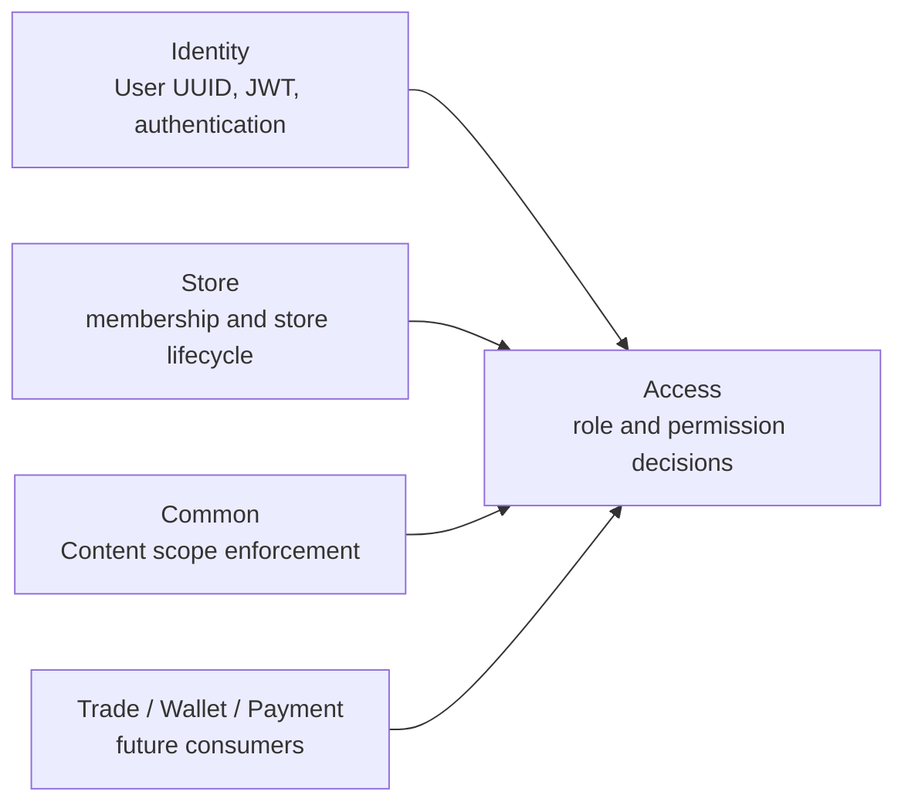

# Access Bundle Design

> **Status: approved design, not implemented.** The Access bundle (`src/Access/`) is
> the authorization boundary for the modular monolith. Identity remains responsible
> for authentication and user identity. This document is the implementation contract
> for RBAC, scoped data access, and a deliberately limited field-level extension.

---

## 1. Decision Summary

### 1.1 Decision

Create an independent `Access` module rather than adding authorization tables and
logic to `Identity`.

```text
Identity: authenticate a principal
Access:   decide what an authenticated principal may do
Store:    own store membership and operational facts
Business: own resources and enforce their data scope through Access
```

This preserves Identity as an authentication module (User, password, JWT, refresh
tokens, OTP, WeChat login) and prevents it from depending on every business module's
resources and actions.

### 1.2 Goals

- Replace the global `ROLE_ADMIN`-only authorization model incrementally with
  permission codes in the form `module:resource:action`.
- Assign roles globally or in a Store scope without cross-module foreign keys.
- Centralize permission decisions in a Symfony Voter and `AccessServiceInterface`.
- Provide reusable scope and field filtering hooks so controllers do not duplicate
  authorization business logic.
- Keep `Store\Entity\Membership` as the authoritative Store membership record; Store
  combines that membership check with Access authorization.
- Preserve existing `User.roles` and `ROLE_ADMIN` behavior during migration.
- Record authorization administration changes in an append-only audit log.

### 1.3 Non-Goals

The first implementation MUST NOT:

- Replace authentication, JWT signing, refresh token rotation, or the Identity user
  UUID contract.
- Move Store membership rows into Access or make Access the owner of Store roles.
- Introduce a generic policy language, Casbin, OPA, or user-authored expressions.
- Turn every field into a permission code such as `common:content:metadata:update`.
- Add foreign keys to `users`, `store`, Trade, Payment, Wallet, or other module
  tables.
- Require a distributed transaction or make broker delivery a precondition for
  authorization.

ABAC-style conditions are an explicit future extension. The first release is scoped
RBAC plus role-defined field allow-lists.

---

## 2. Audit Of The Current State

### 2.1 Authentication Is Mature; Authorization Is Coarse

`Identity\Entity\User` persists a JSON `roles` array and always exposes
`ROLE_USER`. `config/packages/security.yaml` defines only this hierarchy:

```yaml
ROLE_ADMIN: [ROLE_USER]
```

The API firewall authenticates `/api` through `JwtAuthenticator`. `TokenManager`
signs a JWT containing the current roles, but the authenticator reloads the User by
the JWT subject and does not make resource-level authorization decisions.

`security.yaml` currently protects every `/api/v1/manage` route with `ROLE_ADMIN`.
Most Manage controllers duplicate this with a class-level
`#[IsGranted('ROLE_ADMIN')]`. This is safe as a coarse platform-administrator gate,
but cannot express module, action, Store, row, or field scope.

### 2.2 Existing Row-Scoping Hooks Are Valuable

The Core view mixins already pass every list, detail, update, and delete lookup
through controller filters:

```text
commonFilter() -> mixIdToCommonFilter() -> service.get()/list()
deletionFilter() -> service.get() -> service.remove()
```

Controllers use these hooks for ownership filters such as `['user' => $user]` and
the deny-all sentinel `['id' => -1]`. QueryBuilder filters are available for more
complex predicates. Access MUST use these existing enforcement points; it MUST NOT
bypass `BaseService` or query a repository directly from a controller.

### 2.3 Store Has A Separate, Correct Domain Boundary

`Store\Entity\Membership` stores an active/suspended/revoked membership for a local
Store plus a scalar `userUuid`. It has roles `owner`, `manager`, `clerk`, and
`fulfillment`. `MembershipService::isAuthorized()` is currently called directly by
the Store Staff controller for each action.

This is a valid Store-domain authorization implementation, but it has two limits:

- The authorization code and allowed Store roles are repeated in controller methods.
- Other modules cannot consistently reuse a Store-scoped capability without knowing
  Store membership details.

Store keeps membership checks in `MembershipServiceInterface`. Store Staff controllers
will compose that check with `AccessServiceInterface` through a Store-owned helper.
Access therefore has no dependency on Store and cannot form a Store <-> Access module
cycle. It neither modifies the membership schema nor duplicates the membership
lifecycle.

### 2.4 Content Is A Proposed Pilot, Not An Existing Store Resource

`Common\Entity\Content` currently has `id`, `title`, `body`, Category, Tags, and
timestamps. It does **not** have `storeUuid` or `metadata`. The existing App Content
endpoint is readable by ordinary authenticated API users through the default firewall;
the Manage Content controller is `ROLE_ADMIN` CRUD.

Therefore, Store-scoped Content requires a separate Common migration and explicit
controller changes. It cannot be enabled merely by adding Access records.

### 2.5 Constraints Discovered During Audit

- `BaseService` captures the current security token's User in its constructor. New
  authorization code MUST obtain the current user at request time where a long-lived
  service could otherwise retain stale request state.
- Dynamic query privileges (`@dql`, `@sort`, `@hints`) currently check literal
  `ROLE_ADMIN`. They are outside the first Access migration and remain platform-admin
  only until a dedicated Core contract replaces this check.
- The generic Create/Update mixins run static accepted-property filtering before
  `processCreateContent()` and `processUpdateContent()`. Dynamic field permissions
  belong in those hooks after the static schema allow-list has removed unknown fields.
- `@filter`, `@select`, and `@display` are user query features, not authorization
  policies. They MUST NOT be used to store or evaluate administrator-defined Access
  rules.

---

## 3. Architectural Boundary

### 3.1 Dependency Direction



The arrows denote service-interface dependencies only. Access stores Identity and
Store references as UUID strings. It MUST NOT import Store entities, repositories, or
services. Business modules consume `AccessServiceInterface`; they MUST NOT import
Access repositories or entities.

### 3.2 Responsibility Matrix

| Concern | Owner | Access responsibility |
|---|---|---|
| User identity, credentials, roles JSON, JWT | Identity | Read User UUID and invalidate authorization sessions when needed |
| Platform-break-glass administrator | Identity `ROLE_ADMIN` | Recognize as an unconditional compatibility override |
| Store membership lifecycle | Store | Require active membership before its Store-scoped Access decision |
| Permission catalogue and role grants | Access | Authoritative |
| Global/store role assignment | Access | Authoritative |
| Resource ownership and lifecycle | Business module | Supply scope attribute and enforce returned filter |
| HTTP authorization decision | Access Voter | Authoritative for declared Access permissions |
| Field mutation allow-list | Access role grant + business controller schema limit | Return effective permitted fields |

### 3.3 Terminology

| Term | Meaning |
|---|---|
| Permission | A stable capability code, e.g. `common:content:update` |
| Role | Named set of permissions and optional field grants |
| Assignment | A role granted to one Identity user UUID, globally or for one scope |
| Scope | Boundary where a grant applies: `global` or `store` in the first release |
| Resource scope | Scope owned by the target record, e.g. `Content.storeUuid` |
| Field grant | Role-defined allowed fields for one resource action; it narrows an action permission |
| Platform override | Existing `ROLE_ADMIN`; unrestricted during migration |

---

## 4. Permission Model

### 4.1 Permission Codes

All codes use lowercase ASCII segments:

```text
{module}:{resource}:{action}
```

Examples:

```text
access:role:manage
access:assignment:manage
common:content:read
common:content:create
common:content:update
common:content:delete
store:order:read
store:order:accept
store:order:reject
store:order:fulfill
wallet:voucher:manual
```

`*:*` and wildcard matching are NOT persisted permission codes. The compatibility
override for `ROLE_ADMIN` is implemented in the Access decision service, not as a
database record. System roles may contain every seeded concrete permission.

### 4.2 RBAC Decision Rules

For a requested permission `P`, authenticated user `U`, and optional Store UUID `S`:

1. An anonymous principal is denied.
2. A User with `ROLE_ADMIN` is allowed. This is temporary compatibility behavior and
   is also the break-glass operational path.
3. A global active Assignment to a Role containing `P` is allowed.
4. If `S` is present, an active Assignment scoped to `S` whose Role contains `P` is
   allowed.
5. Otherwise the request is denied.

For a Store operation, Store's `StoreAccessService` first requires active membership
using `MembershipServiceInterface`, then calls Access for the scoped permission. An
Access assignment alone must never create Store membership.

An allow in one Store MUST NOT grant access in another Store. A global content editor
may be introduced later as an explicit global role; it is not inferred from a
Store-scoped editor assignment.

### 4.3 Role Scope Compatibility

Roles declare their maximum scope:

| Role scope | Permitted assignment scopes |
|---|---|
| `global` | `global` only |
| `store` | `store` only |

The service rejects a mismatched role/assignment scope. A role is not silently
promoted from Store to global scope.

### 4.4 Field-Level Authorization

Field access is an extension of a successful action decision, not a replacement for
it. For example, both roles below need `common:content:update`:

| Role | Scope | Effective Content update fields |
|---|---|---|
| `store_content_editor` | Store | `title`, `body`, `category`, `tags` |
| `store_content_metadata_editor` | Store | `title`, `body`, `category`, `tags`, `metadata` |

The effective fields are the union of matching active role grants for the request's
scope, then intersected with the controller's static schema allow-list. Unknown or
server-owned fields such as `id`, `storeUuid`, ownership, status, and timestamps are
never made writable by an Access grant.

The first release uses **strict denial**: if a request includes any accepted schema
field that is outside its effective field grant, the API returns `403` and performs
no mutation. Silently stripping input is forbidden because it creates a successful
response with an unexpected partial write.

Roles with an action permission but no `RoleFieldGrant` receive no client-writable
fields for that action. This fail-closed rule prevents a newly added entity field from
becoming writable accidentally.

---

## 5. Persistence Model

### 5.1 Tables

Access owns six tables. All timestamps are UTC `datetime_immutable` values.

| Table | Purpose |
|---|---|
| `access_permission` | Stable permission catalogue |
| `access_role` | Named global or Store-scoped role |
| `access_role_permission` | Role to permission join |
| `access_assignment` | User UUID to role grant in a scope |
| `access_role_field_grant` | Field allow-list for a role/resource/action |
| `access_audit_log` | Append-only authorization administration audit |

### 5.2 Permission

```text
access_permission
  id              int PK
  code            varchar(120) UNIQUE NOT NULL
  module          varchar(60) NOT NULL
  resource        varchar(60) NOT NULL
  action          varchar(60) NOT NULL
  name            varchar(120) NOT NULL
  description     text NULL
  isSystem        boolean NOT NULL DEFAULT false
  createdAt       datetime_immutable NOT NULL
  updatedAt       datetime_immutable NULL
```

The unique code is immutable once used in an assignment graph. Permission removal is
not a normal CRUD delete: system permissions may be disabled only after no role grants
them, and code changes require a migration plus a new code.

### 5.3 Role And Permission Join

```text
access_role
  id              int PK
  uuid            varchar(36) UNIQUE NOT NULL
  code            varchar(80) UNIQUE NOT NULL
  name            varchar(120) NOT NULL
  scopeType       varchar(20) NOT NULL  # global | store
  isSystem        boolean NOT NULL DEFAULT false
  createdAt       datetime_immutable NOT NULL
  updatedAt       datetime_immutable NULL

access_role_permission
  role_id         int NOT NULL FK access_role(id) ON DELETE CASCADE
  permission_id   int NOT NULL FK access_permission(id) ON DELETE RESTRICT
  PRIMARY KEY (role_id, permission_id)
```

`access_role_permission` is Access-local and may use foreign keys. System roles and
permissions cannot be modified or deleted through normal Manage CRUD; only a versioned
seed command may reconcile them.

### 5.4 Assignment

```text
access_assignment
  id              int PK
  uuid            varchar(36) UNIQUE NOT NULL
  user_uuid       varchar(36) NOT NULL
  role_id         int NOT NULL FK access_role(id) ON DELETE RESTRICT
  scope_type      varchar(20) NOT NULL  # global | store
  scope_uuid      varchar(36) NULL
  granted_by_uuid varchar(36) NULL
  createdAt       datetime_immutable NOT NULL
  revokedAt       datetime_immutable NULL
```

Indexes and constraints:

- Unique active grant is enforced by service logic plus a database uniqueness strategy
  appropriate to MySQL, PostgreSQL, and SQLite. A portable first implementation uses
  `UNIQUE(user_uuid, role_id, scope_type, scope_uuid)` and reactivates a revoked row
  rather than inserting a duplicate.
- Index `(user_uuid, revoked_at)` supports effective-permission lookup.
- Index `(scope_type, scope_uuid, revoked_at)` supports Store scope lookups.
- `scope_type=global` requires `scope_uuid IS NULL`; `scope_type=store` requires a
  canonical Store UUID. Doctrine validation enforces this in all database engines;
  the migration adds a CHECK constraint where supported.
- There is intentionally no FK to `users` or `store`. User and Store UUIDs are stable
  cross-module scalar references.

Assignments are revoked, never hard-deleted, to retain the authorization history.

### 5.5 Role Field Grant

```text
access_role_field_grant
  id              int PK
  role_id         int NOT NULL FK access_role(id) ON DELETE CASCADE
  resource        varchar(80) NOT NULL       # common:content
  action          varchar(60) NOT NULL       # create | update
  fields          json NOT NULL               # ordered unique field names
  createdAt       datetime_immutable NOT NULL
  updatedAt       datetime_immutable NULL
  UNIQUE(role_id, resource, action)
```

JSON is intentional here: a grant is one auditable policy object and fields are always
read as a complete set. A separate row per field would complicate writes without
improving query behavior. The service validates field names against the registered
resource schema before persistence; it does not accept arbitrary strings.

### 5.6 Audit Log

```text
access_audit_log
  id              bigint PK
  actor_uuid      varchar(36) NULL
  action          varchar(120) NOT NULL
  target_type     varchar(80) NOT NULL
  target_uuid     varchar(36) NULL
  before_data     json NULL
  after_data      json NULL
  request_id      varchar(64) NULL
  createdAt       datetime_immutable NOT NULL
```

`action` includes `role.created`, `role.permissions.replaced`,
`assignment.granted`, `assignment.revoked`, and `field_grant.replaced`. Audit records
MUST be written in the same local transaction as the management mutation. They contain
UUIDs and permission codes only, never secrets, JWTs, passwords, addresses, or full
request bodies.

---

## 6. Module Structure And Public Contracts

```text
src/Access/
|-- Controller/
|   |-- App/MyAccessController.php
|   `-- Manage/{Permission,Role,Assignment,AuditLog}Controller.php
|-- Entity/{Permission,Role,Assignment,RoleFieldGrant,AuditLog}.php
|-- Repository/{Permission,Role,Assignment,RoleFieldGrant,AuditLog}Repository.php
|-- Security/AccessVoter.php
|-- Service/
|   |-- AccessService.php / AccessServiceInterface.php
|   |-- FieldAccessService.php / FieldAccessServiceInterface.php
|   |-- AccessResourceRegistry.php
|   `-- AccessAuditService.php
|-- Command/SeedPermissionsCommand.php
`-- Resources/config/services_access.yaml
```

`AccessServiceInterface` is the only authorization contract exported to other
business modules. It evaluates Access-owned assignment data only. It provides methods
equivalent to:

```php
can(User $user, string $permission, ?AccessScope $scope = null): bool;
require(User $user, string $permission, ?AccessScope $scope = null): void;
allowedStoreUuids(User $user, string $permission): list<string>;
```

`FieldAccessServiceInterface` provides:

```php
filterWritableFields(
    User $user,
    string $resource,
    string $action,
    array $input,
    array $schemaFields,
    ?AccessScope $scope,
): array;
```

It throws an Access exception when the input contains an unauthorized accepted field.
Controllers translate this to the project's existing 403 response envelope.

`AccessResourceRegistry` is code-owned configuration, not administrator-editable
metadata. It maps an Access resource to valid writable schema fields:

```php
'common:content' => [
    'create' => ['title', 'body', 'category', 'tags', 'metadata'],
    'update' => ['title', 'body', 'category', 'tags', 'metadata'],
]
```

It prevents a role administrator from granting a non-existent, sensitive, or
server-owned property merely by editing a JSON field grant.

---

## 7. Request Authorization Flow

### 7.1 Authentication And Voter Decision

```mermaid
sequenceDiagram
    participant C as Client
    participant J as JwtAuthenticator
    participant V as AccessVoter
    participant A as AccessService
    participant B as Business Controller

    C->>J: Bearer JWT + request
    J->>J: Verify RS256, expiry, revocation; load User
    J->>V: #[IsGranted('common:content:update', subject)]
    V->>A: can(user, permission, scope)
    A-->>V: allow or deny
    V-->>B: permitted request only
    B->>A: obtain allowed Store UUIDs / field filter
```

The Voter performs the Access-owned action-level gate. It must receive an explicit
`AccessScope` or a subject that implements a small `ScopedResourceInterface`; it MUST
NOT infer a Store from client body data. After this gate, Store endpoints call a
Store-owned `StoreAccessService` that checks active membership and obtains the
Access-derived data filter. The request cannot read or mutate a Store row without both
checks, while module dependency remains one-way: `Store -> Access`.

### 7.2 Data Scope Enforcement

Action authorization alone does not make a row writable. A controller serving a
Store-owned resource must constrain every lookup to permitted Store UUIDs:

```text
ROLE_ADMIN                    -> no Store predicate
0 permitted Store UUIDs       -> ['id' => -1]
1 permitted Store UUID        -> ['storeUuid' => uuid]
multiple permitted Store UUID -> QueryBuilder WHERE entity.storeUuid IN (:storeUuids)
```

The QueryBuilder must be created from the resource's service so it composes with the
existing mixin filter pipeline. The same scope filter applies to list, detail, update,
delete, and batch-update lookup bases. A mutation is allowed only when the row is
visible through that filter. Where disclosure is undesirable, an out-of-scope record
returns 404 rather than 403.

### 7.3 Safe Create Scope

Create routes include Store scope in the route, not in the request body:

```text
POST /api/v1/store/stores/{storeUuid}/contents
```

The controller requires `common:content:create` for `{storeUuid}` and sets
`Content.storeUuid` from the route only. `storeUuid` is absent from accepted client
properties. This prevents a client from selecting another Store by sending a different
JSON field.

### 7.4 Field Filtering

For create and update, the order is:

```text
static controller schema allow-list
  -> server-owned scope defaults
  -> FieldAccessService strict field validation
  -> processCreateContent/processUpdateContent
  -> service.update()
```

The Access field grant narrows the static controller schema; it never expands it.
Resource-specific validation stays in the business service/controller hook.

---

## 8. Content Pilot Contract

### 8.1 Required Common Migration

The pilot requires a Common-owned migration and entity change:

```text
common_content.store_uuid  varchar(36) NULL, indexed
common_content.metadata    json NULL
```

`store_uuid` is a scalar Store UUID and has no Store foreign key. `NULL` denotes a
platform/global Content record. Existing rows remain `NULL`; no historical Store
assignment is fabricated.

Content's static allowed fields become:

```text
create/update: title, body, category, tags, metadata
server only:    storeUuid, id, createdAt, updatedAt
```

### 8.2 API Shape

| Method | Path | Permission | Scope | Notes |
|---|---|---|---|---|
| GET | `/api/v1/app/contents` | `ROLE_USER` | none | Existing ordinary-user list; returns global and Store Content visible to all authenticated users |
| GET | `/api/v1/app/contents/{id}` | `ROLE_USER` | none | Existing ordinary-user detail |
| GET | `/api/v1/store/stores/{storeUuid}/contents` | `common:content:read` | Store | Staff work list, scope-filtered |
| POST | `/api/v1/store/stores/{storeUuid}/contents` | `common:content:create` | Store | Server writes `storeUuid` from route |
| PUT | `/api/v1/store/stores/{storeUuid}/contents/{id}` | `common:content:update` | Store + row | Scope filter prevents cross-Store write |
| DELETE | `/api/v1/store/stores/{storeUuid}/contents/{id}` | `common:content:delete` | Store + row | Same scope behavior |
| GET | `/api/v1/app/access/me` | authenticated | own user | Returns UI capability summary only |

The existing `/api/v1/manage/contents` endpoints remain platform administration and
remain protected by `ROLE_ADMIN` in Phase 1. A later migration may replace their
coarse role annotation with Access permissions after all administration routes have
an explicit capability mapping.

### 8.3 Example Decisions

```text
User A: store_content_editor at Store X
  PUT Store X Content -> title/body/category/tags allowed
  PUT Store X Content -> metadata denied (403)
  PUT Store Y Content -> 404 (out of scope)

User B: store_content_metadata_editor at Store X
  PUT Store X Content -> title/body/category/tags/metadata allowed

User C: no assignment
  GET ordinary-user Content -> allowed
  POST Store X Content -> 403

Platform administrator (ROLE_ADMIN)
  Manage Content and Store Content -> allowed during compatibility period
```

### 8.4 My Access Response

The self-service endpoint is informational only. The server remains authoritative.

```json
{
  "data": {
    "permissions": ["common:content:create", "common:content:update"],
    "storeScopes": {
      "common:content:update": ["a5dc7f1a-52f4-4f6c-b10f-5bfe667b5e55"]
    },
    "fieldGrants": {
      "common:content:update": ["title", "body", "category", "tags"]
    }
  },
  "code": 0,
  "message": "SUCCESS"
}
```

This response is for UI navigation and form rendering. Clients must not treat it as a
security token or rely on it to authorize a request.

---

## 9. Management APIs And Seed Data

### 9.1 Management Endpoints

All Access management endpoints remain `ROLE_ADMIN` during Phase 1. They are
break-glass administration APIs and must not be delegated through the roles they
manage.

| Method | Path | Purpose |
|---|---|---|
| GET | `/api/v1/manage/access/permissions` | List catalogue |
| GET | `/api/v1/manage/access/roles` | List roles |
| POST | `/api/v1/manage/access/roles` | Create non-system role |
| PUT | `/api/v1/manage/access/roles/{uuid}` | Rename/update non-system role |
| POST | `/api/v1/manage/access/roles/{uuid}/permissions` | Replace concrete role permissions |
| PUT | `/api/v1/manage/access/roles/{uuid}/field-grants/{resource}/{action}` | Replace a role field grant |
| GET | `/api/v1/manage/access/assignments` | Search current/revoked grants |
| POST | `/api/v1/manage/access/assignments` | Grant or reactivate a role |
| DELETE | `/api/v1/manage/access/assignments/{uuid}` | Revoke assignment; no hard delete |
| GET | `/api/v1/manage/access/audit` | Paginated immutable audit history |

Permission catalogue rows are seeded, not created by normal HTTP CRUD. This prevents
an administrator from creating names that are not implemented by any endpoint.

### 9.2 Seed Command

`app:access:seed` is idempotent and source-controlled. It creates missing system
permissions, system roles, their joins, and the Content pilot roles. It never removes
or widens existing grants automatically. It reports changed records and exits nonzero
on an incompatible system-role definition.

Initial system roles:

| Role | Scope | Purpose |
|---|---|---|
| `store_content_editor` | Store | Content read/create/update/delete without metadata mutation |
| `store_content_metadata_editor` | Store | Store Content editor with metadata field grant |
| `access_administrator` | Global | Reserved future Access administration role; not used to replace Phase 1 `ROLE_ADMIN` |

---

## 10. JWT, Caching, And Revocation

### 10.1 First Release Decision

Authorization is resolved server-side from Access tables and cache. JWTs continue to
contain Identity claims (`sub`, username, email, roles, time claims, JTI, issuer) only.
Permissions and Store scopes are **not** added to JWT in Phase 1.

This makes assignment revocation effective after Access-cache invalidation without
waiting for a 7200-second access-token expiry, and avoids large tokens for users with
many Store assignments.

### 10.2 Cache Contract

Cache key:

```text
access:effective:{userUuid}
```

Cached value contains only effective permission codes, Store scope UUIDs, field grants,
and a version/timestamp. The cache TTL is short (five minutes by default) as a fallback;
every mutation to Role permissions, field grants, or Assignments evicts the affected
users' keys in the same request after transaction commit.

Changing a role's grants must invalidate every active Assignment for that role. The
repository queries affected user UUIDs before commit and the invalidator clears keys
after successful commit. Failed transactions must not evict a cache entry for a change
that did not persist.

### 10.3 High-Risk Revocation

Revoking an Assignment removes permissions on the next request after cache eviction.
It does not require revoking Identity refresh tokens because the JWT carries no Access
permissions. Store membership revocation is independently effective because Store
checks it on every Store operation. If a future version embeds permissions in JWT
claims, it MUST additionally revoke active access and refresh tokens or introduce an
authorization version claim.

---

## 11. Failure Handling And Security Rules

| Condition | Result |
|---|---|
| Missing/invalid JWT | Existing 401 authentication response |
| Authenticated but no action permission | 403 |
| Store route has no active membership or assignment | 403 for create; 404 for existing out-of-scope records |
| Scope UUID is malformed or role/scope mismatch | 400 on management write |
| Requested field outside effective grant | 403; no partial write |
| Assignment already active | Idempotent return of existing assignment or 409; endpoint contract chooses one and tests it |
| Grant refers to unknown resource/field | 400; registry rejects it |
| Audit write fails | Entire authorization administration transaction rolls back |
| Cache failure | Fail closed for mutation-capable routes; read-only decisions may fall back to database only when explicitly tested |

Additional mandatory rules:

- Permission codes, role codes, Store UUIDs, and field names are validated as bounded
  ASCII strings; no user expression is evaluated.
- `ROLE_ADMIN` bypass is logged for sensitive Store/Access mutations.
- Access audit lists are admin-only and must not expose unnecessary user profile data.
- Store scope comes from a route parameter or a persisted target entity, never a client
  body field or `X-Store-Code` without trusted Store context resolution.
- Field grants cannot grant serialization visibility. Serializer groups/`#[Ignore]`
  remain responsible for sensitive read fields.

---

## 12. Implementation Phases

### Phase 1: Access Foundation And Content Pilot

1. Create Access migration, entities, repositories, services, Voter, cache invalidator,
   management APIs, self-service endpoint, and seed command.
2. Add the Access service configuration, route import, OpenAPI entries, translations,
   and MkDocs links.
3. Add Common migration for nullable `Content.storeUuid` and nullable `metadata`.
4. Add Store-scoped Content staff routes using the existing View mixins plus a reusable
   Access scope trait/service adapter.
5. Add static Content schema fields and strict `FieldAccessService` enforcement.
6. Preserve all existing Manage controller `ROLE_ADMIN` guards and existing User roles.

### Phase 2: Incremental Action Migration

1. Define each module's explicit permission catalogue in source code.
2. Replace class-wide `ROLE_ADMIN` annotations only where every route has a tested
   permission mapping.
3. Migrate direct Store Staff `MembershipService` action checks behind the Access Voter
   while retaining Membership as the Store fact source.
4. Add data-scope adapters for Store-owned resources one module at a time.
5. Replace wallet manual provider `ROLE_ADMIN` checks only after a dedicated
   `wallet:voucher:manual` migration and finance authorization review.

### Phase 3: Optional ABAC Policies

Only after scoped RBAC is stable, introduce a separate `access_policy` design if
business requirements need conditions such as time windows, order amounts, or content
status. It must use a restricted, code-reviewed expression context containing subject,
resource, scope, and environment attributes. It MUST NOT reuse client-provided
`@filter` expressions as policy records.

---

## 13. Testing Contract

### 13.1 Unit Tests

| Component | Required cases |
|---|---|
| `AccessVoter` | anonymous deny; ROLE_ADMIN override; global allow; Store allow; wrong Store deny; missing Membership deny |
| `AccessService` | active/revoked grants; role scope mismatch; union across roles; no cross-Store leakage |
| `FieldAccessService` | static schema intersection; basic vs metadata role; forbidden field causes 403; unknown grant field rejected |
| `AccessResourceRegistry` | only code-owned resources/fields are accepted |
| Seed command | idempotent create; no automatic privilege widening/removal |
| Cache invalidator | assignment/role mutation evicts every affected user only after commit |

### 13.2 Integration Tests

| Scenario | Expected outcome |
|---|---|
| Create role, bind permission, grant Store scope | Effective decision succeeds only for that Store |
| Revoke assignment | Next request is denied after cache invalidation |
| Store membership revoked while assignment remains | Store action is denied |
| Content list/detail/update/delete at another Store | No record disclosure or mutation |
| Basic editor submits `metadata` | 403 and unchanged database row |
| Metadata editor submits `metadata` | 200 and field persists |
| Ordinary-user Content read | Unchanged legacy behavior |
| Access management mutation | Corresponding immutable audit record is written |

### 13.3 Regression And Static Analysis

- Run the default UnitTest + Integration suite and keep the 90% coverage gate.
- Add the Access migration to MySQL migration-chain validation.
- Exercise SQLite and PostgreSQL semantics for assignment uniqueness and nullable scope
  fields; do not rely on partial unique indexes unsupported by one target database.
- Run PHPStan Level 8 and Rector type-rule dry-run.
- Do not unskip documented tests unrelated to Access.

---

## 14. Acceptance Criteria

The Access foundation is complete when:

- [ ] Access is a standalone module and no Access entity has a foreign key to another
  business module.
- [ ] Permission, role, assignment, field grant, and audit records have the stated
  integrity constraints and lifecycle rules.
- [ ] Store-scoped decisions require both an Access grant and active Store membership.
- [ ] A controller can declare an action permission without duplicating permission
  lookup logic.
- [ ] Every Store-scoped lookup uses an Access-derived scope filter for list, detail,
  update, delete, and batch mutation paths.
- [ ] Store scope is server-derived from route/record, never accepted from JSON input.
- [ ] Field grants are strict, registry-validated, and cannot widen controller schema.
- [ ] Assignment and role changes invalidate effective-access cache and append audit
  records in their successful transaction.
- [ ] Existing `ROLE_ADMIN`, Identity authentication, and ordinary-user Content read behavior
  remain compatible throughout Phase 1.
- [ ] The Content pilot tests prove User A cannot update `metadata`, User B can, and
  neither can mutate another Store's Content.
