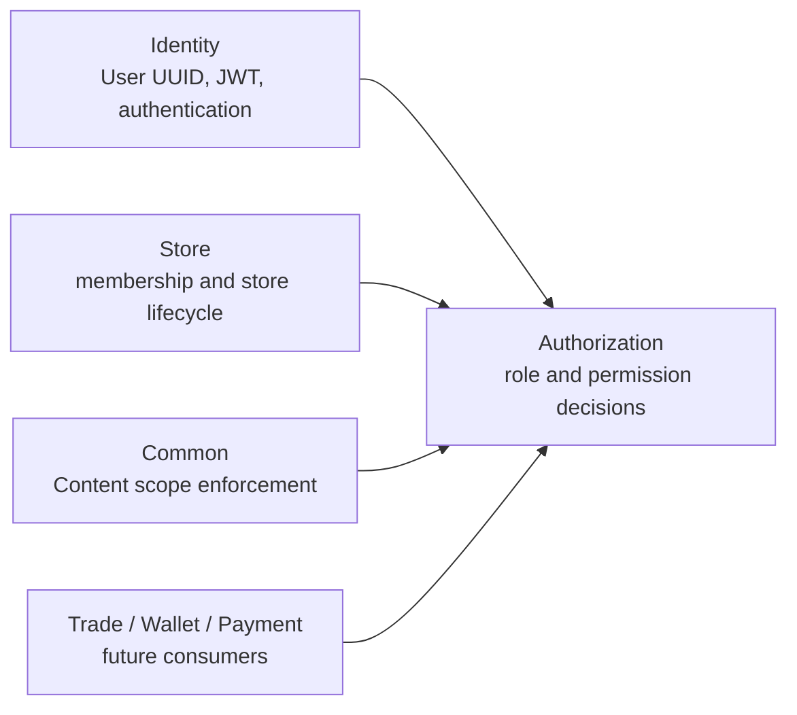

# Authorization Bundle Design

> **Status: Phase 1 implemented — foundation + Content pilot.** The Authorization bundle (`src/Authorization/`) is
> the authorization boundary for the modular monolith. Identity remains responsible
> for authentication and user identity. This document is the implementation contract
> for RBAC, scoped data access, and a deliberately limited field-level extension.

---

## 1. Decision Summary

### 1.1 Decision

Create an independent `Authorization` module rather than adding authorization tables and
logic to `Identity`.

```text
Identity: authenticate a principal
Authorization:   decide what an authenticated principal may do
Store:    own store membership and operational facts
Business: own resources and enforce their data scope through Authorization
```

This preserves Identity as an authentication module (User, password, JWT, refresh
tokens, OTP, WeChat login) and prevents it from depending on every business module's
resources and actions.

### 1.2 Goals

- Replace the global `ROLE_ADMIN`-only authorization model incrementally with
  permission codes in the form `module:resource:action`.
- Assign roles globally or in a Store scope without cross-module foreign keys.
- Centralize permission decisions in a Symfony Voter and `AuthorizationServiceInterface`.
- Provide reusable scope and field filtering hooks so controllers do not duplicate
  authorization business logic.
- Keep `Store\Entity\Membership` as the authoritative Store membership record; Store
  combines that membership check with Authorization authorization.
- Preserve existing `User.roles` and `ROLE_ADMIN` behavior during migration.
- Record authorization administration changes in an append-only audit log.

### 1.3 Non-Goals

The first implementation MUST NOT:

- Replace authentication, JWT signing, refresh token rotation, or the Identity user
  UUID contract.
- Move Store membership rows into Authorization or make Authorization the owner of Store roles.
- Introduce a generic policy language, Casbin, OPA, or user-authored expressions.
- Turn every field into a permission code such as `common:content:metadata:update`.
- Add foreign keys to `users`, `store`, Trade, Payment, Wallet, or other module
  tables.
- Require a distributed transaction or make broker delivery a precondition for
  authorization.

ABAC-style conditions are an explicit future extension. The first release is scoped
RBAC plus role-defined field allow-lists.

---

## 2. Audit Of The Current State

### 2.1 Authentication Is Mature; Authorization Is Coarse

`Identity\Entity\User` persists a JSON `roles` array and always exposes
`ROLE_USER`. `config/packages/security.yaml` defines only this hierarchy:

```yaml
ROLE_ADMIN: [ROLE_USER]
```

The API firewall authenticates `/api` through `JwtAuthenticator`. `TokenManager`
signs a JWT containing the current roles, but the authenticator reloads the User by
the JWT subject and does not make resource-level authorization decisions.

`security.yaml` currently protects every `/api/v1/manage` route with `ROLE_ADMIN`.
Most Manage controllers duplicate this with a class-level
`#[IsGranted('ROLE_ADMIN')]`. This is safe as a coarse platform-administrator gate,
but cannot express module, action, Store, row, or field scope.

### 2.2 Existing Row-Scoping Hooks Are Valuable

The Core view mixins already pass every list, detail, update, and delete lookup
through controller filters:

```text
commonFilter() -> mixIdToCommonFilter() -> service.get()/list()
deletionFilter() -> service.get() -> service.remove()
```

Controllers use these hooks for ownership filters such as `['user' => $user]` and
the deny-all sentinel `['id' => -1]`. QueryBuilder filters are available for more
complex predicates. Authorization MUST use these existing enforcement points; it MUST NOT
bypass `BaseService` or query a repository directly from a controller.

### 2.3 Store Has A Separate, Correct Domain Boundary

`Store\Entity\Membership` stores an active/suspended/revoked membership for a local
Store plus a scalar `userUuid`. It has roles `owner`, `manager`, `clerk`, and
`fulfillment`. `MembershipService::isAuthorized()` is currently called directly by
the Store Staff controller for each action.

This is a valid Store-domain authorization implementation, but it has two limits:

- The authorization code and allowed Store roles are repeated in controller methods.
- Other modules cannot consistently reuse a Store-scoped capability without knowing
  Store membership details.

Store keeps membership checks in `MembershipServiceInterface`. Store Staff controllers
will compose that check with `AuthorizationServiceInterface` through a Store-owned helper.
Authorization therefore has no dependency on Store and cannot form a Store <-> Authorization module
cycle. It neither modifies the membership schema nor duplicates the membership
lifecycle.

### 2.4 Content Is The Field-Level Pilot

`Common\Entity\Content` has `id`, `title`, `body`, Category, Tags, `metadata` (nullable JSON), and
timestamps. It does **not** have `storeUuid` — Store association is not part of the Content model. The existing App Content
endpoint is readable by ordinary authenticated API users; the Manage Content controller is `ROLE_ADMIN` CRUD and now
accepts `metadata` as a whitelisted field to demonstrate strict field-grant enforcement.

Field-level Authorization for Content is provided by `common:content` `create`/`update` field grants (`metadata` vs non-`metadata` roles). Store-scoped Content routes (`/store/stores/{storeUuid}/contents`) do **not** exist in this phase; Store scope is still used for other resources (e.g. `store:order:*`) but Content is scoped only by the field grant, not by Store row scope.

### 2.5 Constraints Discovered During Audit

- `BaseService` captures the current security token's User in its constructor. New
  authorization code MUST obtain the current user at request time where a long-lived
  service could otherwise retain stale request state.
- Dynamic query privileges (`@dql`, `@sort`, `@hints`) currently check literal
  `ROLE_ADMIN`. They are outside the first Authorization migration and remain platform-admin
  only until a dedicated Core contract replaces this check.
- The generic Create/Update mixins run static accepted-property filtering before
  `processCreateContent()` and `processUpdateContent()`. Dynamic field permissions
  belong in those hooks after the static schema allow-list has removed unknown fields.
- `@filter`, `@select`, and `@display` are user query features, not authorization
  policies. They MUST NOT be used to store or evaluate administrator-defined Authorization
  rules.

---

## 3. Architectural Boundary

### 3.1 Dependency Direction



The arrows denote service-interface dependencies only. Authorization stores Identity and
Store references as UUID strings. It MUST NOT import Store entities, repositories, or
services. Business modules consume `AuthorizationServiceInterface`; they MUST NOT import
Authorization repositories or entities.

### 3.2 Responsibility Matrix

| Concern | Owner | Authorization responsibility |
|---|---|---|
| User identity, credentials, roles JSON, JWT | Identity | Read User UUID and invalidate authorization sessions when needed |
| Platform-break-glass administrator | Identity `ROLE_ADMIN` | Recognize as an unconditional compatibility override |
| Store membership lifecycle | Store | Require active membership before its Store-scoped Authorization decision |
| Permission catalogue and role grants | Authorization | Authoritative |
| Global/store role assignment | Authorization | Authoritative |
| Resource ownership and lifecycle | Business module | Supply scope attribute and enforce returned filter |
| HTTP authorization decision | Authorization Voter | Authoritative for declared Authorization permissions |
| Field mutation allow-list | Authorization role grant + business controller schema limit | Return effective permitted fields |

### 3.3 Terminology

| Term | Meaning |
|---|---|
| Permission | A stable capability code, e.g. `common:content:update` |
| Role | Named set of permissions and optional field grants |
| Assignment | A role granted to one Identity user UUID, globally or for one scope |
| Scope | Boundary where a grant applies: `global` or `store` in the first release |
| Resource scope | Scope owned by the target record, e.g. `Content.storeUuid` |
| Field grant | Role-defined allowed fields for one resource action; it narrows an action permission |
| Platform override | Existing `ROLE_ADMIN`; unrestricted during migration |

---

## 4. Permission Model

### 4.1 Permission Codes

All codes use lowercase ASCII segments:

```text
{module}:{resource}:{action}
```

Examples:

```text
authorization:role:manage
authorization:assignment:manage
common:content:read
common:content:create
common:content:update
common:content:delete
store:order:read
store:order:accept
store:order:reject
store:order:fulfill
wallet:voucher:manual
```

`*:*` and wildcard matching are NOT persisted permission codes. The compatibility
override for `ROLE_ADMIN` is implemented in the Authorization decision service, not as a
database record. System roles may contain every seeded concrete permission.

### 4.2 RBAC Decision Rules

For a requested permission `P`, authenticated user `U`, and optional Store UUID `S`:

1. An anonymous principal is denied.
2. A User with `ROLE_ADMIN` is allowed. This is temporary compatibility behavior and
   is also the break-glass operational path.
3. A global active Assignment to a Role containing `P` is allowed.
4. If `S` is present, an active Assignment scoped to `S` whose Role contains `P` is
   allowed.
5. Otherwise the request is denied.

For a Store operation, Store's `StoreAuthorizationService` first requires active membership
using `MembershipServiceInterface`, then calls Authorization for the scoped permission. An
Authorization assignment alone must never create Store membership.

An allow in one Store MUST NOT grant access in another Store. A global content editor
may be introduced later as an explicit global role; it is not inferred from a
Store-scoped editor assignment.

### 4.3 Role Scope Compatibility

Roles declare their maximum scope:

| Role scope | Permitted assignment scopes |
|---|---|
| `global` | `global` only |
| `store` | `store` only |

The service rejects a mismatched role/assignment scope. A role is not silently
promoted from Store to global scope.

### 4.4 Field-Level Authorization

Field access is an extension of a successful action decision, not a replacement for
it. For example, both roles below need `common:content:update`:

| Role | Scope | Effective Content update fields |
|---|---|---|
| `store_content_editor` | Store | `title`, `body`, `category`, `tags` |
| `store_content_metadata_editor` | Store | `title`, `body`, `category`, `tags`, `metadata` |

The effective fields are the union of matching active role grants for the request's
scope, then intersected with the controller's static schema allow-list. Unknown or
server-owned fields such as `id`, ownership, status, and timestamps are
never made writable by an Authorization grant.

The first release uses **strict denial**: if a request includes any accepted schema
field that is outside its effective field grant, the API returns `403` and performs
no mutation. Silently stripping input is forbidden because it creates a successful
response with an unexpected partial write.

Roles with an action permission but no `RoleFieldGrant` receive no client-writable
fields for that action. This fail-closed rule prevents a newly added entity field from
becoming writable accidentally.

---

## 5. Persistence Model

### 5.1 Tables

Authorization owns six tables. All timestamps are UTC `datetime_immutable` values.

| Table | Purpose |
|---|---|
| `authorization_permission` | Stable permission catalogue |
| `authorization_role` | Named global or Store-scoped role |
| `authorization_role_permission` | Role to permission join |
| `authorization_assignment` | User UUID to role grant in a scope |
| `authorization_role_field_grant` | Field allow-list for a role/resource/action |
| `authorization_audit_log` | Append-only authorization administration audit |

### 5.2 Permission

```text
authorization_permission
  id              int PK
  code            varchar(120) UNIQUE NOT NULL
  module          varchar(60) NOT NULL
  resource        varchar(60) NOT NULL
  action          varchar(60) NOT NULL
  name            varchar(120) NOT NULL
  description     text NULL
  isSystem        boolean NOT NULL DEFAULT false
  createdAt       datetime_immutable NOT NULL
  updatedAt       datetime_immutable NULL
```

The unique code is immutable once used in an assignment graph. Permission removal is
not a normal CRUD delete: system permissions may be disabled only after no role grants
them, and code changes require a migration plus a new code.

### 5.3 Role And Permission Join

```text
authorization_role
  id              int PK
  uuid            varchar(36) UNIQUE NOT NULL
  code            varchar(80) UNIQUE NOT NULL
  name            varchar(120) NOT NULL
  scopeType       varchar(20) NOT NULL  # global | store
  isSystem        boolean NOT NULL DEFAULT false
  createdAt       datetime_immutable NOT NULL
  updatedAt       datetime_immutable NULL

authorization_role_permission
  role_id         int NOT NULL FK authorization_role(id) ON DELETE CASCADE
  permission_id   int NOT NULL FK authorization_permission(id) ON DELETE RESTRICT
  PRIMARY KEY (role_id, permission_id)
```

`authorization_role_permission` is Authorization-local and may use foreign keys. System roles and
permissions cannot be modified or deleted through normal Manage CRUD; only a versioned
seed command may reconcile them.

### 5.4 Assignment

```text
authorization_assignment
  id              int PK
  uuid            varchar(36) UNIQUE NOT NULL
  user_uuid       varchar(36) NOT NULL
  role_id         int NOT NULL FK authorization_role(id) ON DELETE RESTRICT
  scope_type      varchar(20) NOT NULL  # global | store
  scope_uuid      varchar(36) NULL      # normalized; NULL remains readable
  scope_key       varchar(36) NOT NULL  # '' for global, Store UUID for store — portable UNIQUE key
  granted_by_uuid varchar(36) NULL
  createdAt       datetime_immutable NOT NULL
  revokedAt       datetime_immutable NULL
```

Indexes and constraints:

- Portable uniqueness: `UNIQUE(user_uuid, role_id, scope_type, scope_key)` where `scope_key` is `COALESCE(scope_uuid,'')`. This preserves revoked-row reactivation without relying on `NULL` semantics in `UNIQUE` (MySQL/PostgreSQL/SQLite allow duplicate `NULL`). Doctrine validates `global→scope_uuid IS NULL` / `store→valid UUID` at the application layer.
- Index `(user_uuid, revoked_at)` supports effective-permission lookup.
- Index `(scope_type, scope_uuid, revoked_at)` supports Store scope lookups.
- `scope_type=global` requires `scope_uuid IS NULL`; `scope_type=store` requires a
  canonical Store UUID. Doctrine validation enforces this in all database engines;
  the migration adds a CHECK constraint where supported.
- There is intentionally no FK to `users` or `store`. User and Store UUIDs are stable
  cross-module scalar references.

Assignments are revoked, never hard-deleted, to retain the authorization history.

### 5.5 Role Field Grant

```text
authorization_role_field_grant
  id              int PK
  role_id         int NOT NULL FK authorization_role(id) ON DELETE CASCADE
  resource        varchar(80) NOT NULL       # common:content
  action          varchar(60) NOT NULL       # create | update
  fields          json NOT NULL               # ordered unique field names
  createdAt       datetime_immutable NOT NULL
  updatedAt       datetime_immutable NULL
  UNIQUE(role_id, resource, action)
```

JSON is intentional here: a grant is one auditable policy object and fields are always
read as a complete set. A separate row per field would complicate writes without
improving query behavior. The service validates field names against the registered
resource schema before persistence; it does not accept arbitrary strings.

### 5.6 Audit Log

```text
authorization_audit_log
  id              bigint PK
  actor_uuid      varchar(36) NULL
  action          varchar(120) NOT NULL
  target_type     varchar(80) NOT NULL
  target_uuid     varchar(36) NULL
  before_data     json NULL
  after_data      json NULL
  request_id      varchar(64) NULL
  createdAt       datetime_immutable NOT NULL
```

`action` includes `role.created`, `role.permissions.replaced`,
`assignment.granted`, `assignment.revoked`, and `field_grant.replaced`. Audit records
MUST be written in the same local transaction as the management mutation. They contain
UUIDs and permission codes only, never secrets, JWTs, passwords, addresses, or full
request bodies.

---

## 6. Module Structure And Public Contracts

```text
src/Authorization/
|-- Controller/
|   |-- App/MyAuthorizationController.php
|   `-- Manage/{Permission,Role,Assignment,AuditLog}Controller.php  # Assignment: List/Detail/Create/Update/Delete via ApiView mixins
|-- Entity/{Permission,Role,Assignment,RoleFieldGrant,AuditLog}.php
|-- Repository/{Permission,Role,Assignment,RoleFieldGrant,AuditLog}Repository.php
|-- Security/AuthorizationVoter.php
|-- Service/
|   |-- AuthorizationService.php / AuthorizationServiceInterface.php
|   |-- FieldAuthorizationService.php / FieldAuthorizationServiceInterface.php
|   |-- AuthorizationResourceRegistry.php
|   |-- AuthorizationAuditService.php / AuthorizationCacheInvalidator.php
|   |-- AuthorizationScope.php / ScopedResourceInterface.php
|   `-- {Permission,Role,Assignment,AuditLog}Service.php
|-- Command/SeedAuthorizationCommand.php   # app:authorization:seed (idempotent, registry-validated)
`-- Resources/config/services_authorization.yaml
```

`AuthorizationServiceInterface` is the only authorization contract exported to other
business modules. It evaluates Authorization-owned assignment data only. It provides methods
equivalent to:

```php
can(User $user, string $permission, ?AuthorizationScope $scope = null): bool;
require(User $user, string $permission, ?AuthorizationScope $scope = null): void;
allowedStoreUuids(User $user, string $permission): list<string>;
```

`FieldAuthorizationServiceInterface` provides:

```php
filterWritableFields(
    User $user,
    string $resource,
    string $action,
    array $input,
    array $schemaFields,
    ?AuthorizationScope $scope,
): array;
```

It throws an Authorization exception when the input contains an unauthorized accepted field.
Controllers translate this to the project's existing 403 response envelope.

`AuthorizationResourceRegistry` is code-owned configuration, not administrator-editable
metadata. It maps an Authorization resource to valid writable schema fields:

```php
'common:content' => [
    'create' => ['title', 'body', 'category', 'tags', 'metadata'],
    'update' => ['title', 'body', 'category', 'tags', 'metadata'],
]
```

It prevents a role administrator from granting a non-existent, sensitive, or
server-owned property merely by editing a JSON field grant.

---

## 7. Request Authorization Flow

### 7.1 Authentication And Voter Decision

```mermaid
sequenceDiagram
    participant C as Client
    participant J as JwtAuthenticator
    participant V as AuthorizationVoter
    participant A as AuthorizationService
    participant B as Business Controller

    C->>J: Bearer JWT + request
    J->>J: Verify RS256, expiry, revocation; load User
    J->>V: #[IsGranted('common:content:update', subject)]
    V->>A: can(user, permission, scope)
    A-->>V: allow or deny
    V-->>B: permitted request only
    B->>A: obtain allowed Store UUIDs / field filter
```

The Voter performs the Authorization-owned action-level gate. It must receive an explicit
`AuthorizationScope` or a subject that implements a small `ScopedResourceInterface`; it MUST
NOT infer a Store from client body data. After this gate, Store endpoints call a
Store-owned `StoreAuthorizationService` that checks active membership and obtains the
Authorization-derived data filter. The request cannot read or mutate a Store row without both
checks, while module dependency remains one-way: `Store -> Authorization`.

### 7.2 Data Scope Enforcement

Action authorization alone does not make a row writable. A controller serving a
Store-owned resource must constrain every lookup to permitted Store UUIDs:

```text
ROLE_ADMIN                    -> no Store predicate
0 permitted Store UUIDs       -> ['id' => -1]
1 permitted Store UUID        -> ['storeUuid' => uuid]
multiple permitted Store UUID -> QueryBuilder WHERE entity.storeUuid IN (:storeUuids)
```

The QueryBuilder must be created from the resource's service so it composes with the
existing mixin filter pipeline. The same scope filter applies to list, detail, update,
delete, and batch-update lookup bases. A mutation is allowed only when the row is
visible through that filter. Where disclosure is undesirable, an out-of-scope record
returns 404 rather than 403.

### 7.3 Safe Create Scope (When Store-Scoped)

When a resource is Store-scoped, create routes include Store scope in the route, not in the request body:

```text
POST /api/v1/store/stores/{storeUuid}/orders
```

The controller requires the relevant permission (e.g. `store:order:create`) for `{storeUuid}` and sets
the Store association from the route only. The Store identifier is absent from accepted client
properties. This prevents a client from selecting another Store by sending a different
JSON field. Content is **not** Store-scoped in this phase (only `metadata` field-grant pilot).

### 7.4 Field Filtering

For create and update, the order is:

```text
static controller schema allow-list
  -> server-owned scope defaults
  -> FieldAuthorizationService strict field validation
  -> processCreateContent/processUpdateContent
  -> service.update()
```

The Authorization field grant narrows the static controller schema; it never expands it.
Resource-specific validation stays in the business service/controller hook.

---

## 8. Content Pilot Contract (Field-Grant Only)

### 8.1 Required Common Migration

The pilot requires a Common-owned migration and entity change:

```text
common_content.metadata    json NULL
```

No `store_uuid` column or Store foreign key is added. Content is not Store-scoped in this phase; `metadata` is the field used to demonstrate strict field-grant enforcement.

Content's static allowed fields become:

```text
create/update: title, body, category, tags, metadata
server only:    id, createdAt, updatedAt
```

### 8.2 API Shape

| Method | Path | Permission | Scope | Notes |
|---|---|---|---|---|
| GET | `/api/v1/app/contents` | `ROLE_USER` | none | Existing ordinary-user list |
| GET | `/api/v1/app/contents/{id}` | `ROLE_USER` | none | Existing ordinary-user detail |
| GET | `/api/v1/manage/contents` | `ROLE_ADMIN` | none | Admin CRUD (now accepts `metadata`) |
| POST | `/api/v1/manage/contents` | `ROLE_ADMIN` | none | Same; `metadata` whitelisted |
| PUT | `/api/v1/manage/contents/{id}` | `ROLE_ADMIN` | none | Same |
| GET | `/api/v1/app/authorization/me` | authenticated | own user | Returns UI capability summary only |

Field-level enforcement for `common:content` is validated via `FieldAuthorizationService` (union of `RoleFieldGrant` intersected with controller `accepted*Properties`, strict 403). The `store:order:*` permissions remain the example of Store-scoped decisions; Store Content routes (`/store/stores/{storeUuid}/contents`) are **not** implemented in this phase.

### 8.3 Example Decisions (Field-Level)

```text
User A: store_content_editor at Store X (has common:content:update, fields title/body/category/tags)
  PUT Content with title/body -> allowed
  PUT Content with metadata   -> 403 (field outside grant), no mutation

User B: store_content_metadata_editor at Store X (same permissions + metadata)
  PUT Content with metadata   -> allowed

User C: no assignment
  GET App Content             -> allowed (ordinary-user read)
  PUT Content                 -> 403 (missing common:content:update)

Platform administrator (ROLE_ADMIN)
  Manage Content              -> allowed during compatibility period (admin bypass)
```

### 8.4 My Authorization Response

The self-service endpoint is informational only. The server remains authoritative.

```json
{
  "data": {
    "permissions": ["common:content:create", "common:content:update"],
    "storeScopes": {
      "common:content:update": ["a5dc7f1a-52f4-4f6c-b10f-5bfe667b5e55"]
    },
    "fieldGrants": {
      "common:content:update": ["title", "body", "category", "tags"]
    }
  },
  "code": 0,
  "message": "SUCCESS"
}
```

This response is for UI navigation and form rendering. Clients must not treat it as a
security token or rely on it to authorize a request.

---

## 9. Management APIs And Seed Data

### 9.1 Management Endpoints

All Authorization management endpoints remain `ROLE_ADMIN` during Phase 1. They are
break-glass administration APIs and must not be delegated through the roles they
manage.

| Method | Path | Purpose | Notes |
|---|---|---|---|
| GET | `/api/v1/manage/permissions` | List permission catalogue (seeded) | Read-only; no HTTP create/update/delete |
| GET | `/api/v1/manage/permissions/{id}` | Permission detail | Same |
| GET | `/api/v1/manage/roles` | List roles | — |
| GET | `/api/v1/manage/roles/{id}` | Role detail | — |
| POST | `/api/v1/manage/roles` | Create non-system role | `code` `[a-z0-9_]+`, `name`, `scopeType` |
| PUT | `/api/v1/manage/roles/{id}` | Update non-system role | System → 403 |
| DELETE | `/api/v1/manage/roles/{id}` | Delete non-system role | System → 403 |
| POST | `/api/v1/manage/roles/{uuid}/permissions` | Replace role permissions | Non-system only; system → 403 |
| PUT | `/api/v1/manage/roles/{uuid}/field-grants/{resource}/{action}` | Replace field grant | Registry-validated; system → 403 |
| GET | `/api/v1/manage/assignments` | Search assignments (`userUuid/scopeType/scopeUuid/includeRevoked` filters) | — |
| GET | `/api/v1/manage/assignments/{id}` | Assignment detail | — |
| POST | `/api/v1/manage/assignments` | Grant or reactivate role | Idempotent; `roleUuid` accepts uuid/id/code; batch array supported |
| PUT | `/api/v1/manage/assignments/{id}` | Update assignment | Re-validates `role↔scope`; deduped; audited `assignment.updated` |
| DELETE | `/api/v1/manage/assignments/{id}` | Revoke assignment (soft `revokedAt`) | Idempotent 204; audited |
| GET | `/api/v1/manage/audit-logs` | Paginated audit history (`targetType/actorUuid`) | — |
| GET | `/api/v1/manage/audit-logs/{id}` | Audit log detail | — |
| GET | `/api/v1/app/authorization/me` | Self-service effective permissions | UI-only; `ROLE_USER` |

Permission catalogue rows are seeded, not created by normal HTTP CRUD. This prevents
an administrator from creating names that are not implemented by any endpoint.

### 9.2 Seed Command

`app:authorization:seed` is idempotent and source-controlled. It creates missing system
permissions, system roles, their joins, and the Content pilot roles. It never removes
or widens existing grants automatically. It reports changed records and exits nonzero
on an incompatible system-role definition.

Initial system roles:

| Role | Scope | Purpose |
|---|---|---|
| `store_content_editor` | Store | Content read/create/update/delete without metadata mutation |
| `store_content_metadata_editor` | Store | Store Content editor with metadata field grant |
| `authorization_administrator` | Global | Reserved future Authorization administration role; not used to replace Phase 1 `ROLE_ADMIN` |

---

## 10. JWT, Caching, And Revocation

### 10.1 First Release Decision

Authorization is resolved server-side from Authorization tables and cache. JWTs continue to
contain Identity claims (`sub`, username, email, roles, time claims, JTI, issuer) only.
Permissions and Store scopes are **not** added to JWT in Phase 1.

This makes assignment revocation effective after Authorization-cache invalidation without
waiting for a 7200-second access-token expiry, and avoids large tokens for users with
many Store assignments.

### 10.2 Cache Contract

Cache key:

```text
authorization:effective:{userUuid}
```

Cached value contains only effective permission codes, Store scope UUIDs, field grants,
and a version/timestamp. The cache TTL is short (five minutes by default) as a fallback;
every mutation to Role permissions, field grants, or Assignments evicts the affected
users' keys in the same request after transaction commit.

Changing a role's grants must invalidate every active Assignment for that role. The
repository queries affected user UUIDs before commit and the invalidator clears keys
after successful commit. Failed transactions must not evict a cache entry for a change
that did not persist.

### 10.3 High-Risk Revocation

Revoking an Assignment removes permissions on the next request after cache eviction.
It does not require revoking Identity refresh tokens because the JWT carries no Authorization
permissions. Store membership revocation is independently effective because Store
checks it on every Store operation. If a future version embeds permissions in JWT
claims, it MUST additionally revoke active access and refresh tokens or introduce an
authorization version claim.

---

## 11. Failure Handling And Security Rules

| Condition | Result |
|---|---|
| Missing/invalid JWT | Existing 401 authentication response |
| Authenticated but no action permission | 403 |
| Store route has no active membership or assignment | 403 for create; 404 for existing out-of-scope records |
| Scope UUID is malformed or role/scope mismatch | 400 on management write |
| Requested field outside effective grant | 403; no partial write |
| Assignment already active | Idempotent return of existing assignment or 409; endpoint contract chooses one and tests it |
| Grant refers to unknown resource/field | 400; registry rejects it |
| Audit write fails | Entire authorization administration transaction rolls back |
| Cache failure | Fail closed for mutation-capable routes; read-only decisions may fall back to database only when explicitly tested |

Additional mandatory rules:

- Permission codes, role codes, Store UUIDs, and field names are validated as bounded
  ASCII strings; no user expression is evaluated.
- `ROLE_ADMIN` bypass is logged for sensitive Store/Authorization mutations.
- Authorization audit lists are admin-only and must not expose unnecessary user profile data.
- Store scope comes from a route parameter or a persisted target entity, never a client
  body field or `X-Store-Code` without trusted Store context resolution.
- Field grants cannot grant serialization visibility. Serializer groups/`#[Ignore]`
  remain responsible for sensitive read fields.

---

## 12. Implementation Phases

### Phase 1: Authorization Foundation And Content Pilot (Field-Grant)

1. Create Authorization migration, entities, repositories, services, Voter, cache invalidator,
   management APIs, self-service endpoint, and seed command.
2. Add the Authorization service configuration, route import, OpenAPI entries, translations,
   and MkDocs links.
3. Add the Core `DqlExpression` row-scope foundation defined in section 15.
4. Add Common migration for nullable `Content.metadata` (no `storeUuid`).
5. Keep `Common/Controller/Manage/ContentController` accepting `metadata` to demonstrate strict `FieldAuthorizationService` enforcement; Store-scoped Content routes are intentionally **not** added.
6. Add static Content schema fields and strict `FieldAuthorizationService` enforcement (field-grant pilot).
7. Preserve all existing Manage controller `ROLE_ADMIN` guards and existing User roles.

### Phase 2: Incremental Action Migration

1. Define each module's explicit permission catalogue in source code.
2. Replace class-wide `ROLE_ADMIN` annotations only where every route has a tested
   permission mapping.
3. Migrate direct Store Staff `MembershipService` action checks behind the Authorization Voter
   while retaining Membership as the Store fact source.
4. Add data-scope adapters for Store-owned resources one module at a time.
5. Replace wallet manual provider `ROLE_ADMIN` checks only after a dedicated
   `wallet:voucher:manual` migration and finance authorization review.

### Phase 3: Optional ABAC Policies

Only after scoped RBAC is stable, introduce a separate `access_policy` design if
business requirements need conditions such as time windows, order amounts, or content
status. It must use a restricted, code-reviewed expression context containing subject,
resource, scope, and environment attributes. It MUST NOT reuse client-provided
`@filter` expressions as policy records.

---

## 13. Testing Contract

### 13.1 Unit Tests

| Component | Required cases |
|---|---|
| `AuthorizationVoter` | anonymous deny; ROLE_ADMIN override; global allow; Store allow; wrong Store deny; missing Membership deny |
| `AuthorizationService` | active/revoked grants; role scope mismatch; union across roles; no cross-Store leakage |
| `FieldAuthorizationService` | static schema intersection; basic vs metadata role; forbidden field causes 403; unknown grant field rejected |
| `AuthorizationResourceRegistry` | only code-owned resources/fields are accepted |
| Seed command | idempotent create; no automatic privilege widening/removal |
| Cache invalidator | assignment/role mutation evicts every affected user only after commit |

### 13.2 Integration Tests

| Scenario | Expected outcome |
|---|---|
| Create role, bind permission, grant Store scope | Effective decision succeeds only for that Store |
| Revoke assignment | Next request is denied after cache invalidation |
| Store membership revoked while assignment remains | Store action is denied |
| Basic editor submits `metadata` via field-grant check | 403 and unchanged database row |
| Metadata editor submits `metadata` | 200 and field persists |
| Ordinary-user Content read | Unchanged legacy behavior |
| Authorization management mutation | Corresponding immutable audit record is written |

### 13.3 Regression And Static Analysis

- Run the default UnitTest + Integration suite and keep the 90% coverage gate.
- Add the Authorization migration to MySQL migration-chain validation.
- Exercise SQLite and PostgreSQL semantics for assignment uniqueness and nullable scope
  fields; do not rely on partial unique indexes unsupported by one target database.
- Run PHPStan Level 8 and Rector type-rule dry-run.
- Do not unskip documented tests unrelated to Authorization.

---

## 14. Acceptance Criteria

The Authorization foundation is complete when:

- [ ] Authorization is a standalone module and no Authorization entity has a foreign key to another
  business module.
- [ ] Permission, role, assignment, field grant, and audit records have the stated
  integrity constraints and lifecycle rules.
- [ ] Store-scoped decisions require both an Authorization grant and active Store membership.
- [ ] A controller can declare an action permission without duplicating permission
  lookup logic.
- [ ] Every Store-scoped lookup uses an Authorization-derived scope filter for list, detail,
  update, delete, and batch mutation paths.
- [ ] Store scope is server-derived from route/record, never accepted from JSON input.
- [ ] Field grants are strict, registry-validated, and cannot widen controller schema.
- [ ] Assignment and role changes invalidate effective-access cache and append audit
  records in their successful transaction.
- [ ] Existing `ROLE_ADMIN`, Identity authentication, and ordinary-user Content read behavior
  remain compatible throughout Phase 1.
- [ ] The Content pilot tests prove User A cannot write `metadata` (field-grant 403) and User B can.

---

## 15. DqlExpression Row-Scope Foundation

### 15.1 Purpose And Boundary

`commonFilter()` already accepts array criteria and Doctrine `QueryBuilder` instances.
Those mechanisms are sufficient to enforce row-level authorization, but policy intent
is often obscured by aliases, joins, and parameter plumbing. `DqlExpression` is a
small Core value object that lets a controller declare a server-owned row policy using
the existing Expression-to-DQL syntax:

```php
use App\Core\Query\DqlExpression;

protected function commonFilter(): DqlExpression
{
    return new DqlExpression(
        'entity.getUser() == this.getUser()',
    );
}
```

It is a declarative representation of a SQL-enforced row scope. It is not a generic
ABAC policy engine, a user-provided query feature, or a replacement for QueryBuilder.

| Filter type | Appropriate use |
|---|---|
| Array criteria | Simple equality such as `['user' => $user]` |
| `DqlExpression` | Readable server-owned ownership, Store, status, tenant or multi-value `in`/`not in` rules using current expression syntax |
| QueryBuilder | Aggregation, subqueries, database functions, or performance-sensitive custom SQL shape |

`DqlExpression` supports `in` and `not in` for collection membership, for example:

```php
new DqlExpression('entity.getStoreUuid() in storeUuids', ['storeUuids' => $allowedStoreUuids]);
new DqlExpression('entity.getStoreUuid() in this.getAllowedStoreUuids()');
```

An empty `in` collection compiles to `1 = 0` (no rows, fail-closed); an empty `not in` collection compiles to `1 = 1`. Collections are always bound as array parameters and may be supplied via `this.getAllowed...()`.

### 15.2 Non-Negotiable Rules

- Only PHP code may construct a `DqlExpression`. HTTP parameters, database records,
  and administrator-managed Authorization data MUST NOT provide the expression source.
- Variables are supplied only through the constructor values array and always bind as
  Doctrine query parameters. They are never interpolated into DQL.
- In an `ApiView::commonFilter()` only, `this` is an internal, read-only context
  variable bound to the current controller. `this.getUser()` is therefore shorthand
  for explicitly passing `['user' => $this->getUser()]` and referring to `user`.
  It is never available to request `@filter` expressions or direct service calls.
- Compilation, Doctrine metadata validation, parameter binding, or criteria validation
  failure is a server configuration error. It returns HTTP 500 and rejects the request.
- `DqlExpression` NEVER uses `LegacyEvaluator`, in-memory filtering, or an unfiltered
  fallback. A security scope must fail closed.
- The expression is combined with mixin-generated `id`/`uuid` lookup criteria using
  `AND`, so detail, update, delete, and batch-update paths cannot bypass the scope.
- It does not change authorization of creation. A create operation has no existing row
  to filter; the controller/service must set user/store ownership from trusted context.

### 15.3 Minimal Runtime Change Set

The implementation intentionally avoids changing `BaseServiceInterface`,
`ExpressionServiceInterface`, `ExpressionService`, `QueryBuilderFactory`, or the
existing public `@filter` behavior. It has ten required Core source changes plus
tests.

| File | Change | Reason |
|---|---|---|
| `src/Core/Query/DqlExpression.php` | New immutable value object | Carries expression, bound variables, internal controller context, and mixin-added criteria |
| `src/Core/Parser/ExpressionDqlParser.php` | Add variable/`in`/`not in`/array compilation | The previous parser compiled `entity.getUser() == user` with an empty right operand and had no collection handling |
| `src/Core/Service/Concern/BaseServiceReadListTrait.php` | Recognize and compile `DqlExpression` in `get()` and `list()` | Single service-layer enforcement point |
| `src/Core/View/ApiView.php` | Bind controller `this`; merge ID/UUID criteria into a `DqlExpression` | Preserves controller context and scope for detail/update/delete/batch lookup |
| `src/Core/View/ListApiViewMixin.php` | Widen hook type only | Allows list filter to receive the value object |
| `src/Core/View/DetailApiViewMixin.php` | Widen hook type only | Allows detail filter to receive the value object |
| `src/Core/View/DeleteApiViewMixin.php` | Widen hook type only | Allows deletion filter to receive the value object |
| `src/Core/View/SingleDetailApiViewMixin.php` | Resolve the common filter through `ApiView` | Binds `this` for singleton detail |
| `src/Core/View/SingleCreateAndUpdateApiViewMixin.php` | Resolve the common filter through `ApiView` | Binds `this` for singleton lookup/update |

`ScopedListApiViewMixin` and `ScopedDetailApiViewMixin` remain unchanged in the first
release. They already require each scope controller to build an explicit filter and
can adopt `DqlExpression` only when an actual scoped resource needs it.

### 15.4 Value Object Contract

```php
final readonly class DqlExpression
{
    /**
     * @param array<string, mixed> $values
     * @param array<string, mixed> $criteria
     */
    public function __construct(
        public string $expression,
        public array $values = [],
        private array $criteria = [],
        private ?object $context = null,
    ) {}

    public function withContext(object $context): self;

    /** @param array<string, mixed> $criteria */
    public function withCriteria(array $criteria): self;

    /** @return array<string, mixed> */
    public function criteria(): array;
}
```

Constructor validation:

- `expression` must be non-empty.
- Every variable name in `values` must match `[A-Za-z_][A-Za-z0-9_]*`.
- `entity` and `this` are reserved. They cannot be supplied in `values`.
- `withCriteria()` never overwrites an existing criterion; duplicate keys are rejected
  as a configuration error rather than weakening the original expression.
- `withContext()` is idempotent for the same object and rejects a different object. It
  adds an internal `this` binding only during `ApiView` filter resolution.

`criteria` is not a public controller input feature. `ApiView::mixToCommonFilter()`
uses it internally for keys such as `id` and `uuid`.

### 15.5 Controller `this` Binding

There is no ambient controller `this` in Symfony ExpressionLanguage. The existing
expression compiler receives only `entity` and explicitly supplied values. In
particular, BaseService's `$this` is the service instance, not the controller, so it
must never be used for this feature.

`ApiView` introduces one private resolver:

```php
protected function resolvedCommonFilter(): array|QueryBuilder|DqlExpression
{
    $filter = $this->commonFilter();

    return $filter instanceof DqlExpression
        ? $filter->withContext($this)
        : $filter;
}
```

All existing Core mixins that obtain `commonFilter()` directly use this resolver:

```text
ListApiViewMixin
SingleDetailApiViewMixin
SingleCreateAndUpdateApiViewMixin
ApiView::mixToCommonFilter() for detail/update/delete/batch paths
```

This preserves the desired concise controller code:

```php
return new DqlExpression('entity.getUser() == this.getUser()');
```

and makes it equivalent to:

```php
return new DqlExpression(
    'entity.getUser() == user',
    ['user' => $this->getUser()],
);
```

The first form is available only as a `commonFilter()` return value. A direct
`BaseService::list(new DqlExpression(...))` call has no controller context and must
use explicit values instead.

### 15.6 Parser Change: Bind Variables Safely

`ExpressionDqlParser` currently handles constants and getter chains but falls through
for Symfony ExpressionLanguage variable nodes. For this expression:

```text
entity.getUser() == user
```

the current compiler produces an invalid fragment equivalent to:

```sql
filter_entity.user =
```

The narrow change adds explicit handling for `NameNode`:

1. Read its name.
2. Reject `entity`, undeclared values, and any reserved/internal name.
3. Allocate the next existing `filter_parameter_N` name.
4. Add `new Parameter($name, $this->values[$variableName])`.
5. Return `:$name` to the DQL fragment.

This retains the parser's existing getter-chain compilation, Doctrine metadata
validation, and parameter namespace. Objects such as an Identity User bind as Doctrine
association parameters; scalar Store UUIDs and statuses bind as scalar parameters.

When it sees a `this.getX()` getter chain, the parser accepts it only when `this` was
bound internally by `ApiView`, evaluates the no-argument getter once during server-side
compilation, and binds the returned value as the same generated Doctrine parameter.
It does not expose an arbitrary expression `this` variable to HTTP input.

No new operators, functions, dynamic property access, or expression evaluation are
introduced.

### 15.7 BaseService Enforcement

`BaseServiceReadListTrait` is the only runtime compiler integration point. It creates
the normal root QueryBuilder (`entity`), compiles the expression against the service's
managed entity class, validates fragments through Doctrine metadata, and applies the
fragments directly using the existing:

```php
ExpressionQueryBuilderAssembler::applyToQueryBuilder($qb, $parser)
```

This direct application is preferable to the current public `@filter` implementation,
which wraps a second filter query in `entity.id IN (subquery)`. A row scope is a
mandatory part of the main query and should retain normal joins and pagination.

After expression fragments are applied, the trait adds `criteria` predicates with a
private helper:

1. Get the root alias.
2. Confirm each criterion key is a mapped field or association on the managed entity.
3. Generate an internal unique parameter name such as
   `_common_filter_criterion_1`.
4. Append `rootAlias.field = :parameter` using the validated mapping name.
5. Bind the value.

Field names are never concatenated before metadata validation. This matters because
the batch-update `@basis` path can ultimately pass a client-selected basis key into
`mixToCommonFilter()`.

`get(DqlExpression)` reuses the same QueryBuilder construction and retains the
existing `NoResultException` / `NonUniqueResultException` behavior. `list()` accepts
the same object and otherwise preserves all array and QueryBuilder branches exactly.

Any exception from this server-owned compilation path is rethrown as a descriptive
`LogicException` (for example, `Invalid server DQL common filter: ...`). Existing API
exception handling turns it into HTTP 500. Unlike request `@filter`, there is no catch
that can enable in-memory evaluation.

### 15.8 ApiView Composition

`ApiView::mixToCommonFilter()` resolves and binds its common filter before it merges
scalar criteria for detail/update/delete lookups. Its new branch is deliberately small:

```php
if ($base instanceof DqlExpression) {
    return $base->withCriteria($data);
}
```

For example, Detail obtains:

```text
commonFilter(): entity.getUser() == user
route:          {id}=42
effective SQL:  entity.user = :user AND entity.id = :id
```

This means the row scope remains enforced without changing every controller or adding
separate authorization calls to CRUD actions.

The existing array behavior remains unchanged, including its deny-all convention:

```php
return ['id' => -1];
```

Existing controllers that return a QueryBuilder remain unchanged.

### 15.9 Why ExpressionService Is Not Changed Now

`ExpressionService::buildFilter()` has a cache path that stores parameter values under
a key made only from entity class and expression source. A user-dependent expression
could therefore reuse a previously cached parameter value for a different user.

`DqlExpression` must not use that path in this narrow implementation. It constructs
`ExpressionDqlParser` directly with no cache and applies it through the existing
assembler. This makes user/store parameter binding request-local and correct while
avoiding an unrelated refactor of public `@filter` behavior.

The existing `@filter` cache issue remains separate technical debt and must be fixed
before `ExpressionService` is reused for server-owned authorization filters.

### 15.10 Required Tests

| Layer | Cases |
|---|---|
| Parser unit | `entity.getUser() == user` compiles to a bound parameter; missing variable is rejected; reserved `entity`/`this` values are rejected |
| Value object unit | Empty source, invalid variable names, immutable criteria composition, context binding idempotency, duplicate criterion rejection |
| Base service unit | `list()` and `get()` recognize the value object and propagate a compilation error rather than falling back |
| Core integration | Persist two Users and two User-owned entities; list/detail/update/delete for User A never return or mutate User B's entity |
| Core integration | `this.getUser()` and explicit `user` syntax produce identical scoped results through list and singleton mixins |
| Core integration | Getter chain plus scalar variable, e.g. Store UUID/status, validates and applies on the root QueryBuilder |
| Regression | Existing array criteria and direct QueryBuilder common filters retain their current output |

The integration test must exercise the normal View mixins, not only `BaseService`, so
it proves `mixIdToCommonFilter()` adds the ID criterion on detail, update, and delete.

### 15.11 Adoption Examples

```php
// Existing, preferred for a simple equality scope.
protected function commonFilter(): array
{
    return ['user' => $this->getUser()];
}

// DqlExpression, preferred when the policy itself benefits from a readable rule.
protected function commonFilter(): DqlExpression
{
return new DqlExpression(
        'entity.getUser() == this.getUser() && entity.getStatus() != archived',
        ['archived' => 'archived'],
    );
}

// Continue to use QueryBuilder for a variable-size Store set.
protected function commonFilter(): QueryBuilder
{
    return $this->storeScopeQueryBuilder($allowedStoreUuids);
}
```

No existing controller is migrated as part of the Core feature. The first migration
must be a small user-owned resource with list/detail/update/delete integration tests.
Only then may Authorization use `DqlExpression` as its readable single-Store/ownership scope
primitive.
