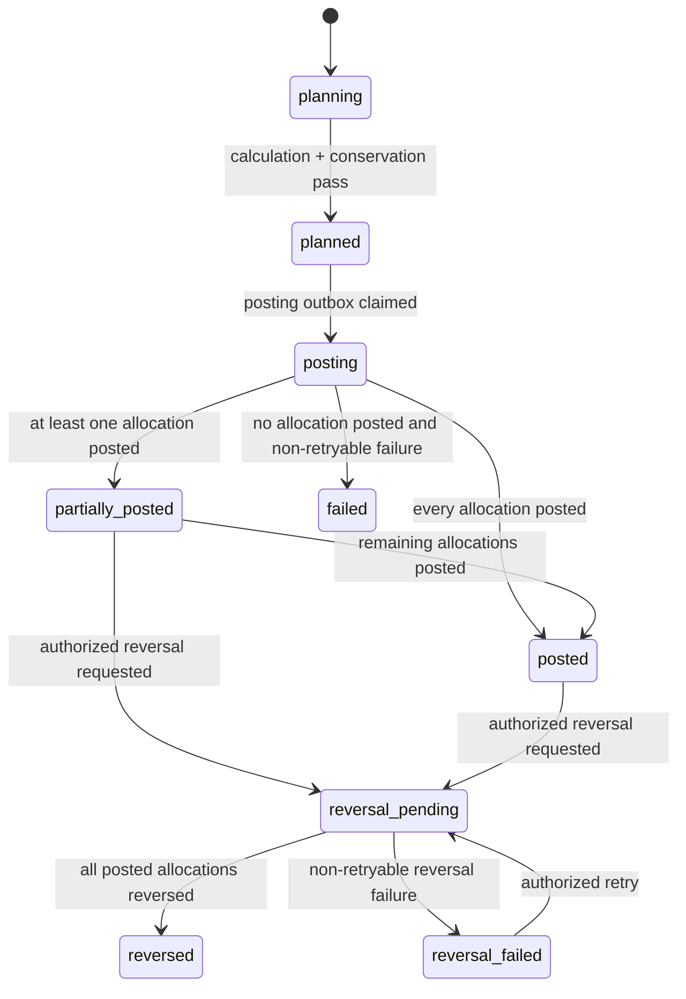
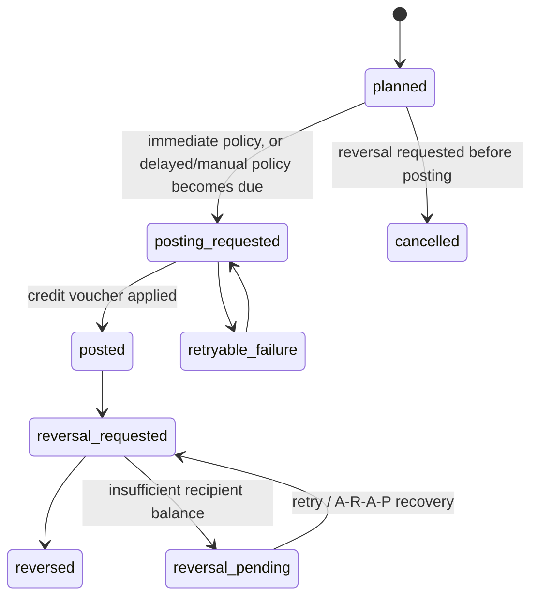

# Settlement Bundle Design

> **Status: design only, not implemented.**
> 
> Settlement is a general-purpose allocation and settlement-planning domain. It
> accepts a confirmed funding fact, evaluates versioned rules against an immutable
> source context, produces auditable recipient allocations, and requests booking
> through a host-provided voucher port. It is intentionally independent of Trade
> orders, Payment invoices, and Wallet entities.

---

## 1. Goal And Scope

### 1.1 Goal

Settlement determines **who is entitled to a confirmed amount, why, and how much**.
It records a durable plan before any balance is booked, executes each allocation
idempotently, and preserves the exact references needed to reverse that booking.

```text
trusted funding source
  -> SettlementFundingConfirmed
  -> immutable source context
  -> versioned rules and recipient resolvers
  -> SettlementPlan + SettlementAllocation[]
  -> voucher booking adapter
  -> recipient accounts
```

The first host integration will be a paid Payment invoice. This is only one funding
producer. The Settlement core MUST NOT require an Invoice, an Order, an OrderItem,
or any Wallet class to exist.

### 1.2 In Scope

- Generic, trusted funding sources represented by stable scalar references.
- Immutable funding, context, rule, recipient, calculation, and posting snapshots.
- Multiple allocations to opaque recipients for one funding amount.
- Composable eligibility rules and amount formulas.
- Extensible recipient resolution through controlled plugins.
- Exact, arbitrary-precision calculation at a fixed 18-decimal internal scale.
- Deterministic conversion to a target account posting scale, including largest-
  remainder allocation of rounding dust.
- `T+0` (default), delayed (`T+N`), and manual absent/mandatory posting policies, all
  scheduled on the Settlement side before funds leave the Settlement boundary.
- Voucher-backed posting through a Settlement-owned port implemented by Wallet. Once a
  credit is applied, the funds belong entirely to the recipient and Settlement no longer
  interacts with them, except by reversing the original voucher.
- Reversal of the original posted vouchers, never a recomputation of current rules.
- SQL Outbox, Inbox deduplication, business idempotency, retry, and audit trails.
- Payment refund blocking while any booked settlement amount has not been reversed.
- Management read, simulation, approval, retry, posting-authorization, and reversal commands.

### 1.3 Explicit Non-Goals

The initial bundle MUST NOT:

- Depend directly on `App\Trade\Entity\Order`, `OrderItem`, `App\Payment\Entity\Invoice`,
  `App\Wallet\Entity\Wallet`, or their repositories.
- Store a cross-bundle Doctrine association or foreign key.
- Treat any arbitrary object, HTTP request, or administrator input as proof that
  funds exist.
- Execute database-stored PHP, Symfony ExpressionLanguage, container lookups, or
  arbitrary object-property paths as a settlement rule.
- Use `float`, native integer arithmetic for money, implicit rounding, or a decimal
  database type as the source of truth for financial calculations.
- Create a second wallet ledger, a replacement payment gateway, a tax engine, or an
  accounts-receivable/accounts-payable subsystem.
- Force a recipient with insufficient balance to fund a reversal by creating a
  negative wallet balance. Future receivables/payables functionality owns recovery.
- Perform foreign exchange in phase one. A plan has exactly one unit/currency.
- Import historical data from the legacy `night-keeper` implementation.

### 1.4 Important Terms

| Term | Meaning |
|---|---|
| Funding | A confirmed amount made available by a trusted external producer. |
| Source | The external business aggregate that produced a funding fact. |
| Context | The immutable, whitelisted facts available to settlement rules. |
| Rule | A versioned declarative definition of eligibility, recipient resolution, and formula. |
| Plan | The aggregate that fixes a funding amount and its calculated allocations. |
| Allocation | One recipient's entitled amount and its independent posting lifecycle. |
| Posting | Booking an allocation through the host voucher boundary. After a successful
  credit, the amount belongs to the recipient and Settlement does not manage it further. |
| Availability policy | Settlement-side scheduling of when to post. `T+0` posts immediately;
  `T+N`/manual defer the posting command until a future time. It is not a Wallet `held` state. |
| Reversal | Reversing the exact original voucher-backed credit. This is the only interaction
  Settlement performs with an already-posted amount. |
| Finality lock | A source-level block on Payment refund after any allocation is posted. |
| Fallback allocation | An explicit allocation of otherwise undistributed rounding or rule remainder. |

---

## 2. Confirmed Product Decisions

The following decisions are part of this design and MUST NOT be changed implicitly by
an implementation detail.

| Concern | Decision |
|---|---|
| Initial trigger | A funding producer may create a plan as soon as its funding is confirmed. Payment paid is the first producer. |
| Source scope | Any trusted source type may participate; Invoice and Order are not special Settlement entities. |
| Plan currency | One plan has one currency/unit. FX is deferred. |
| Recipient identity | `RecipientReference(type, id)` is opaque and extensible. |
| Recipient relationship | A closed recipient grammar resolves literal references, frozen context candidates, or declared facts. |
| Missing Wallet | Wallet adapter automatically provisions the mapped account when policy permits. |
| Calculation precision | Internal arithmetic has a fixed decimal scale of 18 places. |
| Posting precision | The target account defines the final posting scale. Existing Wallet CNY uses cents (scale 2). |
| Rounding | Allocation-level floor followed by deterministic largest-remainder distribution. Default dust recipient is platform; rules may override it. |
| Conservation | A plan may complete only when `unallocatedAmount == 0`. |
| Fallback scope | Fallback handles calculation remainder only. A failed recipient posting remains that recipient's failed allocation and is retried. |
| Default availability | `T+0` default: Settlement posts immediately and the credit is available to the recipient. |
| Delayed availability | `T+N`/manual are Settlement-side posting schedules, not Wallet availability. Once posted, funds belong entirely to the recipient; Settlement performs no hold/release. |
| Refund after posting | Payment refund is locked after the first successful allocation posting. |
| Refund unlock | No automatic unlock. An authorized operator must complete reversal of all posted allocations, then explicitly unlock the source refund. |
| Reversal insufficient funds | Reversal remains pending and refund stays blocked. A future A/R-A/P module may coordinate recovery. |
| Rule governance | Published rule versions are immutable; plans store the exact version and trace used. |
| Execution granularity | Allocations post independently. A plan may be `partially_posted`. |
| Legacy data | No migration from `night-keeper`. It is a product-reference input only. |

---

## 3. Ownership And Dependency Boundary

### 3.1 Ownership Matrix

| Concern | Owner | Settlement responsibility |
|---|---|---|
| External collection / payment proof | Payment, bank, provider, finance process | Consume a trusted funding fact only. |
| Order, item, SKU, store, staff relationships | Trade / Store / host domain | Receive a normalized context through a port only. |
| Rule selection, plan, allocation, state | Settlement | Authoritative. |
| Recipient account mapping and provisioning | Wallet adapter / account host | Resolve opaque recipient references and create accounts if allowed. |
| Wallet balance, voucher, transaction, availability | Wallet | Authoritative. Wallet owns availability (including any unrelated `held` usage) after a credit is applied. |
| Refund transition | Payment or source owner | Ask the generic finality guard; never inspect Settlement tables directly. |
| Collection of unpaid reversal | Future A/R-A/P module | Out of Settlement scope. |

### 3.2 Core Dependency Rule

The Settlement core namespace may import Core infrastructure and its own classes only.
It MUST NOT import adjacent domain namespaces:

```text
forbidden from src/Settlement core:
  App\Trade\*
  App\Payment\*
  App\Wallet\*
  App\Store\*
  App\Identity\Entity\User
```

The host application may provide adapters in the owning adjacent module, for example:

```text
src/Payment/Integration/Settlement/PaymentFundingPublisher.php
src/Trade/Integration/Settlement/TradeSettlementContextResolver.php
src/Wallet/Integration/Settlement/WalletSettlementVoucherPort.php
src/Settlement/Integration/Payment/SettlementPaymentRefundGuard.php
```

The last adapter is an integration shell, not Settlement core. It implements a
Payment-owned extension contract and calls a Settlement-owned application interface.
This prevents a circular entity or repository dependency.

### 3.3 Stable References Only

Every cross-boundary field is a scalar string, UUID, code, or immutable snapshot.
Local numeric primary keys MAY be used inside one module only.

| Value | Example | Forbidden replacement |
|---|---|---|
| Funding source | `payment_invoice:7b4...` | `ManyToOne Invoice` |
| Subject | `trade.order.v1:0ae...` | `ManyToOne Order` |
| Recipient | `store:3d1...` | `ManyToOne Store` |
| Voucher receipt | opaque `voucherReference` | `ManyToOne Voucher` |
| Event correlation | UUID | another module's integer ID |

### 3.4 Why Not Reuse the Legacy Settle Module

`night-keeper` demonstrates mature business requirements: multi-recipient plans,
priority rules, fixed/proportional amounts, generation before execution, and reversal.
Those concepts are adopted here. Its implementation is intentionally not reused:

- It makes `Settle` a `OneToOne` extension of `OrderItem`.
- It ties recipient identity to User/Staff/Store ORM relations.
- It evaluates stored expressions against a service container.
- It assumes a fixed `admin -> store -> beneficiary` wallet route.
- It uses floating arithmetic and re-derives reversal counterparties.
- It has only boolean settlement state and no durable message idempotency.

Settlement preserves the product expressiveness while replacing these implementation
choices with explicit ports, snapshots, state machines, arbitrary precision, and
voucher references.

---

## 4. Package Layout

The exact file names may evolve during implementation, but the dependency direction is
contractual.

```text
src/Settlement/
|-- Entity/
|   |-- SettlementPlan.php
|   |-- SettlementAllocation.php
|   |-- SettlementRule.php
|   |-- SettlementRuleVersion.php
|   |-- SettlementConsumedEvent.php
|   |-- SettlementOutboxMessage.php
|   |-- SettlementReversal.php
|-- Repository/
|   |-- SettlementPlanRepository.php
|   |-- SettlementAllocationRepository.php
|   |-- SettlementRuleRepository.php
|   |-- SettlementConsumedEventRepository.php
|   |-- SettlementOutboxMessageRepository.php
|-- Contract/
|   |-- SettlementFunding.php
|   |-- SettlementSubject.php
|   |-- SettlementContext.php
|   |-- RecipientReference.php
|   |-- AllocationProposal.php
|   |-- VoucherPostingReceipt.php
|-- Service/
|   |-- SettlementService.php
|   |-- SettlementServiceInterface.php
|   |-- SettlementRuleEngine.php
|   |-- SettlementRuleEngineInterface.php
|   |-- SettlementCalculator.php
|   |-- SettlementFinalityService.php
|   |-- SettlementOutboxService.php
|   |-- Money/
|   |   |-- QuantumAmount.php
|   |   |-- ExactAmount.php
|   |   |-- AllocationRoundingService.php
|   |   |-- RoundingPolicy.php
|-- Context/
|   |-- SettlementContextResolverInterface.php
|   |-- SettlementContextResolverRegistry.php
|-- Port/
|   |-- SettlementVoucherPort.php
|   |-- SettlementRefundLockPort.php
|   |-- ClockInterface.php
|-- Message/
|   |-- SettlementFundingConfirmedMessage.php
|   |-- SettlementAllocationPostingMessage.php
|   |-- SettlementAllocationReleaseMessage.php
|   |-- SettlementReversalRequestedMessage.php
|-- MessageHandler/
|-- Command/
|-- Controller/
|   |-- Manage/
|-- Exception/
|-- Resources/config/services_settlement.yaml
```

Source-specific adapters remain outside this tree. The `Settlement` core owns its
inbound and outbound port interfaces; an adapter is selected by DI tags.

---

## 5. Funding Contract

### 5.1 Funding Is Not an Invoice

A plan starts from a **confirmed funding fact**. It does not start from an Order,
OrderItem, Invoice, Wallet transaction, or arbitrary object.

Examples of eligible producers after implementation:

| Source type | Example confirmation authority |
|---|---|
| `payment.invoice.v1` | Payment marks an invoice paid and writes an outbox event. |
| `bank.transfer.v1` | Bank reconciliation recognizes a credited transfer. |
| `provider.payout.v1` | A marketplace/provider confirms funds are available. |
| `finance.adjustment.v1` | An approval-controlled finance process confirms an adjustment. |
| `campaign.subsidy.v1` | A subsidy budget process reserves and confirms funds. |

No source is accepted merely because an authenticated user requested it. The producer
must be a registered trusted adapter and must publish a stable idempotency key plus an
auditable external or internal reference.

### 5.2 `SettlementFunding`

The internal DTO is immutable and contains only scalar data:

```php
final readonly class SettlementFunding
{
    /**
     * @param array<string, scalar|list<scalar>|null> $snapshot
     */
    public function __construct(
        public string $fundingId,
        public string $sourceType,
        public string $sourceId,
        public string $confirmationReference,
        public string $currency,
        public string $amountQuantum,
        public int $calculationScale,
        public \DateTimeImmutable $confirmedAt,
        public string $idempotencyKey,
        public ?string $correlationId,
        public ?string $causationId,
        public array $snapshot = [],
    ) {
    }
}
```

Rules:

- `fundingId` is a Settlement UUID generated by the producer or derived from a stable
  producer key. It is not a local database integer.
- `amountQuantum` is a canonical base-10 integer string at `calculationScale`.
- `amountQuantum` MUST be strictly positive.
- `calculationScale` is exactly `18` in phase one.
- `currency` is normalized uppercase but may be a Wallet unit-of-account such as
  `CNY.ESCROW`; it is not limited to ISO codes.
- `confirmationReference` identifies the proof of availability, for example a provider
  transaction ID, bank statement line, or approved finance record.
- `snapshot` is sanitized, finite, and contains no raw gateway signature, token, or
  personally identifying payload not needed for settlement audit.

### 5.3 Integration Event Schema

All producers publish a versioned serializable event. Messenger messages MAY wrap this
envelope, but the envelope is the durable contract.

```json
{
  "eventId": "c93e6077-b913-4a35-bb7c-ef4e3f795df5",
  "type": "settlement.funding.confirmed.v1",
  "occurredAt": "2026-08-19T12:00:00+00:00",
  "aggregateType": "payment_invoice",
  "aggregateId": "a22d9d80-42b0-4c16-8fc7-d3084f68ad30",
  "correlationId": "2a13084a-1f7e-4aac-b383-5484f270e2ec",
  "causationId": "provider-payment-reference",
  "payload": {
    "fundingId": "0a5b2fb8-9f6a-47a7-8a64-c621a53cd9bb",
    "source": {"type": "payment.invoice.v1", "id": "a22d9d80-42b0-4c16-8fc7-d3084f68ad30"},
    "confirmationReference": "wechat-transaction-id",
    "currency": "CNY",
    "amountQuantum": "12800000000000000000000",
    "calculationScale": 18,
    "confirmedAt": "2026-08-19T12:00:00+00:00"
  }
}
```

The example represents `12800.000000000000000000 CNY` before final Wallet posting
conversion. A producer MUST NOT emit a different amount/currency/context snapshot for
the same business funding identity.

### 5.4 Payment Producer

Payment is the first producer and MUST gain a durable outbox before Settlement depends
on it.

```text
Payment transaction:
  invoice becomes paid
  + payment outbox inserts payment.invoice.paid.v1

Payment publisher:
  payment.invoice.paid.v1
  -> Settlement funding adapter
  -> settlement.funding.confirmed.v1 handling
```

The Payment event is a producer-specific event. A small Payment adapter maps it to
`SettlementFunding`; Settlement does not read the Invoice table or subscribe to the
in-process `InvoicePaidEvent` that carries an Invoice entity.

`grossAmount` is the funding basis unless the producer explicitly defines another
available amount. Gateway-paid amount and Wallet adjustment amount are reporting
components, not values Settlement may infer from `extraData`.

### 5.5 Funding Idempotency And Conflict

The following constraints are mandatory:

| Key | Constraint | Purpose |
|---|---|---|
| `settlement_consumed_event.event_id` | unique | Transport duplicate defense. |
| `settlement_plan.funding_id` | unique | One plan per funding fact in phase one. |
| `(source_type, source_id, funding_kind)` | unique | Business duplicate defense. |
| `settlement_plan.funding_fingerprint` | immutable | Detect a changed replay. |

If a duplicate event has the same immutable funding fingerprint, handling is a no-op.
If it conflicts in amount, currency, confirmation reference, source, or calculation
scale, the handler MUST NOT overwrite the plan. It records an audit failure and routes
the event to retry/dead-letter/manual review according to operations policy.

---

## 6. Source Context

### 6.1 Purpose

Funding proves an amount exists. A source context provides the facts necessary to decide
how it should be allocated. Settlement never follows a Doctrine path such as:

```text
orderItem.order.store.owner
```

Instead, a source module projects the necessary facts into a frozen, whitelisted
`SettlementContext`.

### 6.2 Subject And Resolver Contracts

```php
final readonly class SettlementSubject
{
    public function __construct(
        public string $type,
        public string $id,
        public string $version,
    ) {
    }
}

interface SettlementContextResolverInterface
{
    public static function getName(): string;

    public function supports(SettlementSubject $subject): bool;

    public function resolve(
        SettlementFunding $funding,
        SettlementSubject $subject,
        \DateTimeImmutable $asOf,
    ): SettlementContext;
}
```

```php
final readonly class SettlementContext
{
    /**
     * @param array<string, scalar|list<scalar>|null> $facts
     * @param array<string, RecipientReference> $recipientCandidates
     */
    public function __construct(
        public SettlementSubject $subject,
        public string $currency,
        public string $distributableAmountQuantum,
        public int $calculationScale,
        public array $facts,
        public array $recipientCandidates,
        public string $sourceSnapshotVersion,
        public \DateTimeImmutable $resolvedAt,
    ) {
    }
}
```

The resolver runs before plan creation. Its output is serialized as canonical JSON and
stored with a SHA-256 hash on the plan. Rule evaluation after plan creation uses only
that stored snapshot, never a live source read.

### 6.3 Fact Namespace

Facts are flat, explicitly named, and versioned by source context. They are not a
generic property-access language.

Example `trade.order.v1` facts:

```json
{
  "order.uuid": "...",
  "order.status": "paid",
  "order.storeUuid": "...",
  "order.completedAt": null,
  "order.customerUuid": "...",
  "line.count": 2,
  "line.0.uuid": "...",
  "line.0.quantity": "2",
  "line.0.netAmountQuantum": "9200000000000000000000",
  "line.0.productCode": "SKU-001",
  "line.1.uuid": "...",
  "line.1.quantity": "1",
  "line.1.netAmountQuantum": "3600000000000000000000"
}
```

The source adapter decides whether a plan has one aggregate context or one context per
line. It must make the allocation basis explicit. It MUST NOT assume that the current
`OrderItem::price` is authoritative where order-level promotions were not allocated to
lines.

### 6.4 Context Resolver Rules

- A resolver validates its subject type/version before querying its own module.
- A resolver performs one scalar projection query or an equivalent bounded read; it
  does not leak entities or proxies into the context.
- Missing source, unsupported state, inconsistent currency, and ambiguous commercial
  basis are explicit domain errors, not empty facts.
- A resolver provides only facts with a documented business purpose.
- A resolver may provide named recipient candidates, but they are snapshots and do not
  grant Wallet access.
- Source context evolution requires a new source version, for example
  `trade.order.v2`; existing rules/plans retain their historical snapshot.

---

## 7. Rule Model And Expression Power

### 7.1 Rule Structure

A `SettlementRuleVersion` is an immutable published definition. A draft may be edited;
publishing creates a new version and never mutates the published version used by a plan.

```json
{
  "appliesTo": ["trade.order.v1"],
  "conflictMode": "stack",
  "eligibility": {
    "all": [
      {"factEquals": ["order.status", "paid"]},
      {"factIn": ["order.storeUuid", ["store-uuid"]]}
    ]
  },
  "recipient": {"resolver": "context_candidate", "key": "store.owner"},
  "formula": {"rateOf": {"basis": "funding.distributable", "bps": 8000}},
  "reasonCode": "store_revenue"
}
```

`priority`, `effectiveFrom`, and `effectiveTo` are version metadata rather than
definition fields. A management client creates a rule draft, creates or updates a
draft version, then publishes that version. `GET /manage/settlement-rules/configuration`
returns the accepted operation names and required fields.

```text
POST /manage/settlement-rules
POST /manage/settlement-rule-versions
PUT  /manage/settlement-rule-versions/{versionUuid}
POST /manage/settlement-rule-versions/{versionUuid}/publish
```

The definition remains JSON for persistence and API transport, but it is parsed by a
strict, closed Settlement evaluator. Unknown nodes, unknown facts, malformed amount
strings, and unsupported currency behavior are rejected before publishing.

### 7.2 Rule Selection

Rule selection is deterministic:

1. Resolve context and capture one `asOf` time from the injected clock.
2. Query active rule versions by source type, enabled state, and effective interval.
3. Sort by `priority ASC`, then immutable rule UUID ASC.
4. Validate each rule against the context version.
5. Evaluate its eligibility predicate.
6. Apply its conflict mode and produce zero or more proposals.
7. Apply plan-level conservation and rounding.
8. Create the plan only if every validation succeeds.

Supported conflict modes in phase one:

| Mode | Meaning |
|---|---|
| `stack` | Rule may add allocations alongside other matched rules. |
| `exclusive_group` | First matched rule in a named group wins; later rules in that group are skipped. |
| `stop` | A matched rule ends further rule selection after its proposals are accepted. |

### 7.3 Eligibility Primitives

Rules stay small and composable. The initial primitives are:

| Primitive | Meaning |
|---|---|
| `FactEquals` | Exact equality of a declared fact and scalar literal. |
| `FactIn` | Fact belongs to a declared scalar list. |
| `IntAtLeast` / `IntAtMost` | Integer comparison for a declared fact. |
| `AmountAtLeast` / `AmountAtMost` | Exact quantum amount comparison. |
| `OccurredBefore` / `OccurredAfter` | Instant comparison using ISO-8601 facts. |
| `AllOf` | All child predicates must pass. |
| `AnyOf` | At least one child predicate must pass. |
| `Not` | Negates exactly one child predicate. |

There is deliberately no `eval`, no generic method call, no access to Symfony services,
and no expression that may traverse an object graph. More complex matching must be
projected into a source fact before it reaches Settlement.

### 7.4 Formula Primitives

| Primitive | Result |
|---|---|
| `FixedAmount` | A literal exact decimal amount. |
| `FactAmount` | A declared quantum amount fact. |
| `FundingAmount` | The plan's distributable funding amount. |
| `RateOf` | Exact fraction of a child formula using basis points. |
| `MultiplyByQuantity` | Product of a formula and declared integer quantity. |
| `Add` / `Subtract` | Exact arithmetic over children. |
| `MinOf` / `MaxOf` | Exact min/max of children. |

All formula results are exact non-negative rational values until plan-level rounding.
`Subtract` and `Remaining` MUST reject a negative result. A rule may not silently turn a
negative amount into zero.

### 7.5 Recipient Resolution

Recipient relationships use a closed configuration grammar over the frozen context:

| Resolver | Input | Result |
|---|---|---|
| `literal` | configured type/id | Fixed platform or named recipient. |
| `context_candidate` | candidate key | Recipient projected by source adapter. |
| `fact_reference` | declared `recipient.*` fact pair | A normalized source fact recipient. |
More relationships must be projected by the source adapter into a recipient candidate or
declared facts. They may not read live Order/Staff/User entities after plan creation.

### 7.6 Advanced Rules

If a stable business concern cannot be expressed as primitives, it may implement:

```php
interface SettlementRuleHandlerInterface
{
    public static function getName(): string;

    public static function getVersion(): int;

    /** @param array<string, mixed> $config */
    public function propose(SettlementContext $context, array $config): array;
}
```

The handler returns `AllocationProposal` value objects only. It MUST NOT post vouchers,
change plan state, load cross-module entities, access the Symfony container, or perform
network I/O. Every handler requires explicit unit tests, a versioned config schema, and
an audit-friendly explanation payload.

---

## 8. Exact Money And Overflow Safety

### 8.1 Hard Rule: No Float

Settlement financial code MUST NOT use PHP `float`, `round()`, `(int)` casts of
financial values, or native arithmetic over money strings. PHP's signed integer range is
insufficient for arbitrary 18-scale values and multiplication can overflow before a
validation sees the result.

### 8.2 Required Library

Implementation MUST add `brick/math` as a production dependency. It provides immutable,
arbitrary-precision numeric objects without making `ext-bcmath` or `ext-gmp` an
undeclared deployment prerequisite.

| Type | Settlement use |
|---|---|
| `Brick\Math\BigInteger` | Canonical quantum integers, totals, ranks, and target posting units. |
| `Brick\Math\BigRational` | Exact percentages, division, and intermediate formula results. |
| `Brick\Math\BigDecimal` | Parsing/display and conversion to declared scales. |
| `Brick\Math\RoundingMode` | Required at each conversion where precision is intentionally lost. |

### 8.3 Amount Representation

An `ExactAmount` is not a PHP scalar monetary integer:

```text
quantum integer string: "12345678901000000000"
scale:                  18
display decimal:        12.345678901000000000
currency:               CNY
```

The database persists the quantum integer as a canonical base-10 string. This avoids
database decimal precision limits and PHP integer overflow. It has no `+` sign, no
leading zero except exactly `"0"`, and no decimal separator.

```php
final readonly class QuantumAmount
{
    public function __construct(
        public string $quantum,
        public int $scale,
        public string $currency,
    ) {
    }
}
```

The initial scale is fixed at `18`. Currency's target Wallet posting scale is independent
of this calculation scale: existing CNY Wallets are scale `2`, points might be `0`, and
a future token account might be `18`.

### 8.4 Formula Evaluation

Formula evaluation keeps fractions exact for as long as possible:

```php
$basis = BigRational::of($context->distributableAmountQuantum());
$commission = $basis->multipliedBy('1500/10000');
```

No formula is converted to scale 18 merely because an intermediate operation contains a
division. A non-terminating result remains a rational number. Conversion occurs only at
the plan's explicit allocation quantum boundary and at the final target posting scale.

Every division must have one of these outcomes:

- Exact division: use the exact result.
- Deliberate allocation rounding: use the documented rounding algorithm.
- A rule that requires exactness but cannot be represented: reject plan creation with a
  domain error.

### 8.5 Conversion To Wallet Posting Units

Let `C = 18` be calculation scale and `P` be target posting scale. For CNY Wallet,
`P = 2`. The conversion factor is `10^(C - P)`.

```text
walletMinor = allocationQuantum / 10^(18 - postingScale)
```

This conversion may not be exact. The bundle handles it across the plan, not per line:

1. Evaluate all matched allocations exactly.
2. Validate the exact allocation total is less than or equal to funding.
3. Convert each allocation to its target posting unit by floor toward zero.
4. Retain its exact fractional remainder and stable allocation UUID.
5. Determine the total available target units from the funding amount.
6. Allocate remaining whole units by descending fractional remainder.
7. Break equal remainders by immutable allocation UUID ascending.
8. If a configured fallback recipient exists, it receives rule remainder before this
   final distribution; the default fallback is the platform recipient.
9. Persist exact amount, posted amount, rounding delta, ranking, and policy snapshot.
10. Assert target-unit conservation before writing the plan.

The selected policy is `largest_remainder`. It is deterministic, explainable, and does
not mint or burn a cent.

### 8.6 Conservation Invariants

At the calculation scale:

```text
fundingAmount = allocationAmountTotal + unallocatedAmount
```

At final posting scale:

```text
fundingPostingAmount = sum(allocation.postingAmount) + unallocatedPostingAmount
```

Before a plan can be marked `posted`, `reversal_pending`, or `reversed`, it
MUST satisfy:

```text
unallocatedAmount = 0
unallocatedPostingAmount = 0
```

The fallback allocation is a real allocation with a real recipient, rule trace, and
voucher. It is not an untracked accounting adjustment.

### 8.7 Guardrails

- Scale must be in the bounded configured range `0..18`; phase one fixes it at `18`.
- A quantum string length has an implementation-configured maximum before parsing to
  avoid input-based memory abuse.
- Rule amounts, rate values, quantity facts, and formula depth have bounded schemas.
- Rate values are represented as integer basis points in phase one; arbitrary decimal
  rates require a dedicated reviewed primitive.
- All amount comparisons use `BigInteger`/`BigRational`, never lexical strings.
- A Wallet adapter validates that the final posting integer fits Wallet's supported
  database/PHP range. An out-of-range allocation becomes a non-retryable manual-review
  failure; it never truncates.

---

## 9. Domain Model

### 9.1 Entity Overview

| Entity | Table | Purpose |
|---|---|---|
| `SettlementRule` | `settlement_rule` | Stable rule identity and current publication pointer. |
| `SettlementRuleVersion` | `settlement_rule_version` | Immutable, effective-dated rule definition. |
| `SettlementPlan` | `settlement_plan` | Funding, snapshots, plan lifecycle, totals, and finality state. |
| `SettlementAllocation` | `settlement_allocation` | One recipient entitlement and posting/reversal lifecycle. |
| `SettlementReversal` | `settlement_reversal` | One operator-authorized reversal operation and audit reason. |
| `SettlementConsumedEvent` | `settlement_consumed_event` | Inbox deduplication and transport audit. |
| `SettlementOutboxMessage` | `settlement_outbox_message` | Durable command/event delivery. |

All aggregate-level records expose UUIDs as external identifiers in addition to local
integer primary keys. No table has a foreign key to another business module.

### 9.2 `SettlementRule`

| Field | Type | Notes |
|---|---|---|
| `id` | integer | Local primary key. |
| `uuid` | string(36), unique | Public immutable rule identity. |
| `code` | string(100), unique | Human-readable stable business key. |
| `name` | string(255) | Display name. |
| `status` | string(20) | `draft`, `published`, `retired`. |
| `current_version` | integer nullable | Latest published version number. |
| `created_at`, `updated_at` | datetime immutable | Audit. |

`code` never changes after publication. A retired rule remains readable because plans
refer to its immutable version snapshot.

### 9.3 `SettlementRuleVersion`

| Field | Type | Notes |
|---|---|---|
| `id` | integer | Local primary key. |
| `uuid` | string(36), unique | Stable version identity. |
| `rule_uuid` | string(36) | Scalar parent reference or local relation within Settlement only. |
| `version` | integer | Monotonic per rule. |
| `definition` | json | Strict, validated AST/config. |
| `definition_hash` | string(64) | SHA-256 canonical JSON. |
| `effective_from` | datetime immutable | Inclusive. |
| `effective_to` | datetime immutable nullable | Exclusive; null is open-ended. |
| `priority` | integer | Lower executes first. |
| `status` | string(20) | `draft`, `published`, `retired`. |
| `published_at`, `published_by` | scalar nullable | Governance audit. |
| `created_at` | datetime immutable | Audit. |

Constraints:

- Unique `(rule_uuid, version)`.
- No overlapping published effective intervals for the same logical rule version lane.
- Published `definition`, hash, priority, and effective range are immutable.
- A plan stores a complete definition snapshot even though this table is immutable; this
  makes extraction and forensic export self-contained.

### 9.4 `SettlementPlan`

| Field | Type | Notes |
|---|---|---|
| `id` | integer | Local primary key. |
| `uuid` | string(36), unique | Public plan identity. |
| `funding_id` | string(64), unique | Stable funding identity. |
| `source_type`, `source_id` | string(64) | Opaque source reference. |
| `funding_kind` | string(50) | Funding lane, initially `confirmed`; part of business idempotency. |
| `confirmation_reference` | string(128) | Funding proof reference. |
| `funding_fingerprint` | string(64) | Immutable canonical funding fingerprint. |
| `currency` | string(32) | One plan unit. |
| `calculation_scale` | smallint | Phase one: 18. |
| `funding_amount_quantum` | string(128) | Positive canonical integer string. |
| `allocated_amount_quantum` | string(128) | Sum of exact allocation amounts. |
| `unallocated_amount_quantum` | string(128) | Must reach zero before terminal success. |
| `posting_scale` | smallint | Target unit scale for plan allocations. |
| `funding_posting_amount` | string(128) | Final target-unit integer string. |
| `allocated_posting_amount` | string(128) | Sum of allocation posting amounts. |
| `unallocated_posting_amount` | string(128) | Must reach zero before terminal success. |
| `subject_type`, `subject_id`, `subject_version` | strings | Context subject identity. |
| `context_snapshot` | json | Immutable normalized facts/candidates. |
| `context_hash` | string(64) | SHA-256 canonical snapshot. |
| `funding_snapshot` | json | Sanitized immutable producer data. |
| `rule_snapshot` | json | All selected rule definitions/versions. |
| `calculation_trace` | json | Match, formula, exact result, rounding evidence. |
| `fallback_recipient_type`, `fallback_recipient_id` | strings | Resolved plan fallback recipient. |
| `status` | string(32) | State machine below. |
| `refund_locked_at` | datetime immutable nullable | First successful posting finality marker. |
| `refund_unlocked_at` | datetime immutable nullable | Only after complete approved reversal. |
| `correlation_id`, `causation_id` | string(64) nullable | Cross-boundary tracing. |
| `created_at`, `updated_at`, `completed_at` | datetime immutable | Audit. |

Business constraints:

- `funding_amount_quantum > 0`.
- Currency and calculation scale never change.
- Snapshots and trace never change after planning.
- `allocated + unallocated = funding` in both precision domains.
- `unallocated` is zero before successful terminal plan states.
- A plan never changes recipient or allocation amount after a posting attempt; correction
  uses reversal and a new funding/adjustment process.

### 9.5 `SettlementAllocation`

| Field | Type | Notes |
|---|---|---|
| `id` | integer | Local primary key. |
| `uuid` | string(36), unique | Stable allocation identity and voucher source key. |
| `plan_uuid` | string(36) | Settlement-local plan reference. |
| `sequence` | integer | Deterministic display/order number. |
| `allocation_key` | string(128) | Stable business key inside plan. |
| `recipient_type`, `recipient_id` | strings | Opaque resolved recipient. |
| `recipient_snapshot` | json | Resolver name/version/config/candidate evidence. |
| `rule_code`, `rule_version_uuid` | strings nullable | Source rule; fallback is explicit. |
| `reason_code` | string(100) | Business explanation. |
| `exact_amount_quantum` | string(128) | Exact allocation amount at scale 18. |
| `posting_amount` | string(128) | Final integer amount for Wallet. |
| `posting_scale` | smallint | Target posting scale. |
| `rounding_delta_quantum` | string(128) | Exact minus posted conversion represented at scale 18. |
| `rounding_rank` | integer nullable | Largest-remainder deterministic rank. |
| `release_policy` | string(20) | `immediate`, `delayed`, `manual`; when the posting command may run. |
| `posting_available_at` | datetime immutable nullable | Required for `delayed`; when the posting command may run. |
| `posting_due_at` | datetime immutable nullable | Scheduler cutoff for a `manual`/`delayed` posting command. |
| `status` | string(32) | Allocation state machine below. |
| `posting_reference` | string(128) nullable | Opaque Wallet voucher receipt reference. |
| `posting_idempotency_key` | string(128), unique | Stable command key. |
| `posted_at` | datetime immutable nullable | Posting success time. Funds are the recipient's from this moment. |
| `reversal_reference` | string(128) nullable | Opaque Wallet reversal receipt. |
| `reversal_idempotency_key` | string(128), unique nullable | Stable reversal key. |
| `reversed_at` | datetime immutable nullable | Reversal success time. |
| `failure_code`, `failure_detail` | nullable strings | Sanitized operational diagnosis. |
| `attempt_count`, `next_attempt_at` | integer/datetime nullable | Retry state. |
| `created_at`, `updated_at` | datetime immutable | Audit. |

Constraints:

- Unique `(plan_uuid, allocation_key)`.
- `posting_amount > 0`; a zero allocation is never persisted.
- Recipient type/id and exact amount are immutable after planning.
- A successful `posting_reference` cannot be replaced.
- Reversal references the original allocation, not a newly calculated counterparty.

### 9.6 `SettlementReversal`

A reversal request is an auditable aggregate rather than a button that directly changes
allocations.

| Field | Type | Notes |
|---|---|---|
| `uuid` | string(36), unique | External reversal request identity. |
| `plan_uuid` | string(36) | Target plan. |
| `reason_code`, `reason_detail` | strings | Required human and machine reason. |
| `requested_by` | opaque scalar | Authorized operator identity. |
| `status` | string(32) | `requested`, `reversing`, `partially_reversed`, `reversed`, `failed`. |
| `idempotency_key` | string(128), unique | Prevent duplicate operator requests. |
| `created_at`, `completed_at` | datetimes | Audit. |

It creates a reversal outbox command only for allocations already posted. Unposted
allocations are cancelled and cannot later be posted. A request completes only when all
posted allocations are reversed.

### 9.7 Inbox And Outbox

`SettlementConsumedEvent` fields:

```text
event_id unique
topic
source_aggregate_type
source_aggregate_id
payload_hash
processed_at
```

`SettlementOutboxMessage` fields follow the established Trade/Store pattern:

```text
event_id unique
topic
aggregate_type
aggregate_id
correlation_id
causation_id
payload json
available_at
claimed_at
claim_token
published_at
attempt_count
last_error
created_at
```

All local business mutation plus an outbox insertion occur in one database transaction.

---

## 10. State Machines

### 10.1 Plan State



The persisted implementation may derive `posting`, `partially_posted`, and `posted`
from allocation state, but externally visible state must have these semantics.

`planned` does not lock a source refund. The first `posted` allocation sets
`refund_locked_at`; therefore a `partially_posted` plan already has finality lock.

A plan has no Wallet-side hold/release state. Once an allocation is `posted`, the funds
belong to the recipient and the plan only tracks the reversal evidence of those vouchers.

### 10.2 Allocation State



There is no transition from a posted allocation back to `planned`, no replacement
recipient, and no rewritten amount. There is no `release` transition because Settlement
never holds funds after posting: `post()` is the moment ownership transfers to the
recipient, and reversal of that voucher is the only later operation.

### 10.3 Refund Finality State

Settlement owns the evidence but the funding source owns its refund state:

```text
no posted allocation
  -> refund eligibility is source-defined

first successful allocation posting
  -> Settlement records refund_locked_at
  -> Payment/producer rejects refund

authorized complete Settlement reversal
  -> all posted allocation vouchers reversed
  -> Settlement records refund_unlocked_at
  -> Payment/producer may execute its normal refund process
```

There is intentionally no timer that automatically unlocks a source refund. Settlement-side
posting scheduling changes when a credit is handed to the recipient, not whether funding
finality exists once that credit is handed over.

---

## 11. Wallet Voucher Boundary

> **One-way handoff.** Settlement decides *when* a confirmed allocation becomes the
> recipient's money and posts that allocation through the voucher boundary. From the
> moment the credit voucher is applied, the funds are unconditionally the recipient's;
> Settlement performs no balancing, no `held` freeze, no release, and no partial management
> of that money. The only later operation is reversing the exact original voucher.

### 11.1 Settlement-Owned Port

Settlement owns the contract below and never returns a Wallet entity or Voucher entity:

```php
interface SettlementVoucherPort
{
    /**
     * Credit the recipient's account. On success the amount is unconditionally theirs.
     * @throws SettlementVoucherException on rejection or non-retryable mapping failure
     */
    public function post(ConfirmedAllocation $allocation): VoucherPostingReceipt;

    /** Reverse the exact original posting; insufficient funds is a classified result. */
    public function reverse(PostedAllocation $allocation, ReversalRequest $request): VoucherPostingReceipt;
}
```

`VoucherPostingReceipt` contains Settlement-safe scalars only:

```php
final readonly class VoucherPostingReceipt
{
    public function __construct(
        public string $externalReference,
        public string $idempotencyKey,
        public \DateTimeImmutable $processedAt,
        public string $status,
    ) {
    }
}
```

`externalReference` is opaque to Settlement. The Wallet implementation may use a Wallet
voucher UUID; Settlement cannot parse it or query it.

### 11.2 Wallet Adapter Responsibilities

The Wallet adapter:

1. Maps `RecipientReference(type, id)` and currency to an account provisioning policy.
2. Creates the Wallet if it does not exist and the reference type is permitted to own a
   Wallet for that currency.
3. Validates Wallet currency, frozen state, posting range, and recipient mapping.
4. Calls Wallet's voucher-backed credit gate with `voucherType = settlement`.
5. Uses allocation UUID as stable voucher source and a deterministic reference id, for
   example `settlement-credit:{allocationUuid}`.
6. Returns an opaque voucher receipt for a successful credit.
7. Uses the original opaque voucher reference to reverse exactly the original booking.

The adapter may depend on Wallet services because it belongs at the Wallet integration
edge. Settlement core does not.

### 11.3 Voucher Semantics

For a successful allocation posting:

```text
Voucher type:       settlement
Voucher source ID:  allocation UUID
Reference ID:       settlement-credit:{allocation UUID}
Direction:           credit
Fund source:         external (the confirmed funding entered the Wallet boundary)
Created by:          settlement
```

Wallet's existing unique `referenceId` and `(voucherType, voucherId)` constraints are
both required. The adapter MUST verify that a duplicate receipt matches allocation,
recipient wallet, amount, currency, direction, and applied status before treating it as
success.

### 11.4 T+0, T+N, And Manual Posting Scheduling

`T+0` is the default: excess ownership is immediate. Delayed and manual policies are
Settlement-side scheduling decisions about **when to post the credit**, not Wallet-side
availability controls.

| Posting policy | Settlement behavior | Recipient ownership |
|---|---|---|
| `immediate` (`T+0`, default) | Posting command runs as soon as the plan is created. | At credit application. |
| `delayed` (`T+N`) | Posting command is scheduled for `posting_available_at`; the scheduler runs it at/after that time. | At credit application after the scheduled posting. |
| `manual` | Posting command is held in Settlement until an authorized operator approves it. | At credit application after approval. |

For a delayed policy the scheduler must wait until `posting_available_at` before issuing
the posting command. `posting_available_at` is calculated and frozen during planning. The
rule or funding policy must state its business calendar semantics: next settlement-day
versus strict duration. The implementation SHOULD use an injected business-calendar
service rather than silently interpreting `T+1` as 24 hours.

`manual` posting requires an authorized operator command. A `manual` allocation waits in
`planned` until approval sets its `posting_available_at` (past) or emits the posting
command directly.

Because posting is the ownership transfer, Scheduling a delayed/manual allocation is
still governed by the same posting idempotency, retry, and reversal rules as `T+0`. There
is no `held` amount, no `release` command, and no separate `held` balance anywhere.

### 11.5 Wallet Is Final

Once `post()` has returned a successful receipt for an allocation:

- The credited amount is the recipient's unconditional balance.
- Settlement does not track availability, spend, or partial ownership of that balance.
- Settlement performs no compensating journal entries, holds, or freezes on that money.
- The only Settlement operation is reversing the exact original voucher, which is treated
  like any host deposit reversal: it debits the recipient's available balance.
- Settlement does not need a `held` column, a release state, or a release scheduler.

This keeps the boundary clean: Settlement controls the timing and correctness of
distribution, and Wallet (which already owns balances, holds for other purposes, frozen
flags, and reversal semantics) owns everything after the credit.

### 11.6 Reversal Semantics

Reversal always targets the original settlement voucher:

| Original state | Wallet effect |
|---|---|
| Posted | Debit the recipient's available balance; write the original credit voucher's reversal. |
| Not posted (immediate/delayed/manual due) | Cancel allocation; no Wallet call. |

If the available balance is insufficient after a posted allocation, Wallet
returns a classified insufficient-funds result. Settlement records `reversal_pending`,
keeps the funding refund lock, and makes no compensating adjustment. A future receivable
module may settle the debt and then permit a retry, but it must not rewrite this history.
Settlement does not create a negative balance to force the reversal through.

### 11.7 Wallet Changes Required

Existing Wallet deposit/reverse supports voucher provenance. The only required Wallet-side
extension for Settlement is a voucher provider/authorization path for the `settlement`
voucher type:

- Add a Settlement-owned voucher provider/authorization path inside Wallet.
- Reuse Wallet's existing deposit + voucher + transaction atomicity for the credit.
- Reuse Wallet's existing deposit reversal for the reversal; no `held` integration is
  required for Settlement.
- Preserve Wallet's transaction, voucher, lock, currency, idempotency, and reconciliation
  invariants.
- Do not expose these operations through a generic self-service HTTP endpoint.

No `Wallet.held` change is needed for Settlement feature delivery. Wallet may still use
`held` for entirely separate business purposes unrelated to Settlement; Settlement must
not depend on it.

---

## 12. Payment Refund Lock Integration

### 12.1 Generic Payment Extension Point

Payment should expose a generic, tagged refund-guard contract rather than import
Settlement:

```php
interface PaymentRefundGuardInterface
{
    public function supports(string $sourceType): bool;

    public function assertRefundAllowed(string $sourceId, int $amount, string $currency): void;
}
```

The Settlement integration adapter implements this interface for source types it owns.
Payment invokes all applicable guards before transitioning an invoice into refund work.
The adapter asks `SettlementFinalityService` using scalar source identity only.

This permits future funding consumers to define their own finality guard without making
Payment know any settlement table or entity.

### 12.2 Refund Rule

For a source with any successfully posted allocation:

```text
refund requested
  -> guard sees refund_locked_at and no refund_unlocked_at
  -> reject with a stable business error
  -> operator requests full Settlement reversal
  -> every posted allocation reverses the original voucher
  -> operator explicitly unlocks the plan/source
  -> normal Payment refund may proceed
```

Partial Payment refund is not allowed while a plan is finality-locked in phase one.
Supporting proportional partial refund requires a future design for allocation-level
partial reversals, rounding remainder ownership, and source-level refund totals.

### 12.3 Explicit Unlock

Unlock is an authorized, auditable command. It requires:

- Plan state `reversed`.
- Every allocation either `reversed` or `cancelled` before posting.
- Both plan `unallocated` fields equal zero.
- A recorded reversal request UUID and operator reason.
- No pending outbox command for posting, posting-cancel, or reversal.

Unlock does not itself refund money. It only permits the source owner's normal refund
process to begin.

---

## 13. Reliable Processing And Idempotency

### 13.1 Local Transaction Boundary

Plan creation transaction:

```text
Settlement transaction:
  validate inbox event
  + persist consumed event
  + resolve and snapshot context
  + select/evaluate/snapshot rules
  + create plan and allocations
  + assert conservation
  + insert posting outbox commands
  + commit
```

No Voucher call is made in this transaction. The recipient posting is an external
boundary, even in a modular monolith sharing one database, because it belongs to Wallet
and must tolerate retries independently.

### 13.2 Outbox Commands

| Topic | Aggregate | Payload purpose |
|---|---|---|
| `settlement.allocation.post.requested.v1` | allocation UUID | Request the voucher credit. Emitted at `T+0`, or by the scheduler at `posting_available_at` for `delayed`, or after manual approval. |
| `settlement.allocation.post.cancel.v1` | allocation UUID | Reverse/withdraw a `delayed`/`manual` posting command before it runs (posting cancel). |
| `settlement.allocation.reverse.requested.v1` | allocation UUID | Request original voucher reversal. |
| `settlement.plan.posted.v1` | plan UUID | Optional downstream completion notification. |
| `settlement.plan.reversed.v1` | plan UUID | Optional source finality/unlock notification. |

The outbox relay uses the existing claim-token pattern. A crashed worker may publish a
message more than once. Consumers rely on business keys and Wallet voucher idempotency.

There is no `release` outbox message. Posting is the handoff; there is no second
Settlement action that makes funds usable.

### 13.3 Posting Handler

```text
receive allocation-post command
  -> lock/load allocation by UUID
  -> if already posted: verify receipt and acknowledge
  -> if cancelled/reversed: acknowledge as obsolete
  -> if posting_policy is delayed and not yet due: re-defer the command
  -> call SettlementVoucherPort.post(allocation)
  -> transactionally record immutable receipt and posted state
  -> set plan refund_locked_at if this is first successful posting
  -> recompute plan aggregate state
```

If Wallet posts successfully but the handler crashes before persisting the receipt, retry
uses the same `posting_idempotency_key`; Wallet returns the original voucher receipt.

### 13.4 Failure Classification

| Class | Examples | Handler action |
|---|---|---|
| Retryable | DB/network transient, temporary Wallet lock, relay failure | Increment attempt and defer outbox. |
| Business-pending | `delayed` posting not yet due; Wallet temporarily frozen | Record pending reason; re-defer until due or retry. |
| Non-retryable | Unknown recipient type, invalid currency mapping, out-of-range target amount | Mark allocation failed, plan remains incomplete/manual review. |
| Recovery-required | Recipient lacks available funds for reversal | Mark `reversal_pending`; keep refund lock. |
| Integrity conflict | Duplicate key with changed payload/receipt | Stop processing, alert, manual review. |

An execution failure never routes its amount to the fallback recipient. Fallback is only
for a calculated, valid remainder and is itself posted/retried like every allocation.

### 13.5 Concurrency

- Inbox unique keys serialize duplicate transport delivery.
- Plan funding unique keys serialize duplicate funding facts.
- Allocation source UUID and posting idempotency key serialize duplicate posting.
- Wallet performs its own lock and voucher unique-key protection.
- A plan's aggregate state is recomputed under a plan row lock or an atomic versioned
  update after allocation transitions.
- Outbox claim leases prevent duplicate relay work but are not relied upon for exactly
  once behavior.
- A reversal command races safely with posting: allocation state is locked; an unposted
  allocation is cancelled (including a `delayed`/`manual` posting command that has not yet
  run), while a posted allocation reverses its recorded receipt.
- A `delayed` posting command races safely with a manual approval or posting cancel:
  posting is idempotent by `posting_idempotency_key`, so a command that arrives after the
  allocation was cancelled or reversed is acknowledged as obsolete.

---

## 14. Management API And Authorization

### 14.1 API Principle

Settlement plans, allocations, posted amounts, and state transitions are financial
records. Generic CRUD endpoints MUST NOT permit direct mutation or deletion of them.
Controllers issue commands to application services.

### 14.2 Proposed Management Commands

| Endpoint concept | Command | Required authorization |
|---|---|---|
| Create/update rule draft | Rule draft command | Settlement rule administrator. |
| Publish/retire rule | Rule governance command | Separate approver or privileged finance role. |
| Simulate | Pure calculation against supplied trusted/sanitized fixture context | Rule administrator; no persistence or voucher call. |
| Read plan/allocation | Query | Scoped finance/audit permission. |
| Retry allocation | Requeue existing allocation posting command | Operations role. |
| Approve manual posting | Authorize a `manual` allocation's posting command | Settlement posting authority. |
| Cancel pending posting | Withdraw a `delayed`/`manual` posting command before it runs | Operations role. |
| Request reversal | Create `SettlementReversal` | Finance reversal authority. |
| Retry reversal | Requeue existing reversal command | Finance reversal authority. |
| Unlock source refund | Explicit finality unlock | Finance authority after reversal proof. |

All command requests require a client idempotency key where a human can retry an action.
The actor identity, role/authorization reason, request ID, timestamp, and sanitized
request metadata are included in the audit record.

### 14.3 Read Security

Allocation recipients, funds, and audit references are sensitive. Read APIs must not
reuse an Order/Store join for authorization. Settlement query authorization uses a
dedicated policy that receives plan/source scalar references and actor claims. An
integration adapter may supply source-specific scope checks through an interface; it
must not leak a source entity into the Settlement domain.

---

## 15. Observability, Audit, And Reconciliation

### 15.1 Required Audit Evidence

A completed allocation must answer all of these questions without loading another
module's mutable data:

- What confirmed funding was allocated?
- Which source/context facts were used, and what is their hash?
- Which rule version and recipient resolver version applied?
- What exact rational/formula result was calculated?
- How was it converted to final posting units and where did each remainder unit go?
- Which recipient reference received it?
- Which voucher receipt booked it, when, and with what idempotency key?
- Which posting policy scheduled it, and at what `posting_available_at`?
- Was it reversed, by whom, why, and with which original-voucher reversal receipt?

### 15.2 Metrics

The implementation should add module metrics using the existing Core metrics approach:

```text
settlement_plans_total{status,currency}
settlement_allocations_total{status,recipient_type,currency}
settlement_outbox_backlog{topic}
settlement_posting_failures_total{class}
settlement_reversal_pending_total{currency}
settlement_pending_posting_total{policy}           # delayed/manual allocations awaiting their posting command
settlement_unallocated_amount_quantum{currency}
settlement_refund_locks_total{source_type}
```

Amounts may be exported as carefully documented decimal strings or converted only where
the metrics backend supports arbitrary precision. A Prometheus float sample must not be
used as financial truth.

### 15.3 Reconciliation

Settlement reconciliation compares its immutable allocation receipts with Wallet's
boundary vouchers:

| Settlement field | Wallet voucher field |
|---|---|
| allocation UUID | `voucher_id` for type `settlement` |
| posting idempotency key | `reference_id` |
| posting amount/currency | voucher amount/currency |
| posting reference | Wallet voucher external identity |
| reversal reference | original voucher reversal identity |

Any mismatch is an integrity incident. Reconciliation reports it but does not silently
repair money by adjusting plans or Wallet balances.

---

## 16. Database Migration Requirements

The migration must be portable across SQLite test, PostgreSQL CI, and MySQL deployment.
Avoid database-specific JSON path logic or numeric casts for financial values.

Required indexes include:

```text
settlement_rule:
  UNIQUE(uuid)
  UNIQUE(code)

settlement_rule_version:
  UNIQUE(uuid)
  UNIQUE(rule_uuid, version)
  INDEX(status, effective_from, effective_to)

settlement_plan:
  UNIQUE(uuid)
  UNIQUE(funding_id)
  UNIQUE(source_type, source_id, funding_kind)
  INDEX(status, created_at)
  INDEX(source_type, source_id)
  INDEX(refund_locked_at, refund_unlocked_at)

settlement_allocation:
  UNIQUE(uuid)
  UNIQUE(plan_uuid, allocation_key)
  UNIQUE(posting_idempotency_key)
  UNIQUE(reversal_idempotency_key)
  INDEX(plan_uuid, status)
  INDEX(status, next_attempt_at)
  INDEX(posting_policy, posting_available_at, status)   # scheduler picks due delayed/manual postings
  INDEX(posting_due_at, status)                         # scheduler/cancel sweeps

settlement_reversal:
  UNIQUE(uuid)
  UNIQUE(idempotency_key)
  INDEX(plan_uuid, status)

settlement_consumed_event:
  UNIQUE(event_id)

settlement_outbox_message:
  UNIQUE(event_id)
  INDEX(published_at, available_at)
  INDEX(claimed_at)
```

The schema stores financial quantum values in `VARCHAR` columns with a documented
maximum length, not `BIGINT` or `DECIMAL`. Application-level canonical-format validation
is mandatory; optional database checks may be added only where portable.

---

## 17. Implementation Phases

Each phase is independently reviewable and testable. A later phase must not bypass an
invariant from an earlier phase.

| Phase | Scope | Required evidence |
|---|---|---|
| P0 | Add `brick/math`; exact amount/rounding primitives; unit tests. | No float use; overflow and 18-scale tests. |
| P1 | Settlement schema, plan/allocation aggregates, rule versions, pure simulation. | Rule and conservation integration tests. |
| P2 | Context resolver/recipient resolver registries and one generic fixture adapter. | Snapshot and plugin contract tests. |
| P3 | Settlement inbox/outbox, posting port, fake adapter, allocation state machine. | Duplicate, crash/retry, partial-post integration tests. |
| P4 | Wallet Settlement adapter (voucher provider path only), immediate `T+0` posting, voucher receipt reconciliation. | Real Wallet voucher transaction tests. |
| P5 | Payment outbox producer and generic refund guard/finality integration. | Paid-to-posted and reversal-before-refund E2E tests. |
| P6 | Settlement-side `T+N` and manual posting scheduling, posting cancel, scheduler delivery. | Posting schedule, approval, and cancel race tests. |
| P7 | Manage APIs, governance, observability, production runbook. | Authorization, OpenAPI, metrics, smoke validation. |

Trade context adapters and non-Payment funding producers can be delivered independently
after P2. The core remains generic even if P5 is the first production integration.

---

## 18. Test Strategy And Mandatory Invariants

### 18.1 Unit Tests

| Area | Required cases |
|---|---|
| `QuantumAmount` | Canonical parsing, signs, zero, scale, extremely large strings, invalid format. |
| Formula primitives | Fixed/rate/cap/floor/remaining, nested composition, negative rejection, no float coercion. |
| Exact math | `1/3`, 18-scale boundaries, huge multiplication, division behavior, overflow-safe conversion. |
| Rounding | Largest remainder, equal-remainder UUID tie break, platform fallback, exact conservation. |
| Eligibility | All/any/not, missing fact, invalid fact type, effective-time boundary. |
| Recipient resolver | Literal/candidate/fallback and snapshot-only behavior. |
| State machines | Valid/invalid plan/allocation/reversal transitions. |

### 18.2 Integration Tests

| Boundary | Required cases |
|---|---|
| Doctrine | Every unique key, immutable snapshot behavior, query indexes where practical. |
| Funding inbox | First delivery, same-event retry, new-event same funding, changed replay conflict. |
| Plan creation | Funding/plan/outbox atomic rollback and unallocated zero enforcement. |
| Outbox | Claim, publish, failure defer, retry, stale lease behavior. |
| Posting | Wallet success, duplicate after handler crash, non-retryable mapping failure, partial plan. |
| Posting schedule | Immediate posts at plan creation; delayed posts only at/after `posting_available_at`; manual waits for approval; posting cancel before it runs. |
| Reversal | Original receipt use, unposted allocation cancel (before or after a pending posting command), available-balance insufficiency. |
| Payment | First posting locks refund; full reversal and explicit unlock permit refund. |
| Context adapter | Scalar projection, source missing, forbidden source state, snapshot unaffected by later mutation. |

### 18.3 Architecture Tests

Automated architecture checks should enforce:

- `src/Settlement` core does not import Trade, Payment, Wallet, Store, or Identity entity
  namespaces.
- Rule implementations do not use the Symfony container, Doctrine EntityManager, or
  network clients.
- Financial Settlement code does not use `float`, `round()`, `bc*`, native monetary
  casts, or `number_format()` as a calculation input.
- Source adapters return only scalar contexts and `RecipientReference` value objects.
- Voucher port DTOs contain no Wallet entity type.

### 18.4 End-To-End Scenarios

At minimum, the disposable-environment smoke flow must prove:

1. Payment confirms one funding amount.
2. Settlement creates an immutable, conserved plan with multiple recipients plus any
   configured fallback allocation.
3. Wallet receives exactly one voucher/transaction per allocation despite redelivery.
4. `T+0` recipient balance is available immediately.
5. Payment refund is blocked after first allocation posting.
6. Operator reversal reverses the exact posted vouchers.
7. Explicit finality unlock enables the normal source refund.
8. A `T+N` allocation is not posted until its scheduled time, then posts exactly once;
   it can be cancelled before posting, and once posted it can only be reversed by the
   original voucher (there is no held/release phase).

---

## 19. Remaining Configuration Decisions

The architectural boundary is fixed. The following are deployment/product configuration
that must be selected before enabling a producer in production:

| Decision | Initial default |
|---|---|
| Initial trusted funding producer | Payment paid outbox adapter only. |
| Initial source context subject | A documented Payment/Trade integration subject, not direct entity access. |
| Initial recipient types | `platform`, then explicitly approved host types such as `user`, `store`, or `merchant`. |
| Platform fallback reference | A configured immutable `RecipientReference`, not magic username/account ID. |
| Wallet auto-provision mapping | Per recipient type + currency policy, with audited creation. |
| `T+1` calendar | Configure business timezone and settlement-day calendar before delayed policy is enabled. |
| Rule publication authority | Finance/operations roles and optional four-eyes approval. |
| Non-retryable failure escalation | Alert channel, manual-review queue, and operational SLA. |
| Future A/R-A/P handoff | Contract for resolving `reversal_pending` without corrupting Settlement history. |

No item in this section authorizes relaxing conservation, immutable snapshots, voucher
reversal, or cross-boundary dependency constraints.

---

## 20. Implementation Checklist

Before merging any Settlement implementation, verify:

- [ ] `brick/math` is added and used by all Settlement financial calculations.
- [ ] No Settlement core import reaches a foreign business entity/repository/service.
- [ ] Every funding producer writes its source mutation and outbox event atomically.
- [ ] Every consumed event, plan, allocation posting, posting-cancel, and reversal has a
      stable database-backed idempotency key.
- [ ] Context, rule, recipient, calculation, rounding, and receipt evidence are frozen.
- [ ] Every plan demonstrates exact and target-unit conservation with `unallocated = 0`.
- [ ] Fallback remainder is a normal allocation, never an implicit adjustment.
- [ ] Wallet posting uses voucher-backed credit, not a direct balance update.
- [ ] Refund lock activates on first posting and unlocks only after approved complete
      original-voucher reversal.
- [ ] `T+0`, delayed, and manual posting scheduling are covered, and the handoff is final:
      once a credit is posted, Settlement performs no hold, no release, and no management
      of that money (only original-voucher reversal).
- [ ] Insufficient-funds reversal stays pending and never manufactures negative balance.
- [ ] Rules cannot execute arbitrary service/container/object-graph access.
- [ ] New messages, outbox/inbox handling, migrations, API permissions, metrics, and
      scheduler commands have tests required by the project test strategy.
