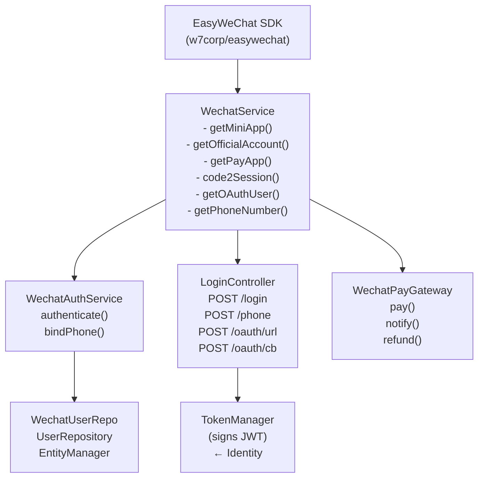
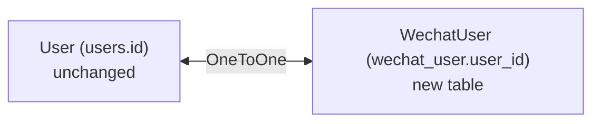
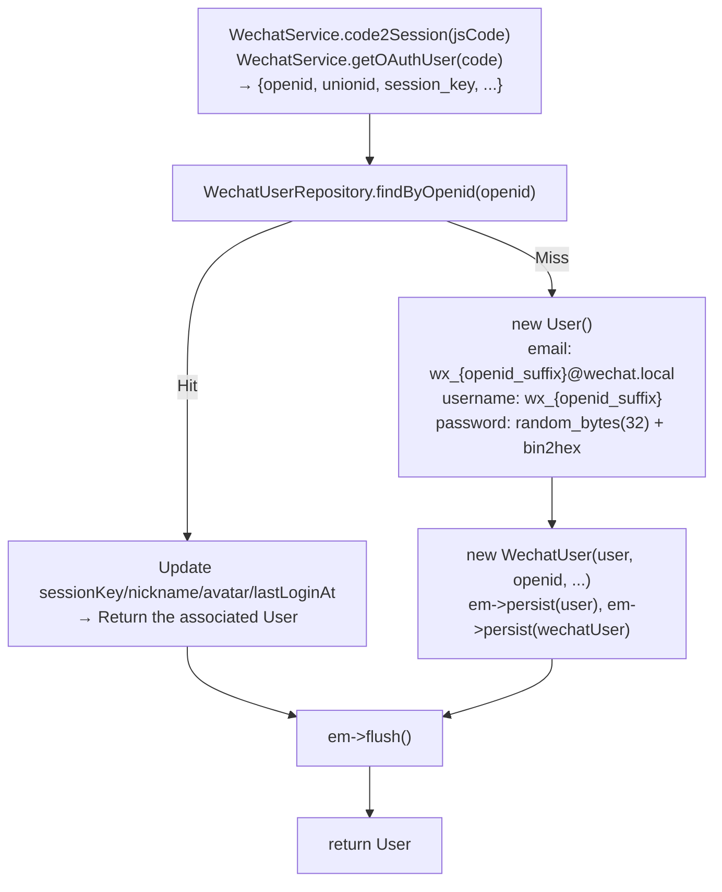
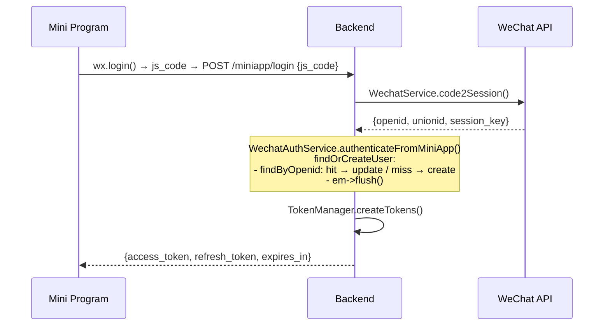
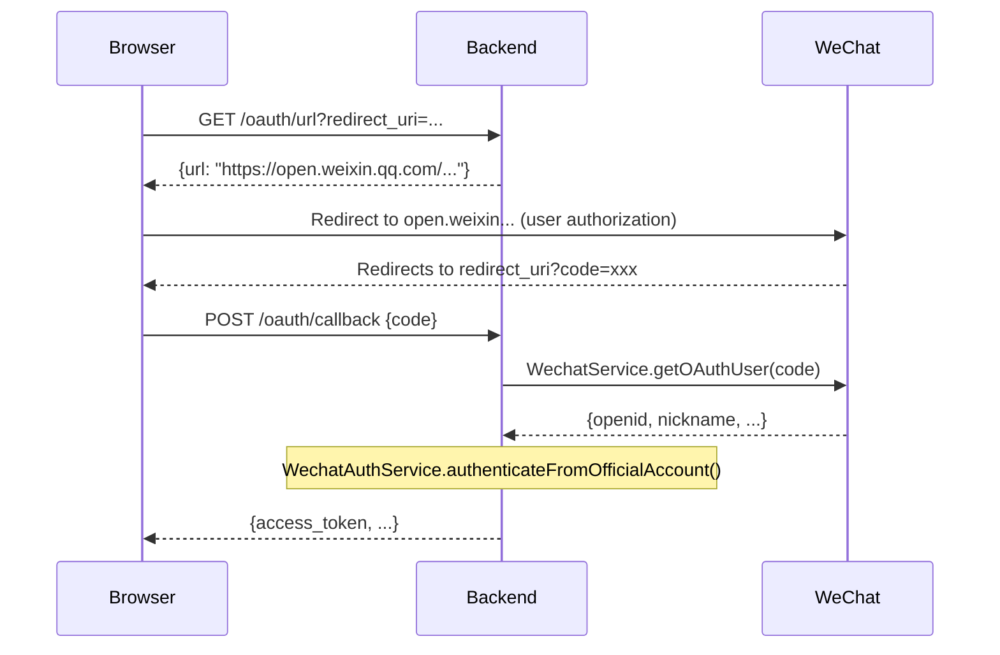

# WeChat Bundle Design

> Created: 2026-06-25

## Overview

A standalone module `src/Wechat/` implementing full WeChat Mini Program login, Official Account OAuth login, phone number binding, and WeChat Pay. It does not modify the `User` entity; user identity is extended via a OneToOne `WechatUser`.

---

## Directory Structure

```text
src/Wechat/
├── Controller/
│   └── LoginController.php              # Route: /api/wechat
├── Entity/
│   └── WechatUser.php                   # OneToOne → User
├── Repository/
│   └── WechatUserRepository.php
├── Service/
│   ├── Payment/
│   │   └── WechatPayGateway.php         # implements PaymentGatewayInterface
│   ├── WechatAuthService.php            # login orchestration service
│   └── WechatService.php                # EasyWeChat three-in-one factory
├── Resources/config/
│   └── services_wechat.yaml
```

### Tests

```text
tests/Wechat/
├── Entity/
│   └── WechatUserTest.php
├── Service/
│   ├── WechatServiceTest.php
│   └── WechatAuthServiceTest.php
├── Controller/
│   └── LoginControllerTest.php
└── Service/Payment/
    └── WechatPayGatewayTest.php
```

---

## Component Contracts

### Dependency Graph



### Impact on the Existing System

| Change | File Count | Description |
|------|--------|------|
| New files | 9 | All Wechat module code |
| Modified existing files | 5 | composer.json, services.yaml, routes.yaml, security.yaml, Invoice.php |
| **Unchanged** | `User.php` | WechatUser is linked via OneToOne; the existing User requires zero changes |

---

## Entity: WechatUser

### Table: `wechat_user`

| Column | Type | Constraints | Description |
|--------|------|-------------|-------------|
| `id` | int | PK, auto | |
| `user_id` | int | FK → users.id, ON DELETE CASCADE | OneToOne association |
| `openid` | string(64) | UNIQUE, NOT NULL | |
| `unionid` | string(64) | nullable | Cross-application unified ID |
| `session_key` | string(64) | nullable | Mini Program only |
| `nickname` | string(128) | nullable | Official Account OAuth only |
| `avatar` | string(512) | nullable | Official Account OAuth only |
| `sex` | int | nullable | Official Account OAuth only |
| `province` | string(64) | nullable | Official Account OAuth only |
| `city` | string(64) | nullable | Official Account OAuth only |
| `country` | string(64) | nullable | Official Account OAuth only |
| `app_type` | string(20) | NOT NULL | `miniapp` / `official` |
| `raw_data` | json | nullable | Raw WeChat API response |
| `last_login_at` | datetime_immutable | NOT NULL | |
| `created_at` | datetime_immutable | NOT NULL | |
| `updated_at` | datetime_immutable | nullable | |

### Relationship



### Mapping

```php
#[ORM\Entity(repositoryClass: WechatUserRepository::class)]
#[ORM\Table(name: 'wechat_user')]
#[ORM\UniqueConstraint(name: 'uniq_wechat_user_openid', columns: ['openid'])]
class WechatUser
{
    #[ORM\OneToOne(targetEntity: \App\Identity\Entity\User::class)]
    #[ORM\JoinColumn(name: 'user_id', referencedColumnName: 'id', nullable: false, onDelete: 'CASCADE')]
    private User $user;

    // getters / setters ...
}
```

---

## Service: WechatService

EasyWeChat Application factory; the upper layers read the `%wechat.*%` configuration via Container parameters.

### Constructor Signature

```php
public function __construct(
    // Mini Program
    private readonly string $miniappAppId,
    private readonly string $miniappSecret,

    // Official Account
    private readonly string $officialAppId,
    private readonly string $officialSecret,
    private readonly string $officialToken,
    private readonly string $officialAesKey,

    // WeChat Pay
    private readonly string $payMchId,
    private readonly string $paySecretKey,
    private readonly string $payPrivateKeyPath,
    private readonly string $payCertificatePath,
)
```

### Method Contract

```php
/** Mini Program */
getMiniApp(): \EasyWeChat\MiniApp\Application    // singleton cache
code2Session(string $jsCode): array              // → {openid, unionid, session_key}
getPhoneNumber(string $code): array              // → {phoneNumber}

/** Official Account */
getOfficialAccount(): \EasyWeChat\OfficialAccount\Application  // singleton cache
getOAuthRedirectUrl(string $callbackUrl): string // Generate snsapi_userinfo redirect URL
getOAuthUser(string $code): array                // → {openid, nickname, avatar, sex, province, city, country}

/** WeChat Pay */
getPayApp(): \EasyWeChat\Pay\Application          // singleton cache
```

### AppType Constants

```php
public const APP_TYPE_MINIAPP = 'miniapp';
public const APP_TYPE_OFFICIAL = 'official';
```

---

## Service: WechatAuthService

### Constructor Signature

```php
public function __construct(
    private readonly WechatService $wechatService,
    private readonly WechatUserRepository $wechatUserRepository,
    private readonly UserRepository $userRepository,
    private readonly EntityManagerInterface $em,
)
```

### Method Contract

```php
/** Mini Program login — js_code → User */
authenticateFromMiniApp(string $jsCode): User

/** Official Account login — oauth code → User */
authenticateFromOfficialAccount(string $code): User

/** Bind phone number (logged-in user) */
bindPhone(User $user, string $code): void
```

### Login Orchestration (internal)



**Design decision: random password for new Users** — WeChat users don't need a password; a JWT is issued directly. A random password prevents privilege escalation through password-login vulnerabilities.

---

## Controller: LoginController

### Class Declaration

```php
#[Route('/api/wechat', name: 'wechat-')]
class LoginController
```

Follows the `AuthController` pattern: does not extend `RestController`, manually returns `JsonResponse`, and has a private `error()` method.

### Constructor Signature

```php
public function __construct(
    private readonly WechatAuthService $wechatAuthService,
    private readonly TokenManager $tokenManager,
    private readonly WechatService $wechatService,
)
```

### Endpoints

#### `POST /api/wechat/miniapp/login` — Mini Program login (PUBLIC_ACCESS)

```php
Request:  { "js_code": "081abc..." }
Response: { "access_token": "...", "expires_in": 7200, "refresh_token": "..." }

Errors:
  400 — js_code missing
  401 — WeChat API returned error (invalid code)
```

```php
#[Route('/miniapp/login', methods: ['POST'])]
public function miniappLogin(Request $request): JsonResponse
{
    $data = json_decode($request->getContent(), true);
    $jsCode = trim((string) ($data['js_code'] ?? ''));
    if ($jsCode === '') {
        return $this->error('js_code is required.', 400);
    }
    try {
        $user = $this->wechatAuthService->authenticateFromMiniApp($jsCode);
    } catch (\RuntimeException $e) {
        return $this->error($e->getMessage(), 401);
    }
    return $this->tokenResponse($user);
}
```

#### `POST /api/wechat/miniapp/phone` — Bind phone number (IS_AUTHENTICATED_FULLY)

```php
Request:  { "code": "xxx" }
Response: 204 No Content

Errors:
  400 — code missing
  401 — WeChat API error
```

```php
#[Route('/miniapp/phone', methods: ['POST'])]
public function miniappPhone(Request $request): JsonResponse
{
    $data = json_decode($request->getContent(), true);
    $code = trim((string) ($data['code'] ?? ''));
    if ($code === '') {
        return $this->error('code is required.', 400);
    }
    try {
        /** @var User $user */
        $user = $this->getUser();
        $this->wechatAuthService->bindPhone($user, $code);
    } catch (\RuntimeException $e) {
        return $this->error($e->getMessage(), 401);
    }
    return new JsonResponse(null, 204);
}
```

#### `GET /api/wechat/oauth/url` — Get Official Account OAuth redirect URL (PUBLIC_ACCESS)

```php
Query:    ?redirect_uri=https://example.com/wechat/callback
Response: { "url": "https://open.weixin.qq.com/..." }

Errors:
  400 — redirect_uri missing
```

```php
#[Route('/oauth/url', methods: ['GET'])]
public function oauthUrl(Request $request): JsonResponse
{
    $redirectUri = trim((string) $request->query->get('redirect_uri', ''));
    if ($redirectUri === '') {
        return $this->error('redirect_uri is required.', 400);
    }
    $url = $this->wechatService->getOAuthRedirectUrl($redirectUri);
    return new JsonResponse(['url' => $url]);
}
```

#### `POST /api/wechat/oauth/callback` — Official Account OAuth callback (PUBLIC_ACCESS)

```php
Request:  { "code": "081abc..." }
Response: { "access_token": "...", "expires_in": 7200, "refresh_token": "..." }
```

```php
#[Route('/oauth/callback', methods: ['POST'])]
public function oauthCallback(Request $request): JsonResponse
{
    $data = json_decode($request->getContent(), true);
    $code = trim((string) ($data['code'] ?? ''));
    if ($code === '') {
        return $this->error('code is required.', 400);
    }
    try {
        $user = $this->wechatAuthService->authenticateFromOfficialAccount($code);
    } catch (\RuntimeException $e) {
        return $this->error($e->getMessage(), 401);
    }
    return $this->tokenResponse($user);
}
```

#### Private helpers

```php
private function tokenResponse(User $user): JsonResponse
{
    return new JsonResponse([
        'access_token'  => $this->tokenManager->createAccessToken($user),
        'expires_in'    => $this->tokenManager->getAccessTtl(),
        'refresh_token' => $this->tokenManager->createRefreshToken($user),
    ]);
}

private function error(string $message, int $status = 400): JsonResponse
{
    return new JsonResponse(['code' => $status, 'message' => $message], $status);
}
```

---

## Gateway: WechatPayGateway

### Contract: implements `PaymentGatewayInterface`

```php
getName() → 'wechat'
```

Consistent with the `Invoice::PAYMENT_WECHAT = 'wechat'` constant.

### Constructor Signature

```php
public function __construct(
    private readonly WechatService $wechatService,
    #[Autowire('%wechat.pay.notify_url%')]
    private readonly string $notifyUrl,
)
```

### Method Implementations

#### `pay(Invoice $invoice, array $options = []): PaymentResult`

Dispatches based on `$invoice->getTradeType()`:

| tradeType | WeChat API | response |
|-----------|-----------|----------|
| `'jsapi'` | `POST v3/pay/transactions/jsapi` | `payload` = `buildMiniAppConfig(prepayId)` |
| `'native'` | `POST v3/pay/transactions/native` | `payUrl` = `code_url` |

JSAPI requires the payer's openid, obtained from `$invoice->getPayer()` via `WechatUserRepository`:
```php
$wechatUser = $this->wechatUserRepository->findByUser($invoice->getPayer());
$openid = $wechatUser->getOpenid();
```

#### `notify(Request $request): PaymentNotifyResult`

```php
1. EasyWeChat $payApp->getValidator()->validate($request)
2. $server = $app->getServer()
3. Parse callback body → out_trade_no, transaction_id, amount, status
4. Return PaymentNotifyResult(outTradeNo, status, amount, transactionId, paidAt)
```

#### `refund(Invoice $invoice, int $amount, string $reason, array $options = []): PaymentRefundResult`

```php
1. POST v3/refund/domestic/refunds
   { out_trade_no, out_refund_no, amount: { refund, total, currency } }
2. Return PaymentRefundResult(refundId, status)
```

#### `getNotifySuccessResponse(PaymentNotifyResult $result): Response`

```php
return new JsonResponse(['code' => 'SUCCESS', 'message' => 'Success']);
```

### Automatic Registration

Once `WechatPayGateway` implements `PaymentGatewayInterface`, no manual configuration is needed. The existing `_instanceof` rule in `config/services.yaml`:

```yaml
_instanceof:
    App\Payment\Service\PaymentGatewayInterface:
        tags: ['payment.gateway']
```

`PaymentGatewayRegistry` auto-discovers it via `#[AutowireIterator('payment.gateway')]`.

---

## API Endpoint Summary

| Method | Path | Auth | Controller Method | Service Call |
|--------|------|------|-------------------|-------------|
| POST | `/api/wechat/miniapp/login` | PUBLIC | `miniappLogin()` | `WechatAuthService::authenticateFromMiniApp()` |
| POST | `/api/wechat/miniapp/phone` | FULLY_AUTH | `miniappPhone()` | `WechatAuthService::bindPhone()` |
| GET | `/api/wechat/oauth/url` | PUBLIC | `oauthUrl()` | `WechatService::getOAuthRedirectUrl()` |
| POST | `/api/wechat/oauth/callback` | PUBLIC | `oauthCallback()` | `WechatAuthService::authenticateFromOfficialAccount()` |
| POST | `/api/payment/notify/wechat` | PUBLIC | (existing `PaymentNotifyController`) | `WechatPayGateway::notify()` |

---

## Existing Files to Modify

### 1. `composer.json`

```bash
composer require w7corp/easywechat
```

### 2. `config/services.yaml`

```yaml
imports:
    - { resource: '../src/Wechat/Resources/config/services_wechat.yaml', ignore_errors: true }
```

### 3. `config/routes.yaml`

```yaml
wechat:
    prefix: /api/wechat
    resource:
        path: ../src/Wechat/Controller/
        namespace: App\Wechat\Controller
    type: attribute
```

### 4. `config/packages/security.yaml`

```yaml
access_control:
    # Public WeChat login (before catch-all ^/api)
    - { path: ^/api/wechat/miniapp/login$, roles: PUBLIC_ACCESS }
    - { path: ^/api/wechat/oauth/url$, roles: PUBLIC_ACCESS }
    - { path: ^/api/wechat/oauth/callback$, roles: PUBLIC_ACCESS }
```

### 5. `src/Payment/Entity/Invoice.php`

```php
public const PAYMENT_WECHAT = 'wechat';
```

### 6. `.env`

```ini
# WeChat Mini Program
WECHAT_MINIAPP_APP_ID=
WECHAT_MINIAPP_SECRET=

# WeChat Official Account
WECHAT_OFFICIAL_APP_ID=
WECHAT_OFFICIAL_SECRET=
WECHAT_OFFICIAL_TOKEN=
WECHAT_OFFICIAL_AES_KEY=

# WeChat Pay
WECHAT_PAY_MCH_ID=
WECHAT_PAY_SECRET_KEY=
WECHAT_PAY_PRIVATE_KEY=
WECHAT_PAY_CERTIFICATE=
WECHAT_PAY_NOTIFY_URL=
```

---

## Services Configuration

### `services_wechat.yaml`

```yaml
services:
    _defaults:
        autowire: true
        autoconfigure: true

    App\Wechat\Service\WechatService:
        arguments:
            $miniappAppId: '%env(WECHAT_MINIAPP_APP_ID)%'
            $miniappSecret: '%env(WECHAT_MINIAPP_SECRET)%'
            $officialAppId: '%env(WECHAT_OFFICIAL_APP_ID)%'
            $officialSecret: '%env(WECHAT_OFFICIAL_SECRET)%'
            $officialToken: '%env(WECHAT_OFFICIAL_TOKEN)%'
            $officialAesKey: '%env(WECHAT_OFFICIAL_AES_KEY)%'
            $payMchId: '%env(WECHAT_PAY_MCH_ID)%'
            $paySecretKey: '%env(WECHAT_PAY_SECRET_KEY)%'
            $payPrivateKeyPath: '%env(WECHAT_PAY_PRIVATE_KEY)%'
            $payCertificatePath: '%env(WECHAT_PAY_CERTIFICATE)%'

    App\Wechat\Service\Payment\WechatPayGateway:
        arguments:
            $notifyUrl: '%env(WECHAT_PAY_NOTIFY_URL)%'
```

### Gateway Auto-Registration (No Extra Configuration)

Handled automatically by the `_instanceof` rule in `config/services.yaml`:
```yaml
_instanceof:
    App\Payment\Service\PaymentGatewayInterface:
        tags: ['payment.gateway']
```

`PaymentGatewayRegistry` auto-discovers all implementations via `#[AutowireIterator('payment.gateway')]`.

---

## Repository: WechatUserRepository

```php
class WechatUserRepository extends ServiceEntityRepository
{
    public function __construct(ManagerRegistry $registry)
    {
        parent::__construct($registry, WechatUser::class);
    }

    public function findByOpenid(string $openid): ?WechatUser
    {
        return $this->findOneBy(['openid' => $openid]);
    }

    public function findByUser(User $user): ?WechatUser
    {
        return $this->findOneBy(['user' => $user]);
    }
}
```

---

## OpenAPI Tags & Documentation

Following the AuthController pattern, each `LoginController` endpoint is annotated with `#[OA\*]` attributes, using the tag `Wechat`.

### NelmioApiDoc Configuration Update

Add to `config/packages/nelmio_api_doc.yaml`:
```yaml
- { name: Wechat, description: 'WeChat login, OAuth, and payment' }
```

Add tag matching to `OpenApiEnricherListener`:
```php
if (str_starts_with($opId, 'wechat-')) return 'Wechat';
```

---

## Login Flow Diagrams

### Mini Program Login



### Official Account OAuth



---

## Implementation Order

| Step | Files | Description |
|------|-------|-------------|
| 1 | `WechatUser.php` + `WechatUserRepository.php` | Entity + Repository |
| 2 | `WechatService.php` | EasyWeChat three-in-one factory |
| 3 | `WechatAuthService.php` | Login orchestration |
| 4 | `LoginController.php` | 4 endpoints |
| 5 | `services_wechat.yaml` | DI configuration |
| 6 | `WechatPayGateway.php` | Payment gateway |
| 7 | config edits | composer, services, routes, security, Invoice, .env |
| 8 | tests | Full coverage of Entity, Service, Controller, Gateway |
| 9 | API docs | Update `#[OA\*]` + Nelmio + Enricher |

---

## Test Coverage Targets

| Class | Coverage Target |
|-------|----------------|
| `WechatUser` | 100% — basic getter/setter assertions |
| `WechatUserRepository` | 100% — findByOpenid / findByUser |
| `WechatService` | 100% — the three Application factories, code2Session, getOAuthUser, getPhoneNumber |
| `WechatAuthService` | 100% — both login flows, bindPhone, new/reused User logic |
| `LoginController` | 100% — 4 endpoints, error handling |
| `WechatPayGateway` | 100% — pay (jsapi/native), notify, refund, signature verification |
