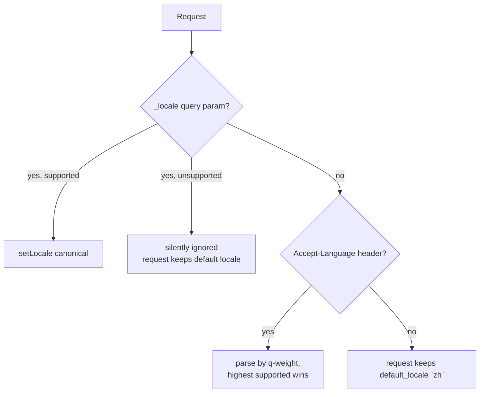

# Internationalization (i18n)

The project uses Symfony's Translation component for user-facing strings and
automatically translates the documentation into Chinese via a build pipeline.
This document covers both systems.

---

## 1. Runtime translations (API messages)

### 1.1 Configuration

`config/packages/translation.yaml`:

```yaml
framework:
    default_locale: zh
    translator:
        default_path: '%kernel.project_dir%/translations'
        providers:
```

- Translations are loaded from `translations/`.
- `default_locale` is `zh` — a fresh request that carries no locale signal
  resolves to Simplified Chinese.
- Messages are stored as YAML files named `messages.{locale}.yaml`.

### 1.2 Supported locales

| Locale   | File                                | Language            |
|----------|-------------------------------------|---------------------|
| `en`     | `translations/messages.en.yaml`     | English             |
| `zh`     | `translations/messages.zh.yaml`     | Chinese (Simplified) |
| `zh_Hant`| `translations/messages.zh_Hant.yaml`| Chinese (Traditional) |
| `ja`     | `translations/messages.ja.yaml`     | Japanese            |

These four codes are the canonical `SUPPORTED_LOCALES` in
`src/Core/EventListener/LocaleListener.php`.

### 1.3 Key convention — English strings are the keys

Translation keys are the **original English message strings** themselves, not
symbolic ids:

```yaml
# translations/messages.en.yaml
"Wallet": "Wallet"
# translations/messages.zh.yaml
"Wallet": "钱包"
```

`messages.en.yaml` is therefore mostly documentation — it maps each key to
itself — because Symfony's translator falls back to returning the key when no
translation is found. The file documents every translatable string:

- Entity names (`Category`, `Order`, `Transaction`, ...)
- Entity field names (`Id`, `Uuid`, `Name`, `Slug`, camelCase → plain text)
- Error / status messages used as exception keys

### 1.4 Where translation happens

The framework reads a message through `$translator->trans($key)` at these
points:

| Site | Mechanism |
|------|-----------|
| Exception responses | `ExceptionInterceptor` — every uncaught exception on `/api/*` is routed through `$this->translator->trans($exception->getMessage())`; the exception message is the key |
| Controller errors | `RestController::warning()`, `AuthController::error()`, `OtpController::error()`, `LoginController::error()` all pass through the translator |
| JWT failures | `JwtAuthenticator::onAuthenticationFailure()` translates the error before returning JSON |
| Entity metadata | `/system/entities/{entityName}` translates field descriptions (e.g. `createdAt` → `创建时间`) |

So a service throwing `new \RuntimeException('Insufficient funds')` is rendered
in the request locale if `"Insufficient funds"` exists in the corresponding
locale file.

## 2. Locale detection

`src/Core/EventListener/LocaleListener.php` runs at `kernel.request` (priority
20) and applies the following resolution order:



1. **`?_locale=` query parameter** — highest priority. A supported value
   (`en`, `zh`, `zh_Hant`, `ja`) is applied directly; an unsupported one is
   ignored (the request keeps its existing locale). This also short-circuits
   the header check.
2. **`Accept-Language` header** — parsed (q-weight respected, highest first)
   and mapped to a canonical locale:

   | Header value                | Canonical |
   |-----------------------------|-----------|
   | `zh-CN`, `zh-Hans`          | `zh`      |
   | `zh-TW`, `zh-HK`, `zh-Hant`, `zh-Hant-TW` | `zh_Hant` |
   | `en-US`, `en-GB`            | `en`      |
   | `ja-JP`, `ja_JP`            | `ja`      |

   A bare `zh`/`en`/`ja`/`zh_Hant` also resolves (they are in
   `SUPPORTED_LOCALES` directly). The mapping table is `LOCALE_MAP` in the
   listener.
3. **Fallback** — if nothing matches, the request keeps the framework
   `default_locale`, configured as `zh`.

> Note: the listener's PHPDoc and the README (§"Internationalization") say the
> fallback is `en`. The actual runtime config in
> `config/packages/translation.yaml` sets `default_locale: zh`, so unsupported
> or absent locale signals currently resolve to **Simplified Chinese**, not
> English. If you change `default_locale`, update both the config and the
> comment to stay consistent.

Only main requests are processed (`$event->isMainRequest()`); subrequests
(ESI etc.) are left untouched.

## 3. Adding keys / a new language

### 3.1 Add a new key to existing locales

1. Use the English string as the key in `messages.en.yaml` (key = value).
2. Add the same key with the translated value to `messages.zh.yaml`,
   `messages.zh_Hant.yaml`, `messages.ja.yaml`.
3. Throw the exception / return the message from the service layer; the
   existing interceptor/controller paths translate it for you.

### 3.2 Add a new language

1. Create `translations/messages.{locale}.yaml`. Symfony auto-discovers files
   in the `translations/` directory — no config registration is required.
2. Add the locale code to `SUPPORTED_LOCALES` and, if you want verbose codes
   like `xx-XX` to map to it, add an entry to `LOCALE_MAP` in
   `src/Core/EventListener/LocaleListener.php`.

## 4. Translated documentation pipeline

The docs (`docs/`, English Markdown) are mirrored to `docs-zh/` (Chinese) by a
script, and both are built into a bilingual static site with mkdocs.

### 4.1 `scripts/translate-docs.py`

Mirrors `docs/` → `docs-zh/` using the free `deep-translator` Google endpoint
(no API key).

- **Prerequisite:** `pip install deep-translator`
- **Usage:**
  ```bash
  python scripts/translate-docs.py                          # full mirror
  python scripts/translate-docs.py design/bundles/payment.md # single file
  ```
- Skips the `research/` and `ai/` directories.
- Preserves: YAML frontmatter, fenced code blocks, inline code, HTML comments,
  images, and links — each is "stashed" before translation and restored after,
  so code and URLs are never mangled.
- Splits the body into paragraphs and translates in chunks (< 4500 chars to
  respect the free API limit). A failed chunk is kept as the original English
  with a `WARN` line.

### 4.2 `scripts/build-docs.sh`

Full bilingual build (`bash scripts/build-docs.sh`). It:

1. Runs `translate-docs.py` (docs → docs-zh).
2. Copies the binary/text assets that should not be translated (`assets/`,
   `research/`, `openapi/`, `ai/`, `javascripts/`) from `docs/` to `docs-zh/`.
3. Generates **two** mkdocs configs from the single `mkdocs.yml`:
   - `mkdocs-en.yml` — English, `site_dir: site`, adds language `alternate`
     links (`/crud-skeleton/` ↔ `/crud-skeleton/zh/`).
   - `mkdocs-zh.yml` — `docs_dir: docs-zh`, `site_dir: site/zh`,
     theme `language: zh`, nav labels translated via a static `MAP`
     (`Home` → `首页`, `Wallet` → `Wallet (钱包)`, ...) with a
     Google-translator fallback for unknown short labels.
4. Builds both, `mkdocs build -f ... --clean`.

Output:

| Site            | Config        | URL (local preview)       |
|-----------------|---------------|---------------------------|
| English         | `mkdocs-en.yml` | `site/index.html`       |
| Chinese         | `mkdocs-zh.yml` | `site/zh/index.html`    |

The source of truth for topics/nav is `mkdocs.yml`
(`site_name: CRUD Skeleton`, Material theme, Mermaid support via
`extra_javascript`). The generated `mkdocs-en.yml` / `mkdocs-zh.yml` are
build artifacts — edit `mkdocs.yml` (and the `MAP` in `build-docs.sh`) and
re-run the script.

### 4.3 Translated READMEs

The repo also ships hand-maintained translated README variants (see README
§"Internationalization"):

| Language | File |
|----------|------|
| Chinese (Simplified) | `README.zh-cn.md` |
| Chinese (Traditional) | `README.zh-hant.md` |
| Japanese | `README.ja.md` |

These are independent of the `docs-zh/` machine translation and are maintained
manually.

---

## Summary

- API strings: keys are English message strings in `translations/messages.*.yaml`;
  four locales (`en`, `zh`, `zh_Hant`, `ja`), default `zh`.
- Detection: `?_locale=` → `Accept-Language` (q-weighted, mapped via
  `LOCALE_MAP`) → framework `default_locale`.
- Docs: `docs/` → `docs-zh/` via `translate-docs.py`; bilingual site built by
  `build-docs.sh` into `site/` and `site/zh/`.